# Lecto — Data Flow & Processing Pipeline

> **Version**: 1.0.0  
> **Last Updated**: 2026-07-07  
> **Status**: Specification Draft  
> **Audience**: Engineering, Architecture, QA

---

## Table of Contents

1. [End-to-End Data Flow](#1-end-to-end-data-flow)
2. [Recording Pipeline](#2-recording-pipeline)
3. [Upload Pipeline](#3-upload-pipeline)
4. [Transcription Pipeline](#4-transcription-pipeline)
5. [AI Processing Pipeline (Gemini)](#5-ai-processing-pipeline-gemini)
6. [PDF Generation Pipeline](#6-pdf-generation-pipeline)
7. [Data Lifecycle Management](#7-data-lifecycle-management)
8. [Offline Data Flow](#8-offline-data-flow)
9. [Error Recovery Matrix](#9-error-recovery-matrix)
10. [Performance Considerations](#10-performance-considerations)

---

## 1. End-to-End Data Flow

### 1.1 Master Pipeline Overview

The Lecto pipeline transforms a live lecture into a downloadable, structured PDF of study notes. Every stage is designed with the invariant that **audio files are the primary asset** until the transcript is confirmed—only then may audio be safely deleted.

```mermaid
flowchart TD
    subgraph CLIENT ["📱 Mobile App (Client)"]
        A["🎙️ User taps RECORD"] --> B["Audio Capture Engine"]
        B --> C{"Chunk boundary\nreached?"}
        C -- "No" --> B
        C -- "Yes" --> D["Write chunk to local disk"]
        D --> E{"Network\navailable?"}
        E -- "Yes" --> F["Enqueue chunk for upload"]
        E -- "No" --> G["Queue in offline store"]
        G --> H{"Network\nrestored?"}
        H -- "No (poll)" --> H
        H -- "Yes" --> F
        F --> I["Upload Manager"]
    end

    subgraph BACKEND ["☁️ Backend API"]
        I --> J["Receive & validate chunk"]
        J --> K["Store in Cloud Storage\n(GCS / S3)"]
        K --> L{"All chunks\nfor session?"}
        L -- "No" --> M["Wait for remaining"]
        L -- "Yes" --> N["Trigger Transcription"]
    end

    subgraph TRANSCRIPTION ["🗣️ Transcription Service"]
        N --> O["Speech-to-Text\n(per chunk)"]
        O --> P["Transcript Assembly"]
        P --> Q["Generate main.md"]
        Q --> R["Quality scoring"]
    end

    subgraph AI ["🤖 AI Processing"]
        R --> S["Gemini API\n(Structured Summarization)"]
        S --> T["Structured Notes JSON"]
    end

    subgraph PDF_GEN ["📄 PDF Generation"]
        T --> U["Render PDF from template"]
        U --> V["Store PDF in cloud"]
        V --> W["Push notification\nto user"]
    end

    subgraph CLEANUP ["🗑️ Data Lifecycle"]
        W --> X{"User confirms\ntranscript?"}
        X -- "Yes" --> Y["Mark audio\nfor deletion"]
        X -- "No / Not yet" --> Z["Retain audio\n(configurable TTL)"]
        Y --> AA["Delete audio\nafter grace period"]
    end

    style CLIENT fill:#e8f4fd,stroke:#2196F3
    style BACKEND fill:#fff3e0,stroke:#FF9800
    style TRANSCRIPTION fill:#e8f5e9,stroke:#4CAF50
    style AI fill:#f3e5f5,stroke:#9C27B0
    style PDF_GEN fill:#fce4ec,stroke:#E91E63
    style CLEANUP fill:#efebe9,stroke:#795548
```

### 1.2 Stage Summary Table

| # | Stage | Input | Output | Location | Fail-safe |
|---|-------|-------|--------|----------|-----------|
| 1 | **Record** | Mic audio stream | `.aac` chunk files | Device local storage | Chunks flushed to disk every buffer cycle |
| 2 | **Chunk** | Continuous audio stream | Sequenced chunk files + metadata JSON | Device local storage | Sequence numbering + checksums |
| 3 | **Upload** | Chunk file + metadata | Cloud-stored chunk object | Cloud Storage (GCS) | Resumable uploads + retry queue |
| 4 | **Transcribe** | Cloud audio chunk | Chunk-level transcript JSON | Backend DB | Retry with alternate model on failure |
| 5 | **Assemble** | Ordered chunk transcripts | Unified `main.md` transcript | Backend DB + Cloud Storage | Idempotent re-assembly |
| 6 | **Summarize** | `main.md` full transcript | Structured notes JSON | Backend DB | Chunked prompting for long transcripts |
| 7 | **Generate PDF** | Structured notes JSON | Branded `.pdf` file | Cloud Storage | Re-generation on demand |
| 8 | **Deliver** | PDF URL | Push notification + in-app card | Client + Push service | Notification retry + in-app polling |
| 9 | **Cleanup** | Confirmation flag + TTL | Deleted audio files | Cloud Storage + Device | Grace period before deletion |

### 1.3 Decision Points

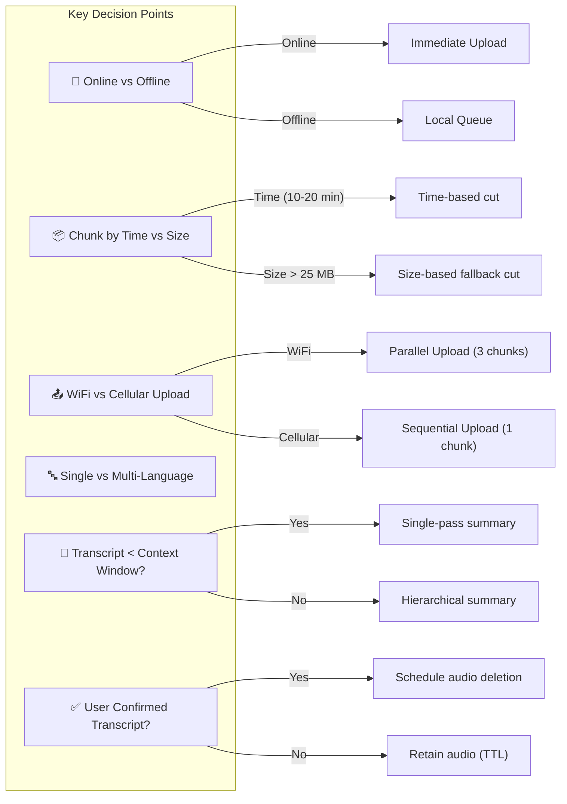

---

## 2. Recording Pipeline

### 2.1 Audio Capture Configuration

| Parameter | Recommended | Fallback | Notes |
|-----------|------------|----------|-------|
| **Codec** | AAC-LC | OPUS | AAC-LC for iOS compatibility; OPUS for smaller size on Android |
| **Container** | `.m4a` (AAC) / `.ogg` (OPUS) | `.wav` (lossless debug) | Prefer lossy for storage economy |
| **Sample Rate** | 44,100 Hz | 16,000 Hz | 16 kHz acceptable for speech-only; 44.1 kHz preserves quality |
| **Bit Rate** | 128 kbps (AAC) / 64 kbps (OPUS) | 64 kbps (AAC) / 32 kbps (OPUS) | OPUS at 64 kbps ≈ AAC at 128 kbps quality for speech |
| **Channels** | Mono | — | Stereo is unnecessary for lecture capture |
| **Bit Depth** | 16-bit | — | Standard for speech |

> [!IMPORTANT]
> At 128 kbps AAC Mono, a 1-hour lecture produces approximately **57.6 MB** of audio. At 64 kbps OPUS, the same lecture is approximately **28.8 MB**.

### 2.2 Chunking Strategy

Lecto uses a **tiered chunking strategy** that prioritizes natural audio boundaries:

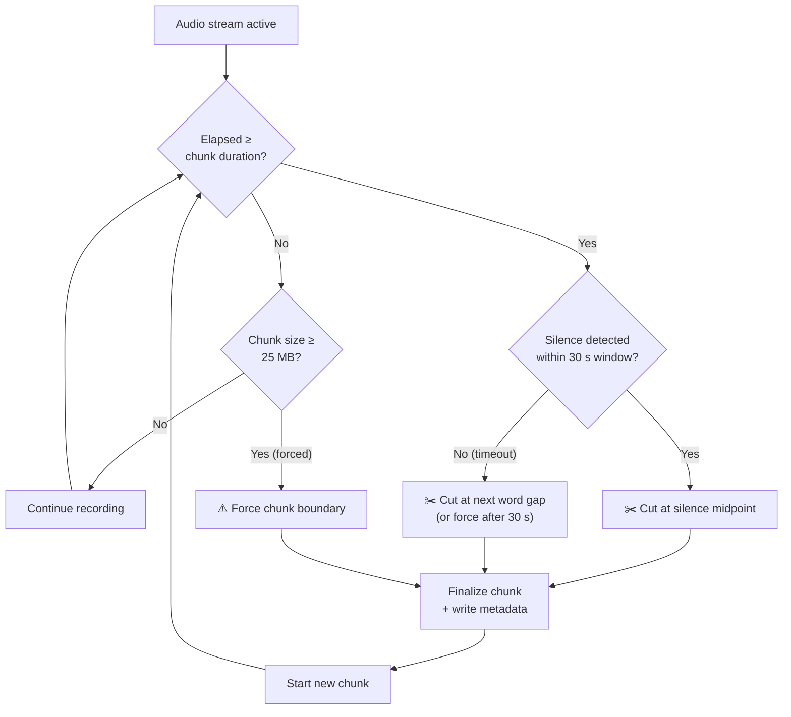

#### Tier 1 — Time-Based (Primary)

| Setting | Default | Min | Max |
|---------|---------|-----|-----|
| Chunk duration | 15 minutes | 10 minutes | 20 minutes |
| User configurable | Yes | — | — |

#### Tier 2 — Size-Based (Fallback Guard)

If a chunk reaches **25 MB** before the time threshold (e.g., due to high bitrate or environmental noise), the system forces a boundary.

#### Tier 3 — Silence Detection (Smart Boundaries)

When a time-based boundary is triggered, the system looks for a natural silence within a **±30 second window** around the target cut point:

| Parameter | Value |
|-----------|-------|
| Silence threshold | -40 dBFS |
| Minimum silence duration | 500 ms |
| Search window | ±30 seconds around target cut point |
| Fallback | Cut at exact time if no silence found within window |

#### Overlap Buffer

To avoid cutting words mid-sentence, each chunk includes a **2-second audio overlap** with the previous chunk. This overlap is tagged in metadata so the transcription assembler can de-duplicate.

### 2.3 Chunk Metadata

Every chunk is accompanied by a metadata JSON sidecar written atomically to local storage:

```json
{
  "chunkId": "chunk_a1b2c3d4",
  "sessionId": "ses_20260707_143022_usr_5f8e",
  "userId": "usr_5f8e9a12",
  "sequenceNumber": 3,
  "totalChunksEstimate": null,
  "isFinalChunk": false,
  "recording": {
    "startedAt": "2026-07-07T14:30:22.000Z",
    "chunkStartOffset": 1800.0,
    "chunkEndOffset": 2700.0,
    "durationSeconds": 900.0,
    "overlapStartSeconds": 1798.0,
    "overlapEndSeconds": 1800.0
  },
  "audio": {
    "codec": "aac",
    "container": "m4a",
    "sampleRate": 44100,
    "bitRate": 128000,
    "channels": 1,
    "fileSizeBytes": 14417920
  },
  "device": {
    "platform": "android",
    "model": "Pixel 8",
    "osVersion": "Android 16"
  },
  "integrity": {
    "sha256": "e3b0c44298fc1c149afbf4c8996fb924...",
    "crc32": "1a2b3c4d"
  },
  "createdAt": "2026-07-07T14:45:22.000Z",
  "status": "RECORDED"
}
```

### 2.4 Local Storage Format & Naming

```
/app_data/lecto/recordings/
├── ses_20260707_143022_usr_5f8e/
│   ├── session_meta.json           # Session-level metadata
│   ├── chunk_001.m4a               # Audio chunk 1
│   ├── chunk_001.meta.json         # Chunk 1 metadata
│   ├── chunk_002.m4a               # Audio chunk 2
│   ├── chunk_002.meta.json         # Chunk 2 metadata
│   ├── chunk_003.m4a               # Audio chunk 3 (in progress)
│   ├── chunk_003.meta.json         # Chunk 3 metadata (partial)
│   └── upload_queue.json           # Upload state tracker
└── ses_20260707_100015_usr_5f8e/
    └── ...
```

**Naming Convention**: `chunk_{NNN}.{ext}` where `NNN` is the zero-padded 3-digit sequence number.

### 2.5 Buffer Management During Recording

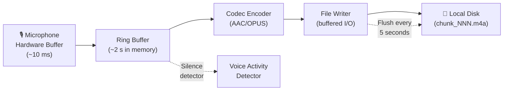

| Buffer | Size | Purpose |
|--------|------|---------|
| Hardware mic buffer | ~10 ms (platform-managed) | Capture raw PCM from microphone |
| Ring buffer (memory) | 2 seconds (~176 KB at 44.1 kHz/16-bit) | Smooth out encoding jitter; feed silence detector |
| Encoder output buffer | 64 KB | Batch encoded frames before disk write |
| File I/O buffer | 256 KB | OS-level buffered write; flushed every 5 seconds |

> [!CAUTION]
> The file writer **must flush to disk at least every 5 seconds** to minimize data loss if the app is killed or the device crashes. On Android, use `FileOutputStream.getFD().sync()`; on iOS, use `fflush()` + `fsync()`.

---

## 3. Upload Pipeline

### 3.1 Upload Architecture

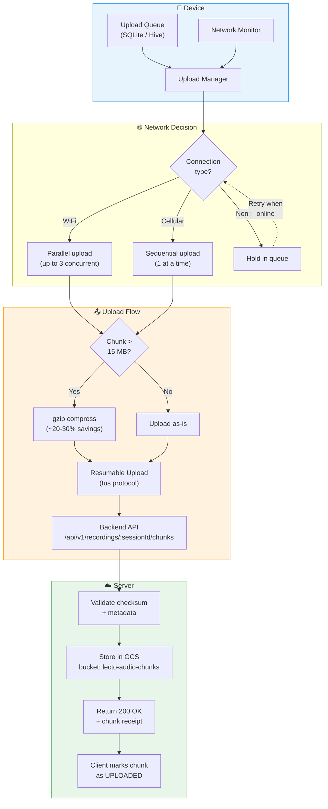

### 3.2 Upload Queue Management

The upload queue is a persistent, crash-safe store (SQLite on Android, Hive/SQLite on Flutter) ordered **FIFO by creation time**:

```json
{
  "queue": [
    {
      "queueEntryId": "uq_001",
      "sessionId": "ses_20260707_143022_usr_5f8e",
      "chunkId": "chunk_a1b2c3d4",
      "sequenceNumber": 1,
      "filePath": "/app_data/lecto/recordings/ses_.../chunk_001.m4a",
      "fileSizeBytes": 14417920,
      "sha256": "e3b0c44...",
      "status": "PENDING",
      "attempts": 0,
      "maxAttempts": 5,
      "nextRetryAt": null,
      "createdAt": "2026-07-07T14:45:22.000Z",
      "priority": 1
    },
    {
      "queueEntryId": "uq_002",
      "sessionId": "ses_20260707_143022_usr_5f8e",
      "chunkId": "chunk_e5f6g7h8",
      "sequenceNumber": 2,
      "filePath": "/app_data/lecto/recordings/ses_.../chunk_002.m4a",
      "fileSizeBytes": 14200832,
      "sha256": "a7c3f21...",
      "status": "PENDING",
      "attempts": 0,
      "maxAttempts": 5,
      "nextRetryAt": null,
      "createdAt": "2026-07-07T15:00:22.000Z",
      "priority": 1
    }
  ]
}
```

**Priority rules**:
1. Older sessions first (complete older recordings before newer ones)
2. Within a session, sequential order by `sequenceNumber`
3. Final chunks get a priority boost (+1) to unlock transcription faster

### 3.3 Upload API Request / Response

**Request**: `PUT /api/v1/recordings/{sessionId}/chunks/{sequenceNumber}`

```
PUT /api/v1/recordings/ses_20260707_143022_usr_5f8e/chunks/1
Content-Type: audio/mp4
X-Lecto-Chunk-Id: chunk_a1b2c3d4
X-Lecto-Session-Id: ses_20260707_143022_usr_5f8e
X-Lecto-Sequence-Number: 1
X-Lecto-Is-Final: false
X-Lecto-Checksum-SHA256: e3b0c44298fc1c149afbf4c8996fb924...
X-Lecto-Duration-Seconds: 900
X-Lecto-Chunk-Start-Offset: 0
X-Lecto-Chunk-End-Offset: 900
Content-Length: 14417920
Upload-Offset: 0
Tus-Resumable: 1.0.0

<binary audio data>
```

**Response (Success)**:

```json
{
  "status": "accepted",
  "chunkId": "chunk_a1b2c3d4",
  "sessionId": "ses_20260707_143022_usr_5f8e",
  "sequenceNumber": 1,
  "cloudPath": "gs://lecto-audio-chunks/usr_5f8e/ses_20260707_143022/chunk_001.m4a",
  "checksumVerified": true,
  "totalChunksReceived": 1,
  "allChunksReceived": false,
  "receivedAt": "2026-07-07T14:46:05.000Z"
}
```

**Response (Final chunk — triggers transcription)**:

```json
{
  "status": "accepted",
  "chunkId": "chunk_m9n0p1q2",
  "sessionId": "ses_20260707_143022_usr_5f8e",
  "sequenceNumber": 4,
  "cloudPath": "gs://lecto-audio-chunks/usr_5f8e/ses_20260707_143022/chunk_004.m4a",
  "checksumVerified": true,
  "totalChunksReceived": 4,
  "allChunksReceived": true,
  "transcriptionTriggered": true,
  "transcriptionJobId": "txn_7f8a9b0c",
  "estimatedCompletionMinutes": 8,
  "receivedAt": "2026-07-07T15:32:15.000Z"
}
```

### 3.4 Resumable Upload Protocol

Lecto uses the **tus v1.0.0** resumable upload protocol for reliable delivery:

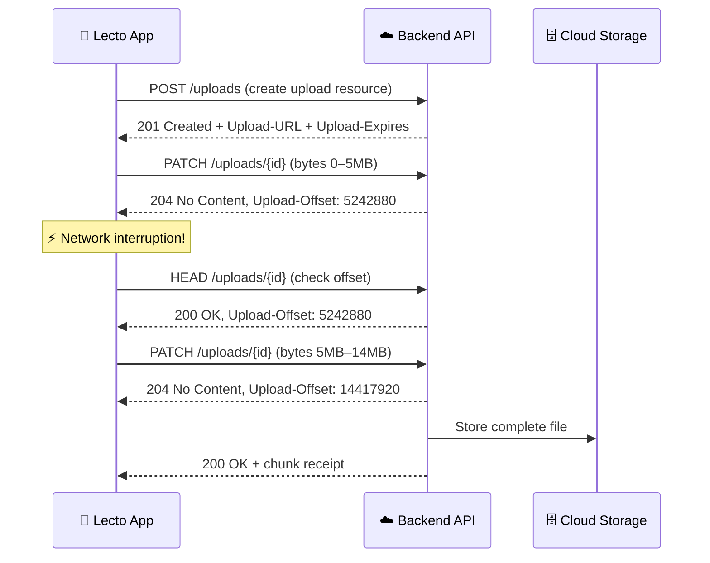

### 3.5 Retry Strategy

| Attempt | Delay | Formula | Max |
|---------|-------|---------|-----|
| 1 | 1 s | `base` | — |
| 2 | 2 s | `base × 2¹` | — |
| 3 | 4 s | `base × 2²` | — |
| 4 | 8 s | `base × 2³` | — |
| 5 | 16 s | `base × 2⁴` | — |
| 6+ | — | **Give up → alert user** | 5 attempts per cycle |

```
delay = min(base × 2^(attempt - 1) + random_jitter(0, 1000ms), 30_000ms)
```

After 5 consecutive failures the chunk is moved to a `FAILED` status. The user is notified and can manually retry. A background job retries all `FAILED` chunks once every 30 minutes when connectivity is available.

### 3.6 Compression Decision

| Scenario | Action | Rationale |
|----------|--------|-----------|
| AAC chunk ≤ 15 MB | Upload raw | AAC is already compressed; gzip savings < 5% |
| AAC chunk > 15 MB | gzip with level 1 (fast) | Marginal savings (~3-5%), but reduces transfer time on slow links |
| OPUS chunk (any size) | Upload raw | OPUS is heavily compressed; gzip provides negligible benefit |
| WAV debug chunk | gzip with level 6 | Significant savings (~60-70%) on uncompressed PCM |

> [!TIP]
> Compression is primarily useful during the WAV debug mode or when uploading very large AAC chunks on slow cellular connections. For most production use cases, AAC and OPUS chunks are uploaded without additional compression.

### 3.7 Bandwidth-Aware Behavior

| Condition | Behavior |
|-----------|----------|
| **WiFi** | Upload up to 3 chunks in parallel; no throttling |
| **Cellular (unlimited/unknown)** | Upload 1 chunk at a time; respect OS data saver settings |
| **Cellular (metered/low data)** | Queue uploads; show banner "Uploads paused — connect to WiFi" |
| **No connectivity** | Queue all; retry on connectivity change broadcast |
| **Battery < 15%** | Pause uploads; resume when charging or battery > 20% |

---

## 4. Transcription Pipeline

### 4.1 Speech-to-Text Service Selection

| Provider | Model | Use Case | Latency | Cost Estimate |
|----------|-------|----------|---------|---------------|
| **Google Cloud Speech-to-Text V2** | `chirp_2` | Primary — high accuracy, 100+ languages | ~0.5× real-time | ~$0.016/min |
| **Deepgram** | `nova-2` | Fallback — fast, cost-effective | ~0.2× real-time | ~$0.0043/min |
| **OpenAI Whisper** (self-hosted) | `large-v3` | Offline/on-device future option | ~1× real-time | Infrastructure cost |

**Primary choice**: Google Cloud Speech-to-Text V2 with the `chirp_2` model for its superior accuracy with academic/lecture content and native multi-language support.

### 4.2 Transcription API Request / Response

**Request** (per chunk):

```json
{
  "config": {
    "autoDecodingConfig": {},
    "model": "chirp_2",
    "languageCodes": ["auto"],
    "features": {
      "enableWordTimeOffsets": true,
      "enableWordConfidence": true,
      "enableAutomaticPunctuation": true,
      "enableSpokenPunctuation": false,
      "diarizationConfig": {
        "minSpeakerCount": 1,
        "maxSpeakerCount": 4
      }
    }
  },
  "uri": "gs://lecto-audio-chunks/usr_5f8e/ses_20260707_143022/chunk_001.m4a"
}
```

**Response** (per chunk — simplified):

```json
{
  "results": [
    {
      "alternatives": [
        {
          "transcript": "So today we're going to talk about the second law of thermodynamics. This is arguably one of the most important concepts in all of physics.",
          "confidence": 0.96,
          "words": [
            {
              "word": "So",
              "startOffset": "0.100s",
              "endOffset": "0.300s",
              "confidence": 0.98,
              "speakerLabel": "1"
            },
            {
              "word": "today",
              "startOffset": "0.320s",
              "endOffset": "0.600s",
              "confidence": 0.99,
              "speakerLabel": "1"
            },
            {
              "word": "we're",
              "startOffset": "0.620s",
              "endOffset": "0.800s",
              "confidence": 0.97,
              "speakerLabel": "1"
            }
          ]
        }
      ],
      "resultEndOffset": "38.500s",
      "languageCode": "en-US"
    }
  ],
  "metadata": {
    "totalBilledDuration": "900s",
    "chunkId": "chunk_a1b2c3d4",
    "sessionId": "ses_20260707_143022_usr_5f8e",
    "sequenceNumber": 1
  }
}
```

### 4.3 Language Detection & Multi-Language Support

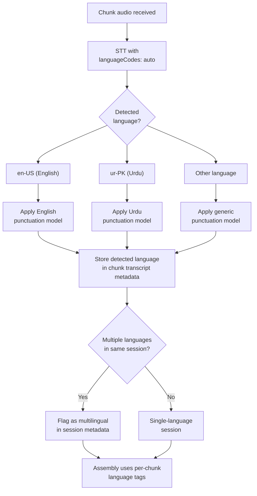

- **Auto-detection** is used by default — the user does not need to select a language.
- If a lecture switches languages mid-stream (common in South Asian universities), each chunk's detected language is preserved and the assembled transcript includes language-switch markers.

### 4.4 Transcript Assembly from Chunks

When all chunks for a session are transcribed, the **Transcript Assembler** merges them into a single `main.md`:

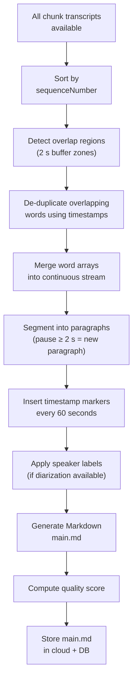

#### Overlap De-duplication Algorithm

1. For adjacent chunks `N` and `N+1`, identify the 2-second overlap window.
2. Extract word sequences from both chunks within the overlap time range.
3. Use Longest Common Subsequence (LCS) on the word arrays to find the alignment point.
4. Keep words from chunk `N` up to the alignment midpoint; continue from chunk `N+1` after the midpoint.
5. If LCS finds no match (rare), fall back to a hard cut at the exact chunk boundary timestamp.

#### Paragraph Segmentation Rules

| Condition | Action |
|-----------|--------|
| Pause ≥ 2.0 seconds between words | Insert paragraph break |
| Speaker change detected | Insert paragraph break + speaker label |
| Every 60 seconds (regardless) | Insert timestamp marker `[MM:SS]` |
| Detected question (rising intonation + `?` punctuation) | Mark as question block |

### 4.5 Transcript Format Specification (`main.md`)

```markdown
---
sessionId: ses_20260707_143022_usr_5f8e
title: "Physics 201 — Thermodynamics Lecture 14"
date: 2026-07-07
duration: 3600
language: en-US
speakers: 2
chunkCount: 4
qualityScore: 0.94
generatedAt: 2026-07-07T16:05:00.000Z
---

# Lecture Transcript

**Date**: July 7, 2026  
**Duration**: 1:00:00  
**Quality Score**: 94%

---

## [00:00] Introduction

**Speaker 1 (Instructor)**:

So today we're going to talk about the second law of thermodynamics.
This is arguably one of the most important concepts in all of physics.
Before we dive in, let me just quickly recap what we covered last
Wednesday about the first law.

The first law, as you'll remember, is essentially a statement about
conservation of energy. Energy cannot be created or destroyed, it can
only be transformed from one form to another.

## [02:15]

**Speaker 1 (Instructor)**:

Now, the second law is different. It doesn't tell us about the quantity
of energy — it tells us about the *quality* of energy and the
*direction* of natural processes.

There are several equivalent formulations. The one I want to start with
is the Clausius statement: heat cannot spontaneously flow from a colder
body to a hotter body.

## [04:30]

**Speaker 2 (Student)**:

Professor, when you say "spontaneously," does that mean it can never
happen, or just that it requires work?

## [04:45]

**Speaker 1 (Instructor)**:

Great question. It means it cannot happen *on its own* — without
external work being done. That's the key distinction. A refrigerator
moves heat from cold to hot, but it requires electrical energy to do so.
That does not violate the second law.

## [05:30] Entropy

**Speaker 1 (Instructor)**:

This brings us to the concept of entropy. Entropy, denoted by the
capital letter S, is a measure of the disorder or randomness of a
system. The second law can be restated as: the total entropy of an
isolated system can never decrease over time.

Mathematically, for a reversible process:

dS = δQ_rev / T

Where δQ_rev is the reversible heat transfer and T is the absolute
temperature.

...

## [55:00] Assignments

**Speaker 1 (Instructor)**:

Alright, for your homework this week: problems 7.1 through 7.5 from
Halliday, Resnick, and Walker. These are due next Monday, July 13th.
Also, I want you to read Chapter 8 on heat engines for Wednesday's
lecture. There will be a quiz.

## [58:00] Closing

**Speaker 1 (Instructor)**:

Any final questions? No? Alright, see you Wednesday. Don't forget —
Chapter 8, and problems 7.1 through 7.5 by Monday.

---

*Transcript generated by Lecto • Quality Score: 94% • 4 chunks assembled*
```

### 4.6 Quality Scoring

The quality score is a composite metric (0.0–1.0):

| Metric | Weight | Measurement |
|--------|--------|-------------|
| **Mean word confidence** | 40% | Average confidence from STT across all words |
| **Language consistency** | 15% | Percentage of chunks matching the dominant language |
| **Overlap alignment success** | 15% | Percentage of chunk boundaries where LCS alignment succeeded |
| **Diarization stability** | 10% | Consistency of speaker labels across chunk boundaries |
| **Completeness** | 20% | `total_transcribed_duration / expected_session_duration` |

```
quality_score = (0.40 × avg_confidence)
             + (0.15 × language_consistency)
             + (0.15 × overlap_alignment_rate)
             + (0.10 × diarization_stability)
             + (0.20 × completeness_ratio)
```

> [!WARNING]
> If `quality_score < 0.60`, the transcript is flagged for manual review. The user sees a banner: "This transcript may contain errors — please review before generating notes."

---

## 5. AI Processing Pipeline (Gemini)

### 5.1 Architecture Overview

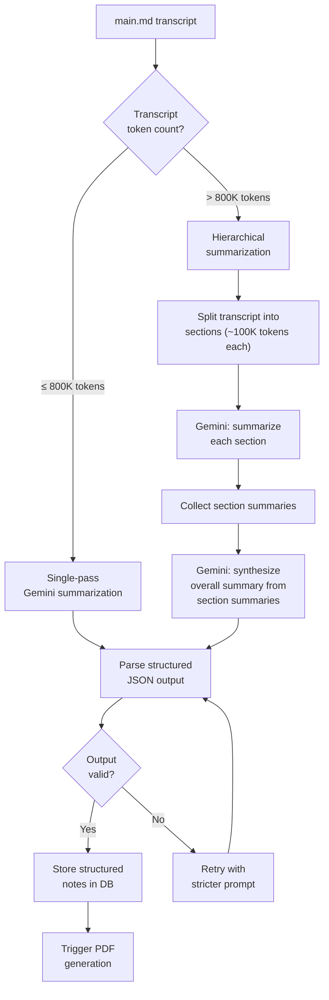

### 5.2 Token Management

| Scenario | Transcript Length | Token Estimate | Strategy |
|----------|-----------------|----------------|----------|
| Short lecture (30 min) | ~4,500 words | ~6,000 tokens | Single-pass |
| Standard lecture (1 hr) | ~9,000 words | ~12,000 tokens | Single-pass |
| Long lecture (2 hrs) | ~18,000 words | ~24,000 tokens | Single-pass |
| Marathon lecture (3+ hrs) | ~27,000+ words | ~36,000+ tokens | Usually single-pass (well within 1M context) |
| Extreme (8+ hr seminar) | ~72,000+ words | ~96,000+ tokens | Single-pass still feasible, hierarchical for quality |

> [!NOTE]
> Gemini 2.5 supports a **1 million token** context window, so the vast majority of lectures will be processed in a single pass. Hierarchical summarization is reserved for unusually long sessions (multi-day workshops, seminars) or when single-pass quality degrades for very long inputs.

**Hierarchical strategy** (when needed):

1. Split transcript into sections of ~100,000 tokens each at paragraph boundaries.
2. Summarize each section independently using the section-level prompt.
3. Feed all section summaries (typically < 50,000 tokens combined) into a synthesis prompt to produce the final structured output.

### 5.3 Prompt Engineering

#### System Prompt

```
You are Lecto AI, an expert academic assistant. Your job is to analyze 
lecture transcripts and produce comprehensive, well-structured study notes 
that help students learn effectively.

You MUST return your response as a valid JSON object following the exact 
schema provided. Do not include any text outside the JSON object.

Guidelines:
- Be thorough but concise — capture all important information
- Use the exact timestamps from the transcript where available
- Distinguish between the instructor's explanations and student questions
- Identify all assignments, deadlines, and reading materials
- Define technical terms clearly
- Note any formulas, equations, or quantitative information
- Preserve the logical flow of the lecture
- If the transcript quality is low, note uncertain sections
```

#### User Prompt (Single-Pass)

```
Analyze the following lecture transcript and produce structured study 
notes. Return ONLY a valid JSON object matching this schema:

{
  "lectureOverview": {
    "title": "string — inferred lecture title",
    "subject": "string — academic subject",
    "date": "string — ISO date if mentioned",
    "duration": "string — lecture duration",
    "instructor": "string — instructor name if mentioned",
    "overviewSummary": "string — 2-3 sentence overview of the lecture"
  },
  "topicBreakdown": [
    {
      "topic": "string — topic title",
      "timestamp": "string — [MM:SS] when topic begins",
      "duration": "string — approximate duration of this topic",
      "content": "string — detailed explanation of what was covered",
      "keyPoints": ["string — important point 1", "..."]
    }
  ],
  "keyConcepts": [
    {
      "term": "string — concept or term name",
      "definition": "string — clear definition",
      "context": "string — how it was explained in the lecture",
      "timestamp": "string — [MM:SS] when first discussed"
    }
  ],
  "importantPoints": [
    {
      "point": "string — the important point",
      "reasoning": "string — why this is important",
      "timestamp": "string — [MM:SS]"
    }
  ],
  "assignmentsAndDeadlines": [
    {
      "type": "homework | reading | quiz | exam | project | other",
      "description": "string — what is assigned",
      "deadline": "string — when it's due (date or relative)",
      "details": "string — additional details (page numbers, etc.)"
    }
  ],
  "questionsDiscussed": [
    {
      "question": "string — the question asked",
      "askedBy": "student | instructor",
      "answer": "string — the answer given",
      "timestamp": "string — [MM:SS]"
    }
  ],
  "formulas": [
    {
      "formula": "string — the mathematical formula",
      "name": "string — formula name",
      "description": "string — what it represents",
      "variables": [
        {
          "symbol": "string",
          "meaning": "string"
        }
      ]
    }
  ],
  "summary": "string — comprehensive 1-2 paragraph summary of the entire lecture, suitable for quick review"
}

TRANSCRIPT:
---
{transcript_content}
---
```

#### Section-Level Prompt (Hierarchical Mode)

```
This is SECTION {section_number} of {total_sections} from a lecture 
transcript. Summarize this section's content following the same JSON 
schema as above. Mark timestamps relative to the original lecture 
(they are preserved in the transcript).

SECTION TRANSCRIPT:
---
{section_content}
---
```

#### Synthesis Prompt (Hierarchical Mode)

```
The following are structured summaries of {total_sections} consecutive 
sections of a single lecture. Synthesize these into ONE unified set of 
study notes following the exact JSON schema provided. Merge related 
topics, de-duplicate concepts, and ensure a coherent narrative flow.

Resolve any cross-section references (e.g., "as mentioned earlier" 
should reference the actual topic from a prior section).

SECTION SUMMARIES:
---
{json_array_of_section_summaries}
---
```

### 5.4 Gemini API Request / Response

**Request**:

```json
{
  "model": "gemini-2.5-flash",
  "contents": [
    {
      "role": "user",
      "parts": [
        {
          "text": "<system_prompt>\n\n<user_prompt_with_transcript>"
        }
      ]
    }
  ],
  "generationConfig": {
    "responseMimeType": "application/json",
    "temperature": 0.3,
    "topP": 0.85,
    "topK": 40,
    "maxOutputTokens": 65536
  },
  "safetySettings": [
    {
      "category": "HARM_CATEGORY_HARASSMENT",
      "threshold": "BLOCK_NONE"
    },
    {
      "category": "HARM_CATEGORY_HATE_SPEECH",
      "threshold": "BLOCK_NONE"
    },
    {
      "category": "HARM_CATEGORY_SEXUALLY_EXPLICIT",
      "threshold": "BLOCK_NONE"
    },
    {
      "category": "HARM_CATEGORY_DANGEROUS_CONTENT",
      "threshold": "BLOCK_NONE"
    }
  ]
}
```

> [!NOTE]
> Safety filters are set to `BLOCK_NONE` because lecture content may legitimately discuss sensitive academic topics (e.g., medical lectures on anatomy, law lectures on criminal cases, history lectures on conflict). We rely on the academic context to be inherently non-harmful.

**Response** (example output — abbreviated):

```json
{
  "lectureOverview": {
    "title": "The Second Law of Thermodynamics & Entropy",
    "subject": "Physics 201 — Thermodynamics",
    "date": "2026-07-07",
    "duration": "1:00:00",
    "instructor": "Unknown (not named in transcript)",
    "overviewSummary": "This lecture introduced the second law of thermodynamics through the Clausius statement and explored the concept of entropy as a measure of disorder. The instructor covered reversible and irreversible processes, heat engines, and the Carnot cycle, with practical examples and homework assignments."
  },
  "topicBreakdown": [
    {
      "topic": "Recap of the First Law",
      "timestamp": "[00:00]",
      "duration": "~2 minutes",
      "content": "Brief review of the first law of thermodynamics as conservation of energy — energy cannot be created or destroyed, only transformed.",
      "keyPoints": [
        "First law = conservation of energy",
        "Energy transforms between forms but total is constant"
      ]
    },
    {
      "topic": "The Second Law — Clausius Statement",
      "timestamp": "[02:15]",
      "duration": "~3 minutes",
      "content": "Introduction to the second law via the Clausius statement: heat cannot spontaneously flow from a colder body to a hotter body without external work.",
      "keyPoints": [
        "Heat flows naturally from hot to cold",
        "Reverse flow requires external work (e.g., refrigerator)",
        "'Spontaneously' means 'without external work'"
      ]
    },
    {
      "topic": "Entropy",
      "timestamp": "[05:30]",
      "duration": "~50 minutes",
      "content": "Detailed exploration of entropy (S) as a thermodynamic state function measuring disorder. Covered mathematical definition, reversible processes, and applications.",
      "keyPoints": [
        "Entropy (S) measures disorder/randomness",
        "Total entropy of isolated system never decreases",
        "dS = δQ_rev / T for reversible processes"
      ]
    }
  ],
  "keyConcepts": [
    {
      "term": "Second Law of Thermodynamics",
      "definition": "A fundamental law stating that the total entropy of an isolated system can never decrease over time, and heat cannot spontaneously flow from cold to hot.",
      "context": "Presented through the Clausius statement before transitioning to the entropy formulation.",
      "timestamp": "[02:15]"
    },
    {
      "term": "Entropy",
      "definition": "A thermodynamic state function (S) that quantifies the degree of disorder or randomness in a system. Defined mathematically as dS = δQ_rev / T.",
      "context": "Introduced as the central concept connecting the direction of natural processes to disorder.",
      "timestamp": "[05:30]"
    }
  ],
  "importantPoints": [
    {
      "point": "The second law governs the DIRECTION of processes, while the first law governs the QUANTITY of energy.",
      "reasoning": "This distinction is fundamental to understanding why certain processes are irreversible even though they conserve energy.",
      "timestamp": "[02:15]"
    }
  ],
  "assignmentsAndDeadlines": [
    {
      "type": "homework",
      "description": "Problems 7.1 through 7.5 from Halliday, Resnick, and Walker",
      "deadline": "Monday, July 13, 2026",
      "details": "Standard problem set covering second law and entropy"
    },
    {
      "type": "reading",
      "description": "Chapter 8 on Heat Engines",
      "deadline": "Wednesday, July 9, 2026",
      "details": "Preparation for next lecture; quiz expected"
    },
    {
      "type": "quiz",
      "description": "Quiz on Chapter 8 — Heat Engines",
      "deadline": "Wednesday, July 9, 2026",
      "details": "Will be given at the start of Wednesday's lecture"
    }
  ],
  "questionsDiscussed": [
    {
      "question": "When you say 'spontaneously,' does that mean it can never happen, or just that it requires work?",
      "askedBy": "student",
      "answer": "It means it cannot happen on its own without external work. A refrigerator moves heat from cold to hot but requires electrical energy — this does not violate the second law.",
      "timestamp": "[04:30]"
    }
  ],
  "formulas": [
    {
      "formula": "dS = δQ_rev / T",
      "name": "Entropy Change (Reversible Process)",
      "description": "Defines the infinitesimal change in entropy for a reversible process as the ratio of reversible heat transfer to absolute temperature.",
      "variables": [
        { "symbol": "dS", "meaning": "Infinitesimal change in entropy" },
        { "symbol": "δQ_rev", "meaning": "Infinitesimal reversible heat transfer" },
        { "symbol": "T", "meaning": "Absolute temperature (Kelvin)" }
      ]
    }
  ],
  "summary": "This lecture introduced the second law of thermodynamics, beginning with a brief recap of the first law (conservation of energy). The Clausius statement was presented as the entry point: heat cannot spontaneously flow from cold to hot without external work. The bulk of the lecture focused on entropy (S), defined as a measure of disorder, with the mathematical formulation dS = δQ_rev / T for reversible processes. A student question about the meaning of 'spontaneously' led to a practical discussion involving refrigerators. Homework (problems 7.1–7.5, due July 13) and reading (Chapter 8 on heat engines, quiz on Wednesday) were assigned."
}
```

### 5.5 Error Handling for AI Processing

| Error | Detection | Recovery |
|-------|-----------|----------|
| Invalid JSON response | JSON parse failure | Retry up to 3 times with `temperature: 0.1` |
| Missing required fields | Schema validation | Retry with explicit field reminder in prompt |
| Truncated output | `finishReason: "MAX_TOKENS"` | Switch to hierarchical mode; increase `maxOutputTokens` |
| Rate limit (429) | HTTP 429 response | Exponential backoff (1s, 2s, 4s, 8s, 16s) |
| Safety block | `finishReason: "SAFETY"` | Retry with content pre-screening; log for review |
| API timeout | HTTP timeout > 120s | Retry with smaller transcript section |

---

## 6. PDF Generation Pipeline

### 6.1 Generation Flow

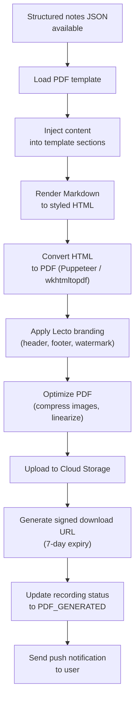

### 6.2 PDF Template Specification

#### Page Layout

| Property | Value |
|----------|-------|
| Page size | A4 (210mm × 297mm) |
| Margins | Top: 25mm, Bottom: 20mm, Left: 20mm, Right: 20mm |
| Header height | 15mm |
| Footer height | 10mm |
| Font (body) | Inter, 11pt |
| Font (headings) | Inter Bold, 14pt / 12pt |
| Font (code/formulas) | JetBrains Mono, 10pt |
| Line spacing | 1.5 |

#### Color Palette

| Element | Color | Hex |
|---------|-------|-----|
| Primary headings | Lecto Blue | `#2563EB` |
| Secondary headings | Dark Gray | `#1F2937` |
| Body text | Charcoal | `#374151` |
| Accent (key concepts) | Lecto Violet | `#7C3AED` |
| Warning / Deadline | Amber | `#D97706` |
| Background highlights | Light Blue | `#EFF6FF` |
| Divider lines | Light Gray | `#E5E7EB` |

#### Content Sections (in order)

```
┌─────────────────────────────────────────────┐
│  LECTO LOGO          Study Notes        📄  │  ← Header (every page)
├─────────────────────────────────────────────┤
│                                             │
│  📘 LECTURE OVERVIEW                        │  ← Title, subject, date,
│  Title: Second Law of Thermodynamics        │     duration, instructor,
│  Subject: Physics 201                       │     overview paragraph
│  Date: July 7, 2026                         │
│  Duration: 1:00:00                          │
│  Overview: This lecture introduced...       │
│                                             │
├─────────────────────────────────────────────┤
│                                             │
│  📋 TOPIC BREAKDOWN                         │  ← Timestamped topic list
│  [00:00] Recap of the First Law             │     with key points under
│  [02:15] The Second Law                     │     each topic
│  [05:30] Entropy                            │
│                                             │
├─────────────────────────────────────────────┤
│                                             │
│  💡 KEY CONCEPTS & DEFINITIONS              │  ← Term → definition
│  • Entropy: A thermodynamic state...        │     pairs with context
│  • Second Law: Heat cannot...               │
│                                             │
├─────────────────────────────────────────────┤
│                                             │
│  ⭐ IMPORTANT POINTS                        │  ← Highlighted bullets
│  • The second law governs DIRECTION...      │
│                                             │
├─────────────────────────────────────────────┤
│                                             │
│  📐 FORMULAS & EQUATIONS                    │  ← Rendered math with
│  dS = δQ_rev / T                            │     variable definitions
│                                             │
├─────────────────────────────────────────────┤
│                                             │
│  ❓ QUESTIONS DISCUSSED                      │  ← Q&A from lecture
│  Q: When you say "spontaneously"...         │
│  A: It means without external work...       │
│                                             │
├─────────────────────────────────────────────┤
│                                             │
│  📅 ASSIGNMENTS & DEADLINES                 │  ← Highlighted in amber
│  ⚠️ HW: Problems 7.1–7.5 — Due Jul 13     │     box for visibility
│  📖 READ: Chapter 8 — Before Jul 9          │
│  📝 QUIZ: Heat Engines — Jul 9              │
│                                             │
├─────────────────────────────────────────────┤
│                                             │
│  📝 SUMMARY                                 │  ← Full paragraph summary
│  This lecture introduced the second law...  │
│                                             │
├─────────────────────────────────────────────┤
│  Generated by Lecto • July 7, 2026 • p.X   │  ← Footer (every page)
└─────────────────────────────────────────────┘
```

### 6.3 Generation Timing

| Trigger | Behavior | User Control |
|---------|----------|--------------|
| **Automatic** (default) | PDF generated immediately after AI summary completes | User receives push notification when ready |
| **On-demand** | User taps "Generate PDF" in app | Generated in real-time; spinner shown (~10-30 s) |
| **Re-generate** | User edits transcript or requests re-summary | Old PDF replaced; new push notification |

### 6.4 Storage & Delivery

```json
{
  "pdf": {
    "cloudPath": "gs://lecto-pdfs/usr_5f8e/ses_20260707_143022/notes_v1.pdf",
    "fileSizeBytes": 204800,
    "pageCount": 4,
    "signedUrl": "https://storage.googleapis.com/lecto-pdfs/usr_5f8e/ses_.../notes_v1.pdf?X-Goog-Signature=...",
    "signedUrlExpiresAt": "2026-07-14T16:10:00.000Z",
    "version": 1,
    "generatedAt": "2026-07-07T16:10:00.000Z"
  },
  "notification": {
    "type": "PDF_READY",
    "title": "📄 Your study notes are ready!",
    "body": "Physics 201 — Second Law of Thermodynamics",
    "action": "OPEN_PDF",
    "payload": {
      "sessionId": "ses_20260707_143022_usr_5f8e",
      "pdfUrl": "lecto://recordings/ses_20260707_143022_usr_5f8e/pdf"
    }
  }
}
```

---

## 7. Data Lifecycle Management

### 7.1 Recording State Machine

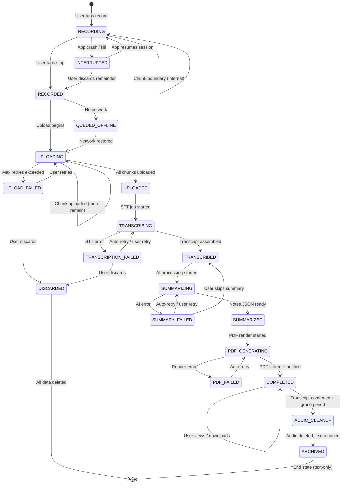

### 7.2 State × Data Location Matrix

| State | Device Audio | Device Metadata | Cloud Audio | Cloud Transcript | Cloud Notes | Cloud PDF |
|-------|:-----------:|:---------------:|:-----------:|:----------------:|:-----------:|:---------:|
| RECORDING | ✅ Writing | ✅ Writing | ❌ | ❌ | ❌ | ❌ |
| RECORDED | ✅ Complete | ✅ Complete | ❌ | ❌ | ❌ | ❌ |
| QUEUED_OFFLINE | ✅ Complete | ✅ Complete | ❌ | ❌ | ❌ | ❌ |
| UPLOADING | ✅ Complete | ✅ Complete | 🔄 Partial | ❌ | ❌ | ❌ |
| UPLOADED | ✅ Complete | ✅ Complete | ✅ Complete | ❌ | ❌ | ❌ |
| TRANSCRIBING | ✅ Complete | ✅ Complete | ✅ Complete | 🔄 Partial | ❌ | ❌ |
| TRANSCRIBED | ✅ Complete | ✅ Complete | ✅ Complete | ✅ Complete | ❌ | ❌ |
| SUMMARIZING | ✅ Complete | ✅ Complete | ✅ Complete | ✅ Complete | 🔄 Processing | ❌ |
| SUMMARIZED | ✅ Complete | ✅ Complete | ✅ Complete | ✅ Complete | ✅ Complete | ❌ |
| COMPLETED | ✅ Retained | ✅ Complete | ✅ Complete | ✅ Complete | ✅ Complete | ✅ Complete |
| AUDIO_CLEANUP | 🗑️ Deleting | ✅ Complete | 🗑️ Deleting | ✅ Complete | ✅ Complete | ✅ Complete |
| ARCHIVED | ❌ Deleted | ✅ Compact | ❌ Deleted | ✅ Complete | ✅ Complete | ✅ Complete |

### 7.3 Audio Retention Policy

> [!CAUTION]
> **Audio files are the irreplaceable primary asset** until the transcript is confirmed. Premature deletion means the lecture is permanently lost. The system MUST err on the side of retention.

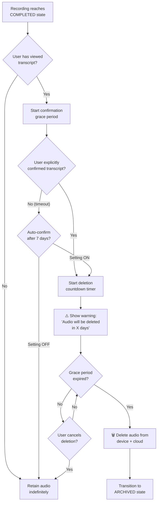

#### Configurable Settings

| Setting | Default | Range | Description |
|---------|---------|-------|-------------|
| Auto-confirm transcript | ON | ON/OFF | Auto-confirm if user doesn't act within 7 days |
| Auto-confirm delay | 7 days | 3–30 days | Days after COMPLETED before auto-confirmation |
| Deletion grace period | 7 days | 1–30 days | Days after confirmation before audio is deleted |
| Manual delete | Always available | — | User can delete audio at any time |
| Delete warning | 24 hours before | — | Push notification before scheduled deletion |

#### Deletion Safeguards

1. **No silent deletion** — user always receives a notification 24 hours before scheduled audio deletion.
2. **Undo window** — 24-hour undo period after deletion is initiated (soft-delete first, hard-delete after 24h).
3. **Quality gate** — if `quality_score < 0.70`, auto-confirm is disabled; user must manually confirm.
4. **Batch protection** — system never deletes more than 10 recordings' audio in a single batch (prevents runaway deletion bugs).

### 7.4 Storage Calculations

#### Per-Recording Estimates

| Data Type | 30-min Lecture | 1-hr Lecture | 2-hr Lecture |
|-----------|:--------------:|:------------:|:------------:|
| Audio (128 kbps AAC) | ~28.8 MB | ~57.6 MB | ~115.2 MB |
| Audio (64 kbps OPUS) | ~14.4 MB | ~28.8 MB | ~57.6 MB |
| Chunk metadata (JSON) | ~2 KB | ~4 KB | ~8 KB |
| Transcript (`main.md`) | ~10 KB | ~20 KB | ~40 KB |
| Structured notes (JSON) | ~25 KB | ~50 KB | ~100 KB |
| PDF file | ~100 KB | ~200 KB | ~400 KB |
| **Total with audio** | **~29 MB** | **~58 MB** | **~116 MB** |
| **Total without audio** | **~137 KB** | **~274 KB** | **~548 KB** |

#### Semester Projection

| Scenario | Calculation | Storage |
|----------|-------------|---------|
| **Typical semester** | 5 subjects × 3 lectures/week × 16 weeks = **240 recordings** | — |
| With audio (AAC 128k, 1 hr avg) | 240 × 57.6 MB | **~13.8 GB** |
| With audio (OPUS 64k, 1 hr avg) | 240 × 28.8 MB | **~6.9 GB** |
| After audio cleanup (text only) | 240 × 274 KB | **~64 MB** |
| **Storage savings after cleanup** | — | **99.5%** |

> [!IMPORTANT]
> Audio cleanup reduces semester storage from **~13.8 GB to ~64 MB** — a 99.5% reduction. This makes the retention→cleanup lifecycle critical for user experience on storage-constrained devices.

---

## 8. Offline Data Flow

### 8.1 Offline Flow Diagram

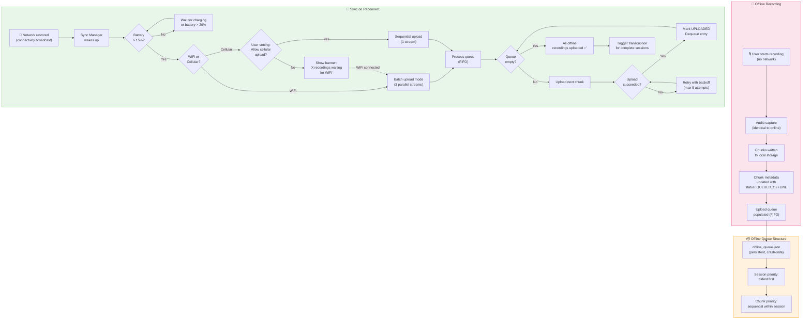

### 8.2 Local Queue Structure

```json
{
  "offlineQueue": {
    "version": 1,
    "lastUpdated": "2026-07-07T16:30:00.000Z",
    "totalPendingChunks": 12,
    "totalPendingSizeBytes": 172646400,
    "sessions": [
      {
        "sessionId": "ses_20260707_100015_usr_5f8e",
        "priority": 1,
        "recordedAt": "2026-07-07T10:00:15.000Z",
        "totalChunks": 4,
        "uploadedChunks": 0,
        "status": "QUEUED_OFFLINE",
        "chunks": [
          {
            "sequenceNumber": 1,
            "filePath": "/app_data/lecto/recordings/ses_.../chunk_001.m4a",
            "sizeBytes": 14417920,
            "sha256": "e3b0c44...",
            "status": "PENDING",
            "attempts": 0
          },
          {
            "sequenceNumber": 2,
            "filePath": "/app_data/lecto/recordings/ses_.../chunk_002.m4a",
            "sizeBytes": 14200832,
            "sha256": "a7c3f21...",
            "status": "PENDING",
            "attempts": 0
          }
        ]
      },
      {
        "sessionId": "ses_20260707_143022_usr_5f8e",
        "priority": 2,
        "recordedAt": "2026-07-07T14:30:22.000Z",
        "totalChunks": 4,
        "uploadedChunks": 0,
        "status": "QUEUED_OFFLINE",
        "chunks": [ "..." ]
      }
    ]
  }
}
```

### 8.3 Batch Processing Strategy

When multiple sessions are queued offline, the sync manager processes them as follows:

| Step | Action | Rationale |
|------|--------|-----------|
| 1 | Sort sessions by `recordedAt` (oldest first) | Oldest recordings have waited longest |
| 2 | For each session, upload chunks in sequence order | Server needs sequential chunks to detect completion |
| 3 | After uploading a session's final chunk, verify server confirms `allChunksReceived` | Triggers transcription pipeline |
| 4 | Move to next session | Don't block waiting for transcription |
| 5 | Report progress to user | "Uploading recording 2 of 5 — 45% complete" |

### 8.4 Sync Conflict Resolution

| Conflict | Detection | Resolution |
|----------|-----------|------------|
| Duplicate chunk upload (retry after ambiguous failure) | Server compares `sha256` hash of received vs stored | If hashes match → idempotent success; if different → reject with 409 |
| Session ID collision | UUID-based IDs; statistically impossible | Server returns 409; client generates new session ID |
| Chunk already transcribed (late arrival) | Server checks if session already in TRANSCRIBING+ state | Re-assemble transcript with new chunk; re-trigger downstream |
| Client clock drift | Server compares `createdAt` against `receivedAt` | Server normalizes timestamps; warns if drift > 5 minutes |

---

## 9. Error Recovery Matrix

### 9.1 Comprehensive Error Table

| Stage | What Can Fail | Detection Method | Recovery Strategy | Data Preservation | User Notification |
|-------|--------------|-------------------|-------------------|-------------------|-------------------|
| **Recording** | App crash / OOM kill | OS process death; app restart detection | Resume from last flushed chunk; recover partial chunk from disk buffer | ✅ Chunks flushed to disk every 5s; at most 5s of audio lost | "Recording was interrupted. We recovered X minutes of audio." |
| **Recording** | Storage full | `IOException` on file write | Pause recording; alert user; offer to free space or stop | ✅ All complete chunks preserved | "Storage full — recording paused. Free space to continue." |
| **Recording** | Microphone permission revoked | Permission check failure | Pause recording; request permission again | ✅ All data up to revocation preserved | "Microphone access lost. Please re-enable in Settings." |
| **Chunking** | Silence detector failure | Timeout on silence search window | Fall back to hard cut at exact time boundary | ✅ No data loss; chunk boundary may cut mid-word (overlap handles this) | None (transparent) |
| **Upload** | Network timeout | HTTP timeout / socket error | Retry with exponential backoff (5 attempts) | ✅ Audio remains on device | "Upload paused — will retry automatically." |
| **Upload** | Server 5xx error | HTTP 500/502/503 response | Retry with exponential backoff | ✅ Audio remains on device | None for first 3 retries; then "Having trouble uploading." |
| **Upload** | Checksum mismatch | Server rejects with 422 | Re-read file from disk; re-compute checksum; re-upload | ✅ Audio remains on device | None (transparent retry) |
| **Upload** | Chunk file corrupted on disk | SHA256 mismatch on read | Attempt recovery from OS file system journal; if impossible, mark chunk as CORRUPTED | ⚠️ Corrupted chunk may be unrecoverable | "Part of your recording may be damaged. Transcript may have a gap." |
| **Transcription** | STT API error (5xx) | HTTP error response | Retry up to 3 times; switch to fallback provider (Deepgram) | ✅ Audio preserved in cloud | None for auto-retries; "Transcription delayed" after 3 failures |
| **Transcription** | STT returns empty result | Empty transcript for a chunk | Check audio file; if valid, retry with different model/config | ✅ Audio preserved | "Part of the transcript couldn't be generated." |
| **Transcription** | Low confidence transcript | `quality_score < 0.60` | Flag for user review; offer re-transcription with different settings | ✅ Audio preserved; transcript marked as low-quality | "This transcript may contain errors — please review." |
| **Assembly** | Overlap alignment failure | LCS returns no match | Hard cut at chunk boundary timestamp | ✅ All chunk transcripts preserved | None (may result in minor word duplication at boundary) |
| **Assembly** | Missing chunk transcript | Expected chunk not in DB | Wait up to 30 minutes; then re-trigger STT for missing chunk | ✅ Audio preserved; other chunk transcripts preserved | "Processing is taking longer than expected." |
| **AI Summary** | Gemini API error | HTTP error / timeout | Retry up to 3 times; on persistent failure, offer transcript-only mode | ✅ Transcript fully preserved | "Summary generation delayed — you can still view the transcript." |
| **AI Summary** | Invalid JSON response | JSON parse failure | Retry with lower temperature (0.1) and explicit format instructions | ✅ Transcript preserved | None (transparent retry) |
| **AI Summary** | Token limit exceeded | `finishReason: "MAX_TOKENS"` | Switch to hierarchical summarization mode | ✅ Transcript preserved | None (transparent fallback) |
| **PDF Generation** | Render failure | Exception in PDF engine | Retry; if persistent, generate simplified text-only PDF | ✅ Notes JSON preserved | "PDF generation encountered an issue — simplified version created." |
| **PDF Generation** | Cloud upload failure | GCS upload error | Retry upload; generate locally on device as fallback | ✅ PDF file preserved locally | "PDF saved to your device." |
| **Deletion** | Premature audio deletion bug | Audit log mismatch | 24-hour soft-delete window; recover from soft-delete | ⚠️ Recoverable within 24h | "Deletion undone — audio recovered." |

### 9.2 State Transition Diagram with Error States

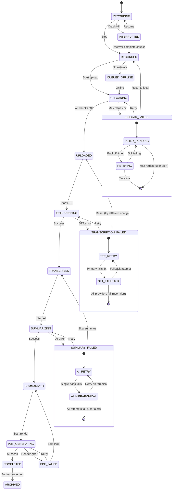

### 9.3 Recovery Guarantees by Stage

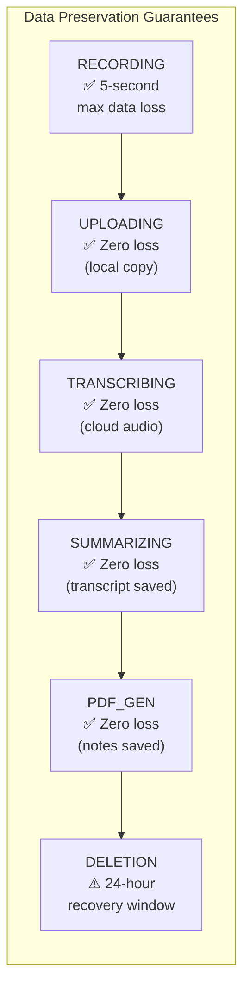

---

## 10. Performance Considerations

### 10.1 Expected Processing Times

| Stage | Typical Duration | Depends On | Optimistic | Pessimistic |
|-------|:----------------:|------------|:----------:|:-----------:|
| **Recording** | Real-time | Lecture length | — | — |
| **Chunking** | < 50 ms per cut | Silence detection window | 10 ms | 200 ms |
| **Upload (1 chunk, WiFi)** | 3-8 s | Chunk size (14 MB avg), bandwidth | 2 s | 30 s |
| **Upload (1 chunk, cellular)** | 15-45 s | Chunk size, cellular quality | 8 s | 120 s |
| **Upload (full 1-hr session, WiFi)** | 15-30 s | 4 chunks × parallel upload | 8 s | 60 s |
| **STT (1 chunk, 15 min)** | 7-15 s | Audio complexity, provider load | 3 s | 30 s |
| **STT (full 1-hr session)** | 15-45 s | 4 chunks processed in parallel | 10 s | 90 s |
| **Transcript assembly** | < 2 s | Number of chunks, overlap processing | 0.5 s | 5 s |
| **AI summarization (1-hr)** | 10-25 s | Transcript length, Gemini load | 5 s | 60 s |
| **PDF generation** | 3-8 s | Notes complexity, page count | 2 s | 15 s |
| **Total (button-press to PDF)** | **~2-5 min** after recording ends | All above factors | ~1 min | ~10 min |

### 10.2 Parallel Processing Opportunities

```mermaid
gantt
    title Processing Timeline for 1-Hour Lecture (4 chunks)
    dateFormat X
    axisFormat %s

    section Upload
    Chunk 1 Upload     :u1, 0, 8
    Chunk 2 Upload     :u2, 0, 8
    Chunk 3 Upload     :u3, 0, 8
    Chunk 4 Upload     :u4, 0, 8

    section Transcription
    Chunk 1 STT        :t1, after u1, 12
    Chunk 2 STT        :t2, after u2, 12
    Chunk 3 STT        :t3, after u3, 12
    Chunk 4 STT        :t4, after u4, 12

    section Assembly
    Merge Transcripts  :a1, after t1 t2 t3 t4, 2

    section AI Processing
    Gemini Summary     :ai1, after a1, 20

    section PDF
    Generate PDF       :pdf1, after ai1, 5
    Push Notification  :milestone, after pdf1, 0
```

> [!TIP]
> **Key parallelism opportunities**:
> 1. All 4 chunks upload simultaneously on WiFi (3 parallel + 1 queued).
> 2. All 4 chunks transcribe simultaneously (server-side parallel STT jobs).
> 3. Assembly must wait for all chunks but is fast (< 2s).
> 4. AI summarization and PDF generation are sequential but each is a single fast operation.

### 10.3 Caching Strategy

| Cache | Location | TTL | Purpose |
|-------|----------|-----|---------|
| **Transcript cache** | Device SQLite | Until ARCHIVED | Avoid re-downloading transcript for in-app viewing |
| **Notes JSON cache** | Device SQLite | Until ARCHIVED | Avoid re-downloading notes for in-app viewing |
| **PDF cache** | Device file system | 30 days | Offline PDF access without re-download |
| **STT result cache** | Backend Redis | 24 hours | Avoid re-transcribing same chunk on retry |
| **Gemini response cache** | Backend Redis | 24 hours | Avoid re-processing same transcript on retry |
| **Signed URL cache** | Device memory | Until expiry - 1 hour | Avoid re-generating signed URLs on each access |

### 10.4 Resource Consumption Estimates

#### Client (Mobile Device)

| Resource | During Recording | During Upload | Idle (Background) |
|----------|:----------------:|:-------------:|:------------------:|
| **CPU** | 8-15% (encoding + silence detection) | 3-5% (network I/O) | < 1% |
| **Memory** | 25-40 MB (buffers + encoder) | 10-15 MB (upload buffers) | 5-8 MB (service) |
| **Battery drain** | ~5-8% per hour (mic + CPU) | ~2-3% per upload session | Negligible |
| **Disk I/O** | ~128 KBps write (AAC stream) | ~1 MBps read (upload) | None |
| **Network** | None | 1-5 Mbps upload | None |

#### Server (Per Recording Session)

| Resource | During Upload | During STT | During AI | During PDF |
|----------|:------------:|:----------:|:---------:|:----------:|
| **CPU** | Minimal (storage proxy) | Delegated to STT API | Delegated to Gemini API | Medium (PDF render) |
| **Memory** | 50 MB (stream buffer) | 20 MB (result processing) | 100 MB (prompt assembly) | 200 MB (PDF engine) |
| **Network (egress)** | Minimal | To STT API | To Gemini API | PDF upload to GCS |
| **Cost estimate** | ~$0.001 | ~$0.96 (1hr × $0.016/min) | ~$0.02 (Gemini Flash) | ~$0.001 |
| **Total per 1-hr lecture** | — | — | — | **~$0.98** |

#### Cost Projection (Semester)

| Item | Per Lecture | Per Semester (240 lectures) |
|------|:----------:|:---------------------------:|
| Cloud Storage (audio, 30-day retention) | $0.0015 | $0.36 |
| Cloud Storage (text, permanent) | $0.000007 | $0.002 |
| Speech-to-Text (1 hr) | $0.96 | $230.40 |
| Gemini AI (summary) | $0.02 | $4.80 |
| PDF Generation (compute) | $0.001 | $0.24 |
| Push Notifications | $0.0001 | $0.024 |
| **Total** | **~$0.98** | **~$235.83** |

> [!NOTE]
> The dominant cost is Speech-to-Text (~98% of total). Consider offering a "Transcript-only" tier at full price and a "Notes + PDF" tier at a premium, or explore self-hosted Whisper to reduce STT costs for high-volume users.

### 10.5 Optimization Strategies

| Strategy | Impact | Complexity | Priority |
|----------|--------|:----------:|:--------:|
| **OPUS encoding** instead of AAC | 50% audio size reduction → faster uploads | Low | 🔴 High |
| **Parallel chunk STT** (server-side) | 4× faster transcription | Medium | 🔴 High |
| **Stream upload during recording** | Zero wait after recording stops | High | 🟡 Medium |
| **On-device Whisper** (future) | Eliminate STT API cost entirely | Very High | 🟢 Low (future) |
| **Transcript caching** on device | Instant re-access; no re-download | Low | 🔴 High |
| **Incremental PDF updates** | Avoid full re-render for minor edits | Medium | 🟢 Low |
| **Smart silence detection** (ML-based) | Better chunk boundaries → fewer overlap issues | High | 🟡 Medium |
| **Batch Gemini calls** for multiple recordings | Amortize API overhead | Medium | 🟡 Medium |

---

## Appendix A: Glossary

| Term | Definition |
|------|------------|
| **Chunk** | A segment of audio from a recording session, typically 10-20 minutes long |
| **Session** | A complete recording from start to stop, comprising one or more chunks |
| **main.md** | The assembled full transcript in Markdown format |
| **Structured Notes** | The JSON output from Gemini containing organized lecture information |
| **Overlap Buffer** | 2-second audio overlap between adjacent chunks to prevent word-cut artifacts |
| **Quality Score** | Composite metric (0.0–1.0) indicating transcript reliability |
| **Grace Period** | Configurable delay between transcript confirmation and audio deletion |
| **Hierarchical Summarization** | Multi-pass AI strategy for transcripts exceeding practical single-pass quality |
| **tus** | Open protocol for resumable file uploads (https://tus.io) |

## Appendix B: File Format Quick Reference

| File | Format | Location | Example Path |
|------|--------|----------|-------------|
| Audio chunk | `.m4a` / `.ogg` | Device + Cloud | `chunk_001.m4a` |
| Chunk metadata | `.meta.json` | Device | `chunk_001.meta.json` |
| Session metadata | `.json` | Device + Backend DB | `session_meta.json` |
| Upload queue | `.json` | Device | `upload_queue.json` |
| Offline queue | `.json` | Device | `offline_queue.json` |
| Full transcript | `.md` | Cloud Storage + Device cache | `main.md` |
| Structured notes | `.json` | Backend DB + Device cache | `notes_v1.json` |
| Study notes PDF | `.pdf` | Cloud Storage + Device cache | `notes_v1.pdf` |

---

*Document generated for the Lecto project — Audio → Notes pipeline specification.*
