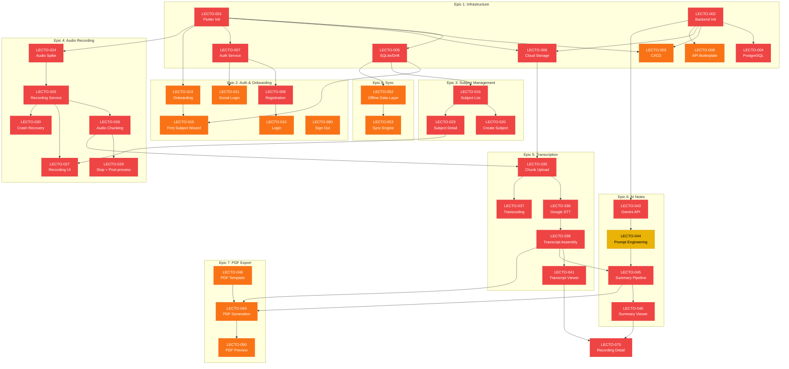

# 🎫 Lecto V1 — Feature Ticket List

> **Document Version**: 1.0  
> **Last Updated**: 2026-07-07  
> **Total Tickets**: 80  
> **Estimated Timeline**: 10 Sprints (20 weeks)  
> **Target Platform**: Flutter (iOS + Android)

---

## Table of Contents

- [Overview & Legend](#overview--legend)
- [Epic 1: Project Setup & Infrastructure](#epic-1-project-setup--infrastructure)
- [Epic 2: Authentication & Onboarding](#epic-2-authentication--onboarding)
- [Epic 3: Subject/Folder Management](#epic-3-subjectfolder-management)
- [Epic 4: Audio Recording Engine](#epic-4-audio-recording-engine)
- [Epic 5: Transcript Generation Pipeline](#epic-5-transcript-generation-pipeline)
- [Epic 6: AI Summary & Notes Generation](#epic-6-ai-summary--notes-generation)
- [Epic 7: PDF Generation & Export](#epic-7-pdf-generation--export)
- [Epic 8: Data Management & Sync](#epic-8-data-management--sync)
- [Epic 9: Error Handling & Resilience](#epic-9-error-handling--resilience)
- [Epic 10: Settings & Polish](#epic-10-settings--polish)
- [Sprint Planning Suggestion](#sprint-planning-suggestion)
- [Dependency Graph](#dependency-graph)

---

## Overview & Legend

### Priority

| Symbol | Level | Meaning |
|--------|-------|---------|
| 🔴 | **P0 — Critical** | Must ship in V1. Blocks other work or is a core differentiator. |
| 🟠 | **P1 — High** | Expected in V1. Significant user-facing value. |
| 🟡 | **P2 — Medium** | Nice-to-have for V1. Can slip to V1.1 if timeline is tight. |
| 🟢 | **P3 — Low** | Polish or enhancement. Can be deferred post-launch. |

### Effort

| Size | Time | Description |
|------|------|-------------|
| **S** | 1–2 days | Small, well-scoped task with known implementation path |
| **M** | 3–5 days | Medium complexity, may involve multiple files/layers |
| **L** | 1–2 weeks | Large feature, cross-cutting or requiring research |
| **XL** | 2+ weeks | Epic-level effort, consider breaking down further |

### Type

| Type | Description |
|------|-------------|
| **Feature** | User-facing functionality |
| **Task** | Technical/infrastructure work not directly visible to users |
| **Spike** | Research or proof-of-concept investigation |
| **Bug** | Fix for known issue *(reserved for future use)* |

---

## Epic 1: Project Setup & Infrastructure

> **Goal**: Establish the foundational project structure, CI/CD, databases, and service scaffolding so all subsequent epics can build on a solid base.

---

### LECTO-001 — Initialize Flutter Project with Architecture Scaffold

| Field | Value |
|-------|-------|
| **Epic** | Project Setup & Infrastructure |
| **Type** | Task |
| **Priority** | 🔴 P0 — Critical |
| **Effort** | M (3–5 days) |

**Description**  
Create the Flutter project using a clean architecture pattern (feature-first folder structure). Set up state management (Riverpod), routing (GoRouter), DI container, and base theme. Configure platform-specific settings for iOS (min iOS 15) and Android (min SDK 26). Include linter rules, analysis options, and code generation setup (build_runner, Freezed).

**Acceptance Criteria**
- [ ] Flutter project builds and runs on both iOS simulator and Android emulator
- [ ] Folder structure follows feature-first clean architecture (`features/`, `core/`, `shared/`)
- [ ] Riverpod configured with `ProviderScope` at root
- [ ] GoRouter configured with initial `/splash` route
- [ ] `analysis_options.yaml` with strict lint rules
- [ ] Freezed + json_serializable configured and generating
- [ ] README with setup instructions committed

**Dependencies**: None  

**Technical Notes**  
- Use `flutter create --org com.lectoapp lecto`  
- Target Flutter 3.24+ / Dart 3.5+  
- Include `.vscode/launch.json` with debug configurations  
- Set up flavors: `dev`, `staging`, `prod`

---

### LECTO-002 — Initialize Backend API Project (Node.js / Express)

| Field | Value |
|-------|-------|
| **Epic** | Project Setup & Infrastructure |
| **Type** | Task |
| **Priority** | 🔴 P0 — Critical |
| **Effort** | M (3–5 days) |

**Description**  
Set up the backend API using Node.js with Express (or Fastify). Include TypeScript, ESLint, Prettier, environment configuration, request validation (Zod), structured logging (Pino), and a health-check endpoint. Use a layered architecture: `routes → controllers → services → repositories`.

**Acceptance Criteria**
- [ ] `GET /health` returns `200 OK` with version info
- [ ] TypeScript compiles without errors
- [ ] ESLint + Prettier configured and passing
- [ ] Environment variables loaded via `.env` with validation
- [ ] Structured JSON logging on all requests
- [ ] Docker Compose file for local development
- [ ] API docs stub via Swagger/OpenAPI

**Dependencies**: None  

**Technical Notes**  
- Consider Fastify for better performance characteristics  
- Use `tsconfig` path aliases (`@/services`, `@/repositories`)  
- Include rate limiting middleware from day one

---

### LECTO-003 — Set Up CI/CD Pipeline (GitHub Actions)

| Field | Value |
|-------|-------|
| **Epic** | Project Setup & Infrastructure |
| **Type** | Task |
| **Priority** | 🟠 P1 — High |
| **Effort** | M (3–5 days) |

**Description**  
Configure GitHub Actions workflows for: (1) Flutter — lint, test, build APK/IPA on PR; (2) Backend — lint, test, build Docker image on PR; (3) Auto-deploy staging on merge to `develop`; (4) Auto-deploy production on merge to `main` (with manual approval gate).

**Acceptance Criteria**
- [ ] PR to `develop` triggers Flutter lint + test + build
- [ ] PR to `develop` triggers backend lint + test
- [ ] Merge to `develop` deploys backend to staging
- [ ] Merge to `main` requires manual approval, then deploys to production
- [ ] Build status badges in repo README
- [ ] Secrets stored in GitHub Actions secrets (not committed)

**Dependencies**: `LECTO-001`, `LECTO-002`  

**Technical Notes**  
- Use GitHub Actions matrix to test on multiple Flutter versions  
- Cache Pub dependencies and Gradle/CocoaPods for faster builds  
- Consider Fastlane for iOS signing and distribution

---

### LECTO-004 — Set Up PostgreSQL Database with Migrations

| Field | Value |
|-------|-------|
| **Epic** | Project Setup & Infrastructure |
| **Type** | Task |
| **Priority** | 🔴 P0 — Critical |
| **Effort** | M (3–5 days) |

**Description**  
Provision PostgreSQL (managed, e.g., Supabase or Cloud SQL). Design the initial schema covering: `users`, `subjects`, `recordings`, `audio_chunks`, `transcripts`, `summaries`. Set up a migration tool (Prisma or Knex) with an initial migration. Include seed data for development.

**Acceptance Criteria**
- [ ] PostgreSQL instance running (local via Docker, remote via managed service)
- [ ] Initial migration creates all core tables with indexes and constraints
- [ ] Foreign key relationships enforced at DB level
- [ ] Seed script creates test user with sample data
- [ ] Migration can be run and rolled back cleanly
- [ ] Connection pooling configured (PgBouncer or built-in)
- [ ] Schema diagram generated and committed to `docs-and-assets/`

**Dependencies**: `LECTO-002`  

**Technical Notes**  
- Use UUIDs for primary keys  
- Add `created_at`, `updated_at`, `deleted_at` (soft delete) to all tables  
- Consider partitioning `audio_chunks` table if volume is high  
- Enable `pgcrypto` extension for UUID generation

---

### LECTO-005 — Set Up SQLite Local Database (Drift)

| Field | Value |
|-------|-------|
| **Epic** | Project Setup & Infrastructure |
| **Type** | Task |
| **Priority** | 🔴 P0 — Critical |
| **Effort** | M (3–5 days) |

**Description**  
Implement the local SQLite database using Drift (formerly Moor) in Flutter. Mirror the core server tables locally for offline-first operation. Include DAOs for each entity, type converters for enums/dates, and a migration strategy for future schema changes.

**Acceptance Criteria**
- [ ] Drift database class with all core tables defined
- [ ] DAOs for `subjects`, `recordings`, `audio_chunks`, `transcripts`, `summaries`
- [ ] Type converters for `DateTime`, custom enums
- [ ] Database opens without errors on fresh install
- [ ] Migration strategy scaffolded (version 1 → 2 path ready)
- [ ] Unit tests for basic CRUD on each DAO
- [ ] Database inspector works in Flutter DevTools

**Dependencies**: `LECTO-001`  

**Technical Notes**  
- Store DB file in app documents directory  
- Add a `sync_status` column to each table (`pending`, `synced`, `conflict`)  
- Use Drift's `@UseRowClass` for type-safe models  
- Consider WAL mode for better concurrent read performance

---

### LECTO-006 — Set Up Cloud Storage (Firebase Storage / S3)

| Field | Value |
|-------|-------|
| **Epic** | Project Setup & Infrastructure |
| **Type** | Task |
| **Priority** | 🔴 P0 — Critical |
| **Effort** | S (1–2 days) |

**Description**  
Configure cloud object storage for audio file uploads. Set up bucket(s) with appropriate folder structure (`users/{uid}/recordings/{recordingId}/chunks/`), security rules (authenticated users can only access their own files), and lifecycle policies (auto-delete raw audio after 30 days post-transcript-confirmation).

**Acceptance Criteria**
- [ ] Storage bucket created with security rules
- [ ] Authenticated users can upload to their own path only
- [ ] Lifecycle rule deletes audio chunks older than 30 days (after transcript confirmed)
- [ ] Max file size enforced (50 MB per chunk)
- [ ] CORS configured for backend access
- [ ] Storage SDK integrated in Flutter app

**Dependencies**: `LECTO-001`, `LECTO-002`  

**Technical Notes**  
- Firebase Storage is simpler for Flutter integration; S3 gives more control  
- Use signed URLs for direct client upload to reduce backend bandwidth  
- Consider CDN for PDF downloads

---

### LECTO-007 — Set Up Authentication Service (Firebase Auth)

| Field | Value |
|-------|-------|
| **Epic** | Project Setup & Infrastructure |
| **Type** | Task |
| **Priority** | 🔴 P0 — Critical |
| **Effort** | M (3–5 days) |

**Description**  
Integrate Firebase Authentication for email/password and OAuth providers. Configure Firebase project, add platform-specific config files (`google-services.json`, `GoogleService-Info.plist`). Set up JWT verification middleware on the backend to validate Firebase ID tokens on every authenticated request.

**Acceptance Criteria**
- [ ] Firebase project created with Auth enabled
- [ ] Email/password provider enabled
- [ ] Google Sign-In provider enabled
- [ ] Apple Sign-In provider enabled (iOS)
- [ ] Firebase config files added to Flutter project (all flavors)
- [ ] Backend middleware validates Firebase ID token and extracts `uid`
- [ ] Unauthorized requests return `401` with descriptive error

**Dependencies**: `LECTO-001`, `LECTO-002`  

**Technical Notes**  
- Apple Sign-In is required by App Store if any social login is offered  
- Use `firebase_auth` and `google_sign_in` Flutter packages  
- Backend should cache public keys for JWT verification  
- Consider custom claims for future role-based access

---

### LECTO-008 — API Boilerplate: Error Handling, Pagination, Versioning

| Field | Value |
|-------|-------|
| **Epic** | Project Setup & Infrastructure |
| **Type** | Task |
| **Priority** | 🟠 P1 — High |
| **Effort** | S (1–2 days) |

**Description**  
Implement cross-cutting API concerns: global error handler with consistent error response format, cursor-based pagination helper, API versioning (`/api/v1/`), request ID tracing, and CORS configuration. All future endpoints should use these patterns.

**Acceptance Criteria**
- [ ] Global error handler catches all unhandled errors and returns structured JSON
- [ ] Error response format: `{ error: { code, message, details?, requestId } }`
- [ ] Cursor-based pagination utility with `limit`, `cursor`, `hasMore` pattern
- [ ] All routes prefixed with `/api/v1/`
- [ ] Request ID (`X-Request-Id`) generated and logged for every request
- [ ] CORS allows Flutter app origins

**Dependencies**: `LECTO-002`  

**Technical Notes**  
- Use a custom `AppError` class hierarchy (`NotFoundError`, `ValidationError`, `AuthError`)  
- Pagination cursors should be opaque (base64-encoded composite keys)  
- Include request duration logging for performance monitoring

---

## Epic 2: Authentication & Onboarding

> **Goal**: Allow users to create accounts, sign in, and experience a smooth first-launch journey that guides them to record their first lecture.

---

### LECTO-009 — User Registration Screen (Email/Password)

| Field | Value |
|-------|-------|
| **Epic** | Authentication & Onboarding |
| **Type** | Feature |
| **Priority** | 🔴 P0 — Critical |
| **Effort** | M (3–5 days) |

**Description**  
Build the registration screen with email and password fields. Include real-time validation (email format, password strength ≥ 8 chars with mixed case + number), loading state, error display, and link to the login screen. On success, create a corresponding user record in the backend database.

**Acceptance Criteria**
- [ ] Email field with real-time format validation
- [ ] Password field with strength indicator (weak / medium / strong)
- [ ] Confirm password field with match validation
- [ ] "Create Account" button disabled until form is valid
- [ ] Loading spinner during registration
- [ ] Error messages displayed inline (e.g., "Email already in use")
- [ ] Successful registration creates Firebase user + backend user record
- [ ] User is navigated to onboarding flow after registration

**Dependencies**: `LECTO-007`  

**Technical Notes**  
- Use `TextFormField` with `AutovalidateMode.onUserInteraction`  
- Debounce email availability check (500ms)  
- Send email verification link (non-blocking, user can proceed)

---

### LECTO-010 — User Login Screen (Email/Password)

| Field | Value |
|-------|-------|
| **Epic** | Authentication & Onboarding |
| **Type** | Feature |
| **Priority** | 🔴 P0 — Critical |
| **Effort** | S (1–2 days) |

**Description**  
Build the login screen with email and password fields. Include "Forgot Password" link, "Create Account" navigation, and a "Remember Me" toggle (persist auth state). Handle error cases: wrong password, no account found, too many attempts.

**Acceptance Criteria**
- [ ] Email and password fields with basic validation
- [ ] "Log In" button with loading state
- [ ] Error messages for invalid credentials, user not found, too many attempts
- [ ] "Forgot Password" link navigates to password reset flow
- [ ] "Create Account" link navigates to registration screen
- [ ] Successful login navigates to home screen (or onboarding if first login)
- [ ] Auth state persisted across app restarts

**Dependencies**: `LECTO-007`, `LECTO-009`  

**Technical Notes**  
- Firebase Auth persists sessions by default  
- Use `authStateChanges()` stream to reactively navigate  
- Rate-limit login attempts client-side (disable button for 30s after 5 fails)

---

### LECTO-011 — Social Login (Google & Apple Sign-In)

| Field | Value |
|-------|-------|
| **Epic** | Authentication & Onboarding |
| **Type** | Feature |
| **Priority** | 🟠 P1 — High |
| **Effort** | M (3–5 days) |

**Description**  
Add "Continue with Google" and "Sign in with Apple" buttons to both login and registration screens. Handle account linking if a user registers with email then later signs in with Google (same email). Apple Sign-In must be present if Google Sign-In is offered (App Store requirement).

**Acceptance Criteria**
- [ ] "Continue with Google" button triggers Google OAuth flow
- [ ] "Sign in with Apple" button triggers Apple Sign-In flow (iOS only, hidden on Android)
- [ ] Successful social login creates/links backend user record
- [ ] If email already exists with different provider, prompt to link accounts
- [ ] User photo and display name extracted from social profile
- [ ] Loading states during OAuth flow
- [ ] Graceful handling when user cancels OAuth

**Dependencies**: `LECTO-007`, `LECTO-009`  

**Technical Notes**  
- Apple Sign-In on Android can be done via web redirect but is optional  
- `google_sign_in` requires SHA-1 fingerprint in Firebase console  
- Apple may return a "private relay" email; handle gracefully  
- Store `authProvider` type on user record for analytics

---

### LECTO-012 — Forgot Password / Password Reset Flow

| Field | Value |
|-------|-------|
| **Epic** | Authentication & Onboarding |
| **Type** | Feature |
| **Priority** | 🟡 P2 — Medium |
| **Effort** | S (1–2 days) |

**Description**  
Implement the forgot password flow. User enters their email, receives a reset link via Firebase, and can set a new password. Include confirmation screen and error handling for non-existent emails.

**Acceptance Criteria**
- [ ] Email input screen with validation
- [ ] "Send Reset Link" button with loading state
- [ ] Success confirmation screen with "Back to Login" button
- [ ] Error handling for unregistered email (show generic message for security)
- [ ] Firebase password reset email sent successfully

**Dependencies**: `LECTO-007`  

**Technical Notes**  
- Use `sendPasswordResetEmail()` from Firebase Auth  
- Show generic "If an account exists, we've sent a reset link" for security  
- Customize Firebase email template with Lecto branding

---

### LECTO-013 — Onboarding Welcome Screens (3-Screen Carousel)

| Field | Value |
|-------|-------|
| **Epic** | Authentication & Onboarding |
| **Type** | Feature |
| **Priority** | 🟠 P1 — High |
| **Effort** | M (3–5 days) |

**Description**  
Create a 3-screen onboarding carousel shown once after first registration. Screens: (1) "Record Your Lectures" — illustration of recording in class; (2) "Auto-Generate Transcripts" — illustration of text appearing; (3) "Smart Study Notes" — illustration of AI-generated notes. Include skip button, progress dots, and "Get Started" CTA on the last screen.

**Acceptance Criteria**
- [ ] 3 swipeable onboarding pages with illustrations and copy
- [ ] Smooth page transition animations
- [ ] Progress dots at the bottom of the screen
- [ ] "Skip" button on first two screens
- [ ] "Get Started" button on third screen
- [ ] Onboarding shown only once (flag stored locally)
- [ ] Navigates to first-subject creation wizard on completion

**Dependencies**: `LECTO-001`  

**Technical Notes**  
- Use `PageView` with `PageController`  
- Store `hasSeenOnboarding` in `SharedPreferences`  
- Use Lottie or Rive for illustrations if budget allows, otherwise static SVGs  
- Keep copy concise — max 2 lines per screen

---

### LECTO-014 — Profile Setup Screen

| Field | Value |
|-------|-------|
| **Epic** | Authentication & Onboarding |
| **Type** | Feature |
| **Priority** | 🟡 P2 — Medium |
| **Effort** | S (1–2 days) |

**Description**  
Allow users to set their display name and optionally upload a profile picture after registration. Pre-fill from social login data if available. Include an institution/university field (optional, free text) for future features.

**Acceptance Criteria**
- [ ] Display name field (required, pre-filled from social login)
- [ ] Profile picture picker (camera or gallery)
- [ ] Profile picture cropped to circle and uploaded to cloud storage
- [ ] Institution field (optional, free text with autocomplete suggestions)
- [ ] "Continue" button saves profile and navigates forward
- [ ] "Skip for Now" option available

**Dependencies**: `LECTO-009`, `LECTO-006`  

**Technical Notes**  
- Use `image_picker` and `image_cropper` packages  
- Compress image to max 500x500 and < 200KB before upload  
- Store profile picture URL on user record

---

### LECTO-015 — First-Subject Creation Wizard

| Field | Value |
|-------|-------|
| **Epic** | Authentication & Onboarding |
| **Type** | Feature |
| **Priority** | 🟠 P1 — High |
| **Effort** | S (1–2 days) |

**Description**  
Guide new users to create their first subject/folder immediately after onboarding. Present a simple, focused UI: subject name, color picker, optional icon. This reduces the "blank slate" problem and teaches the organizational model. On completion, navigate to the home screen with the new subject visible.

**Acceptance Criteria**
- [ ] Subject name field with validation (1–50 chars)
- [ ] Color picker with 12 preset color options
- [ ] Optional icon selector (from predefined set)
- [ ] "Create Subject" button creates the subject locally and syncs
- [ ] Subject visible on home screen immediately after creation
- [ ] Can be skipped (but with friendly nudge)

**Dependencies**: `LECTO-005`, `LECTO-013`  

**Technical Notes**  
- Reuse the same subject creation logic as `LECTO-020`  
- This is a stripped-down version of the full creation dialog  
- Consider showing a tooltip: "Tap the record button inside a subject to start!"

---

## Epic 3: Subject/Folder Management

> **Goal**: Let users organize their recordings by subject, course, or custom folder with full CRUD operations and intuitive UI.

---

### LECTO-016 — Subject List Screen (Home Screen)

| Field | Value |
|-------|-------|
| **Epic** | Subject/Folder Management |
| **Type** | Feature |
| **Priority** | 🔴 P0 — Critical |
| **Effort** | M (3–5 days) |

**Description**  
Build the main home screen displaying all subjects in a grid layout (2 columns). Each subject card shows: name, color accent, icon, recording count, and last activity date. Include an empty state with CTA to create first subject. Add a FAB for creating new subjects.

**Acceptance Criteria**
- [ ] Grid layout (2 columns) with subject cards
- [ ] Each card shows: name, color bar, icon, recording count, last activity
- [ ] Empty state with illustration and "Create Your First Subject" CTA
- [ ] FAB (`+`) to create new subject
- [ ] Tapping a card navigates to subject detail screen
- [ ] Long-press shows context menu (edit, delete)
- [ ] Pull-to-refresh triggers sync
- [ ] Smooth loading skeleton while data loads

**Dependencies**: `LECTO-005`, `LECTO-001`  

**Technical Notes**  
- Use `SliverGrid` inside a `CustomScrollView` for better performance  
- Wrap with `RefreshIndicator` for pull-to-refresh  
- Load from local DB first, then sync in background  
- Show `Shimmer` loading effect on first load

---

### LECTO-017 — Toggle Grid/List View for Subjects

| Field | Value |
|-------|-------|
| **Epic** | Subject/Folder Management |
| **Type** | Feature |
| **Priority** | 🟢 P3 — Low |
| **Effort** | S (1–2 days) |

**Description**  
Add a toggle button in the app bar to switch between grid view and list view for subjects. Persist the user's preference. List view shows more detail per row (name, description, recording count, total duration, last recorded date).

**Acceptance Criteria**
- [ ] Toggle icon in app bar (grid ↔ list)
- [ ] Grid view: 2-column card layout (default)
- [ ] List view: single-column detailed rows
- [ ] View preference persisted across sessions
- [ ] Smooth transition animation between views

**Dependencies**: `LECTO-016`  

**Technical Notes**  
- Store preference in `SharedPreferences`  
- Use `AnimatedSwitcher` for smooth transition  
- List view should show truncated description if available

---

### LECTO-018 — Sort & Filter Subjects

| Field | Value |
|-------|-------|
| **Epic** | Subject/Folder Management |
| **Type** | Feature |
| **Priority** | 🟡 P2 — Medium |
| **Effort** | S (1–2 days) |

**Description**  
Add sort and filter controls to the subject list. Sort by: name (A–Z, Z–A), last recorded, date created, recording count. Filter by: color (multi-select). Persist the last used sort option.

**Acceptance Criteria**
- [ ] Sort dropdown/bottom sheet with options: Name A–Z, Name Z–A, Last Recorded, Date Created, Recording Count
- [ ] Filter by color (multi-select chips)
- [ ] Active sort/filter indicated visually
- [ ] Sort preference persisted
- [ ] Results update immediately on selection

**Dependencies**: `LECTO-016`  

**Technical Notes**  
- Sort/filter logic should operate on the local Drift query, not in-memory  
- Use a `BottomSheet` for the sort/filter UI on mobile

---

### LECTO-019 — Search Subjects

| Field | Value |
|-------|-------|
| **Epic** | Subject/Folder Management |
| **Type** | Feature |
| **Priority** | 🟡 P2 — Medium |
| **Effort** | S (1–2 days) |

**Description**  
Add a search bar to the home screen to quickly find subjects by name. Search should be instant (local, debounced 300ms). Show matching results as the user types, with highlighted match text.

**Acceptance Criteria**
- [ ] Search icon in app bar expands to search field
- [ ] Results filter in real-time as user types
- [ ] Matching text highlighted in results
- [ ] "No results" state with helpful message
- [ ] Clear button to reset search
- [ ] Keyboard dismissed on scroll

**Dependencies**: `LECTO-016`  

**Technical Notes**  
- Use Drift `LIKE` query with case-insensitive matching  
- Debounce input by 300ms to avoid excessive queries  
- Consider searching across subjects AND recording titles in the future

---

### LECTO-020 — Create Subject Dialog

| Field | Value |
|-------|-------|
| **Epic** | Subject/Folder Management |
| **Type** | Feature |
| **Priority** | 🔴 P0 — Critical |
| **Effort** | S (1–2 days) |

**Description**  
Build a bottom sheet dialog for creating a new subject. Fields: name (required), color (pick from palette), icon (pick from icon set), description (optional). Save locally with `sync_status = pending` and trigger background sync.

**Acceptance Criteria**
- [ ] Bottom sheet with subject name field (required, 1–50 chars)
- [ ] Color palette with 12 options (with accessible contrast)
- [ ] Icon grid with 20+ subject-themed icons (science, math, history, etc.)
- [ ] Optional description field (max 200 chars)
- [ ] "Create" button saves to local DB and dismisses dialog
- [ ] Subject appears immediately in the list
- [ ] Background sync pushes to server

**Dependencies**: `LECTO-005`, `LECTO-016`  

**Technical Notes**  
- Use `showModalBottomSheet` with `DraggableScrollableSheet`  
- Generate a UUID client-side for the subject ID  
- Color stored as hex string, icon stored as icon name/codepoint

---

### LECTO-021 — Edit Subject

| Field | Value |
|-------|-------|
| **Epic** | Subject/Folder Management |
| **Type** | Feature |
| **Priority** | 🟠 P1 — High |
| **Effort** | S (1–2 days) |

**Description**  
Allow users to edit a subject's name, color, icon, and description. Reuse the creation bottom sheet with pre-filled data. Update locally and mark for sync.

**Acceptance Criteria**
- [ ] Edit option accessible from subject card context menu and subject detail screen
- [ ] Bottom sheet pre-filled with current values
- [ ] "Save" button updates local DB and marks for sync
- [ ] Changes reflected immediately in the UI
- [ ] Validation rules same as creation

**Dependencies**: `LECTO-020`  

**Technical Notes**  
- Reuse `SubjectFormSheet` widget with an optional `Subject` parameter  
- Track `updated_at` timestamp for conflict resolution

---

### LECTO-022 — Delete Subject with Confirmation

| Field | Value |
|-------|-------|
| **Epic** | Subject/Folder Management |
| **Type** | Feature |
| **Priority** | 🟠 P1 — High |
| **Effort** | S (1–2 days) |

**Description**  
Allow users to delete a subject. Show a confirmation dialog warning that all recordings, transcripts, and notes within the subject will be permanently deleted. Use soft delete (set `deleted_at`), with hard purge after 30 days.

**Acceptance Criteria**
- [ ] Delete option in context menu and subject detail screen
- [ ] Confirmation dialog with clear warning message and recording count
- [ ] "Delete" button is destructive red
- [ ] Subject soft-deleted locally and synced
- [ ] Subject removed from list immediately
- [ ] Undo snackbar shown for 5 seconds
- [ ] Undo restores the subject

**Dependencies**: `LECTO-020`  

**Technical Notes**  
- Soft delete: set `deleted_at = now()`, exclude from queries  
- Undo cancels the soft delete within the snackbar timeout  
- Background job hard-deletes subjects older than 30 days (server-side)

---

### LECTO-023 — Subject Detail Screen (Recording List)

| Field | Value |
|-------|-------|
| **Epic** | Subject/Folder Management |
| **Type** | Feature |
| **Priority** | 🔴 P0 — Critical |
| **Effort** | M (3–5 days) |

**Description**  
Build the subject detail screen showing all recordings within a subject. Display each recording as a list tile with: title, date, duration, transcript status (pending, processing, ready), and summary status. Include a prominent "Record New Lecture" FAB. Empty state should guide the user to start recording.

**Acceptance Criteria**
- [ ] Subject name and color in the app bar
- [ ] List of recordings sorted by date (newest first)
- [ ] Each recording tile shows: title, date, duration, transcript badge, summary badge
- [ ] Status badges: "Transcribing…", "Notes Ready", "Processing…"
- [ ] FAB to start new recording (navigates to recording screen)
- [ ] Empty state with illustration and "Record Your First Lecture" CTA
- [ ] Tapping a recording navigates to recording detail screen
- [ ] Swipe-to-delete with confirmation

**Dependencies**: `LECTO-016`, `LECTO-005`  

**Technical Notes**  
- Use `StreamBuilder` watching Drift query for real-time updates  
- Badge colors: grey (pending), blue (processing), green (ready)  
- Recording detail screen is a tabbed view: Audio / Transcript / Notes

---

## Epic 4: Audio Recording Engine

> **Goal**: Build a reliable, background-safe audio recording engine with chunking, waveform visualization, and crash resilience.

---

### LECTO-024 — Spike: Audio Recording Library Evaluation

| Field | Value |
|-------|-------|
| **Epic** | Audio Recording Engine |
| **Type** | Spike |
| **Priority** | 🔴 P0 — Critical |
| **Effort** | S (1–2 days) |

**Description**  
Evaluate Flutter audio recording libraries: `record`, `flutter_sound`, `audio_waveforms`. Build minimal prototypes testing: background recording stability, audio quality (AAC vs WAV), file chunking feasibility, and platform-specific permissions. Produce a recommendation document.

**Acceptance Criteria**
- [ ] At least 2 libraries tested on both iOS and Android
- [ ] Background recording tested (app in background for 10+ minutes)
- [ ] File size vs. quality comparison for AAC 128kbps vs. WAV
- [ ] Recommendation document with pros/cons table
- [ ] Selected library confirmed with team

**Dependencies**: `LECTO-001`  

**Technical Notes**  
- `record` package is simpler but less feature-rich  
- `flutter_sound` is mature but has larger footprint  
- Key concern: iOS background audio session management  
- Test on real devices, not just simulators

---

### LECTO-025 — Audio Recording Service (Foreground Service)

| Field | Value |
|-------|-------|
| **Epic** | Audio Recording Engine |
| **Type** | Feature |
| **Priority** | 🔴 P0 — Critical |
| **Effort** | L (1–2 weeks) |

**Description**  
Implement the core audio recording service as a foreground service (Android) / background audio session (iOS). The service must: start recording on command, write audio to a local file, continue recording when the app is backgrounded, and expose state (recording, paused, stopped) to the UI layer via a stream.

**Acceptance Criteria**
- [ ] Recording starts and produces valid audio files (AAC, 128kbps, mono)
- [ ] Recording continues when app is backgrounded (tested for 30+ minutes)
- [ ] Recording state exposed as a stream: `idle`, `recording`, `paused`, `stopped`
- [ ] Foreground service notification displayed on Android during recording
- [ ] Audio session configured correctly on iOS (category: record, mode: default)
- [ ] Microphone permission requested and handled gracefully if denied
- [ ] Service is testable in isolation (unit tests with mock audio source)

**Dependencies**: `LECTO-024`, `LECTO-001`  

**Technical Notes**  
- Android: Use `flutter_foreground_task` or native platform channel  
- iOS: Configure `AVAudioSession` with `.record` category  
- Use AAC encoding for smaller files (~1 MB/min at 128kbps mono)  
- Write to app's temporary directory, move to permanent on stop

---

### LECTO-026 — Audio Chunking Mechanism

| Field | Value |
|-------|-------|
| **Epic** | Audio Recording Engine |
| **Type** | Feature |
| **Priority** | 🔴 P0 — Critical |
| **Effort** | L (1–2 weeks) |

**Description**  
Implement automatic audio file chunking during recording. Every N minutes (configurable, default 10 min), finalize the current audio file and start a new one seamlessly without audible gap. Each chunk is a self-contained audio file, labeled sequentially (`chunk_001.aac`, `chunk_002.aac`). Chunking enables parallel upload and transcription.

**Acceptance Criteria**
- [ ] Recording automatically splits into chunks every N minutes (default: 10 min)
- [ ] Chunk interval configurable: 5, 10, 15, 20 minutes
- [ ] No audible gap or data loss at chunk boundaries
- [ ] Each chunk saved as a separate file with sequential naming
- [ ] Chunk metadata (index, start time, duration) saved to local DB
- [ ] Chunking works correctly when app is backgrounded
- [ ] Edge case: manual stop mid-chunk produces a valid short chunk

**Dependencies**: `LECTO-025`  

**Technical Notes**  
- Consider 200ms overlap at boundaries to prevent word splitting  
- Stop the current recorder, immediately start a new one (two recorder instances?)  
- Alternative: record continuously, use FFmpeg to split post-recording  
- Test with very short intervals (1 min) during development for fast iteration

---

### LECTO-027 — Recording Screen UI

| Field | Value |
|-------|-------|
| **Epic** | Audio Recording Engine |
| **Type** | Feature |
| **Priority** | 🔴 P0 — Critical |
| **Effort** | M (3–5 days) |

**Description**  
Build the recording screen with: large timer display (HH:MM:SS), waveform visualization, pause/resume button, stop button with confirmation, and current chunk indicator. The screen should keep the display awake during recording. Show a subtle "Recording" badge with pulsing animation.

**Acceptance Criteria**
- [ ] Large, centered timer counting up (HH:MM:SS format)
- [ ] Real-time waveform/amplitude visualization
- [ ] Pause/Resume button (toggle icon with animation)
- [ ] Stop button with confirmation bottom sheet ("Are you sure?")
- [ ] Current chunk indicator (e.g., "Chunk 2 of ongoing")
- [ ] Screen stays awake during recording (WakeLock)
- [ ] Subject name displayed in app bar
- [ ] Pulsing red "Recording" indicator
- [ ] Back button shows "Stop recording?" confirmation

**Dependencies**: `LECTO-025`, `LECTO-023`  

**Technical Notes**  
- Use `Wakelock` package to prevent screen timeout  
- Waveform: use `audio_waveforms` or custom painter with amplitude stream  
- Timer driven by `Stream.periodic` synced with actual recording duration  
- Disable system back gesture during recording (show dialog instead)

---

### LECTO-028 — Pause / Resume Recording

| Field | Value |
|-------|-------|
| **Epic** | Audio Recording Engine |
| **Type** | Feature |
| **Priority** | 🟠 P1 — High |
| **Effort** | S (1–2 days) |

**Description**  
Implement pause and resume functionality for active recordings. Paused time should NOT count toward the recording timer. The waveform should freeze on pause. Chunk timing should account for paused durations.

**Acceptance Criteria**
- [ ] Pause button stops audio capture but keeps service alive
- [ ] Resume button continues recording into the same chunk file
- [ ] Timer pauses and shows "Paused" label
- [ ] Waveform freezes during pause
- [ ] Total recording time excludes paused duration
- [ ] Multiple pause/resume cycles work correctly

**Dependencies**: `LECTO-025`, `LECTO-027`  

**Technical Notes**  
- Track `totalPausedDuration` separately  
- Some recording libraries may not support native pause; may need to stop and append  
- Ensure chunk boundary timer also pauses during paused state

---

### LECTO-029 — Stop Recording with Post-Processing

| Field | Value |
|-------|-------|
| **Epic** | Audio Recording Engine |
| **Type** | Feature |
| **Priority** | 🔴 P0 — Critical |
| **Effort** | M (3–5 days) |

**Description**  
When the user stops recording: (1) finalize the current chunk, (2) save recording metadata to local DB (title auto-generated from date/time, subject, total duration, chunk count), (3) show a "Recording Saved" confirmation with option to edit title, (4) navigate to the recording detail screen, (5) trigger the upload and transcription pipeline in background.

**Acceptance Criteria**
- [ ] Current chunk finalized on stop (valid audio file)
- [ ] Recording metadata saved: auto-title, subject ID, duration, chunk count, timestamps
- [ ] "Recording Saved ✓" bottom sheet with title edit option
- [ ] Navigates to recording detail screen on dismiss
- [ ] Audio chunk upload queue triggered in background
- [ ] Recording appears in subject's recording list immediately
- [ ] Title auto-format: "Lecture — Jul 7, 2026, 10:30 AM"

**Dependencies**: `LECTO-026`, `LECTO-027`  

**Technical Notes**  
- Auto-title pattern: `{SubjectName} — {DateTime}`  
- Use WorkManager (Android) or BGTaskScheduler (iOS) for background upload  
- Recording detail screen tabs: Audio Player | Transcript | Notes

---

### LECTO-030 — Auto-Save on App Kill / Crash Recovery

| Field | Value |
|-------|-------|
| **Epic** | Audio Recording Engine |
| **Type** | Feature |
| **Priority** | 🔴 P0 — Critical |
| **Effort** | M (3–5 days) |

**Description**  
Ensure no audio data is lost if the app is killed by the OS, the user force-quits, or the app crashes. The foreground service should continue recording. On next app open, detect orphaned recording state and offer to recover or discard.

**Acceptance Criteria**
- [ ] Android foreground service continues recording if app process is killed
- [ ] On app reopen, detect in-progress recording and reconnect UI
- [ ] If recording was interrupted (crash), detect orphaned chunks
- [ ] "We found an unsaved recording" dialog on app open with recover/discard options
- [ ] Recovered recording has correct metadata (duration from file analysis)
- [ ] No duplicate chunks or corrupted files after recovery
- [ ] Crash recovery tested by force-killing app during recording

**Dependencies**: `LECTO-025`, `LECTO-026`  

**Technical Notes**  
- Write recording state to shared preferences on every chunk save  
- On app start, check for `isRecording = true` flag with no active service  
- Use file system analysis (duration from AAC headers) for orphaned chunks  
- Consider periodic metadata flush (every 30s) to survive sudden kills

---

### LECTO-031 — Persistent Recording Notification & Lock Screen Controls

| Field | Value |
|-------|-------|
| **Epic** | Audio Recording Engine |
| **Type** | Feature |
| **Priority** | 🟠 P1 — High |
| **Effort** | M (3–5 days) |

**Description**  
Show a persistent notification during recording with: subject name, elapsed time (updated every second), and action buttons (pause/resume, stop). On Android, this is the foreground service notification. On iOS, implement lock-screen media controls showing recording state.

**Acceptance Criteria**
- [ ] Android: Foreground notification with live timer, subject name
- [ ] Android: Notification actions: Pause/Resume, Stop
- [ ] iOS: Now Playing info showing recording state
- [ ] iOS: Lock screen controls for pause/resume
- [ ] Tapping notification opens the recording screen
- [ ] Notification dismissed automatically when recording stops
- [ ] Timer updates every second in the notification

**Dependencies**: `LECTO-025`, `LECTO-028`  

**Technical Notes**  
- Android: Use `flutter_local_notifications` with ongoing flag  
- iOS: Use `MPNowPlayingInfoCenter` and `MPRemoteCommandCenter`  
- Chronometer style for Android notification timer (battery efficient)

---

### LECTO-032 — Audio Quality Settings

| Field | Value |
|-------|-------|
| **Epic** | Audio Recording Engine |
| **Type** | Feature |
| **Priority** | 🟡 P2 — Medium |
| **Effort** | S (1–2 days) |

**Description**  
Allow users to select audio quality from settings: Low (64kbps, ~0.5 MB/min), Medium (128kbps, ~1 MB/min, default), High (256kbps, ~2 MB/min). Show estimated storage usage per hour for each option. Quality setting applies to the next recording.

**Acceptance Criteria**
- [ ] Audio quality selector in settings with 3 options
- [ ] Estimated storage per hour shown for each option
- [ ] Setting persisted and applied to the next recording
- [ ] Current quality shown on recording screen
- [ ] Changing quality mid-recording is not allowed (greyed out)

**Dependencies**: `LECTO-025`  

**Technical Notes**  
- All options use AAC codec, mono channel  
- Higher bitrate marginally improves STT accuracy  
- Show warning for "Low" quality: "May reduce transcript accuracy"

---

### LECTO-033 — Storage Monitoring & Warnings

| Field | Value |
|-------|-------|
| **Epic** | Audio Recording Engine |
| **Type** | Feature |
| **Priority** | 🟠 P1 — High |
| **Effort** | S (1–2 days) |

**Description**  
Monitor device storage during recording. Show a warning when available storage drops below 500 MB ("Low Storage — recording may stop soon"). Auto-stop recording if storage drops below 100 MB to prevent data loss. Show storage usage in settings.

**Acceptance Criteria**
- [ ] Storage checked every 60 seconds during recording
- [ ] Warning shown at < 500 MB remaining (non-blocking snackbar)
- [ ] Critical warning at < 200 MB (persistent banner)
- [ ] Auto-stop recording at < 100 MB with save confirmation
- [ ] Storage usage summary in settings (total used by Lecto)
- [ ] Per-recording storage size shown in recording list

**Dependencies**: `LECTO-025`  

**Technical Notes**  
- Use `path_provider` to get storage info  
- Android: `StatFs` via platform channel; iOS: `FileManager.attributesOfFileSystem`  
- Also check cloud storage quota if applicable

---

### LECTO-034 — Waveform Visualization Component

| Field | Value |
|-------|-------|
| **Epic** | Audio Recording Engine |
| **Type** | Feature |
| **Priority** | 🟡 P2 — Medium |
| **Effort** | M (3–5 days) |

**Description**  
Build a real-time audio waveform visualization widget used on the recording screen. Show amplitude bars that react to microphone input in real-time. The visualization should be performant (60fps), customizable (color, bar width, bar count), and freeze when paused.

**Acceptance Criteria**
- [ ] Real-time amplitude visualization during recording
- [ ] Smooth 60fps animation
- [ ] Customizable: color, number of bars, bar width, spacing
- [ ] Freezes when recording is paused
- [ ] Falls back gracefully if amplitude data unavailable
- [ ] Widget is reusable and accepts an amplitude stream

**Dependencies**: `LECTO-025`  

**Technical Notes**  
- Use `CustomPainter` with `shouldRepaint` optimization  
- Source amplitude from the recording library's `onAmplitudeChanged` stream  
- Keep a rolling buffer of the last N amplitude samples for display  
- Consider `RepaintBoundary` to isolate repaints

---

## Epic 5: Transcript Generation Pipeline

> **Goal**: Upload audio chunks, transcribe them via Google Cloud Speech-to-Text, assemble the full transcript, and display it with timestamps.

---

### LECTO-035 — Audio Chunk Upload Service

| Field | Value |
|-------|-------|
| **Epic** | Transcript Generation Pipeline |
| **Type** | Feature |
| **Priority** | 🔴 P0 — Critical |
| **Effort** | M (3–5 days) |

**Description**  
Build a background service that uploads audio chunks to cloud storage. Chunks are queued in the local DB with status (`pending`, `uploading`, `uploaded`, `failed`). Upload in order but with configurable concurrency (default: 2 parallel uploads). Support resume on network failure. Update progress percentage per chunk.

**Acceptance Criteria**
- [ ] Chunks queued for upload when recording stops
- [ ] Upload runs in background (survives app backgrounding)
- [ ] Upload progress tracked per chunk (0–100%)
- [ ] Failed uploads retried 3 times with exponential backoff
- [ ] Status transitions: `pending → uploading → uploaded / failed`
- [ ] Network connectivity checked before starting upload
- [ ] Queued uploads resume when network is restored
- [ ] Upload works on Wi-Fi and cellular (user setting to restrict to Wi-Fi only)

**Dependencies**: `LECTO-006`, `LECTO-026`  

**Technical Notes**  
- Use WorkManager for Android, BGTaskScheduler for iOS  
- Upload via Firebase Storage resumable uploads or S3 multipart  
- Consider `connectivity_plus` for network monitoring  
- Respect iOS background execution limits (30s without special entitlement)

---

### LECTO-036 — Speech-to-Text Integration (Google Cloud STT)

| Field | Value |
|-------|-------|
| **Epic** | Transcript Generation Pipeline |
| **Type** | Feature |
| **Priority** | 🔴 P0 — Critical |
| **Effort** | L (1–2 weeks) |

**Description**  
Implement server-side integration with Google Cloud Speech-to-Text API. When an audio chunk is uploaded, a backend worker picks it up, sends it to STT (using `LongRunningRecognize` for files > 1 min), and stores the resulting transcript with word-level timestamps. Support English initially, with architecture ready for multi-language.

**Acceptance Criteria**
- [ ] Backend worker polls for uploaded chunks and initiates STT
- [ ] Uses `LongRunningRecognize` for async processing of long audio
- [ ] Transcript stored with word-level timestamps
- [ ] Speaker diarization enabled (basic, 2 speakers)
- [ ] Punctuation and capitalization enabled
- [ ] Language code configurable (default: `en-US`)
- [ ] STT result mapped to `transcript_chunks` table
- [ ] Processing time tracked for analytics
- [ ] Handles STT errors gracefully (quota, invalid audio, timeout)

**Dependencies**: `LECTO-035`, `LECTO-004`  

**Technical Notes**  
- Use enhanced model: `latest_long` for better accuracy  
- Enable `enable_automatic_punctuation` and `enable_word_time_offsets`  
- STT pricing: ~$0.006/15s — track costs per user  
- Consider Whisper as a cheaper alternative or fallback  
- Chunk must be in supported format (FLAC or LINEAR16 recommended; AAC needs transcoding)

---

### LECTO-037 — Audio Transcoding Worker (AAC → FLAC)

| Field | Value |
|-------|-------|
| **Epic** | Transcript Generation Pipeline |
| **Type** | Task |
| **Priority** | 🔴 P0 — Critical |
| **Effort** | S (1–2 days) |

**Description**  
Google Cloud STT performs best with FLAC or LINEAR16 audio. Build a lightweight server-side worker that transcodes uploaded AAC chunks to FLAC before sending to STT. Use FFmpeg. Delete the FLAC file after successful transcription.

**Acceptance Criteria**
- [ ] AAC files transcoded to FLAC (16kHz, mono) before STT
- [ ] FFmpeg used with appropriate codec settings
- [ ] Transcoded file stored temporarily in cloud storage or local disk
- [ ] FLAC file deleted after successful transcription
- [ ] Transcoding failure logged and reported
- [ ] Processing time and file size tracked

**Dependencies**: `LECTO-035`  

**Technical Notes**  
- FFmpeg command: `ffmpeg -i input.aac -ac 1 -ar 16000 output.flac`  
- Consider using a container with FFmpeg pre-installed  
- Alternative: Use Whisper which accepts AAC directly

---

### LECTO-038 — Transcript Chunk Assembly & main.md Generation

| Field | Value |
|-------|-------|
| **Epic** | Transcript Generation Pipeline |
| **Type** | Feature |
| **Priority** | 🔴 P0 — Critical |
| **Effort** | M (3–5 days) |

**Description**  
Once all chunks of a recording are transcribed, assemble them into a single coherent transcript. Adjust timestamps to be relative to the overall recording start (not per-chunk). Merge speaker labels across chunks. Generate a `main.md` markdown file with the full transcript, timestamped paragraphs, and speaker labels. Store in cloud storage and sync to device.

**Acceptance Criteria**
- [ ] Assembly triggered when all chunks of a recording are transcribed
- [ ] Timestamps adjusted to recording-absolute time
- [ ] Speaker labels merged across chunk boundaries
- [ ] `main.md` generated with markdown formatting
- [ ] Format: `[HH:MM:SS] **Speaker 1**: Transcript text...`
- [ ] Paragraphs broken at natural pauses (> 2s gap)
- [ ] `main.md` uploaded to cloud storage
- [ ] Recording status updated to `transcript_ready`
- [ ] Transcript synced to device local DB

**Dependencies**: `LECTO-036`  

**Technical Notes**  
- Handle the 200ms overlap between chunks (deduplicate overlapping words)  
- Use word-level timestamps to identify paragraph breaks  
- Consider sentence-level confidence scores for highlighting uncertain segments  
- Markdown format enables easy rendering and future editing

---

### LECTO-039 — Transcript Processing Progress UI

| Field | Value |
|-------|-------|
| **Epic** | Transcript Generation Pipeline |
| **Type** | Feature |
| **Priority** | 🟠 P1 — High |
| **Effort** | M (3–5 days) |

**Description**  
Show a multi-step progress indicator for the transcription pipeline on the recording detail screen. Steps: (1) Uploading chunks (with per-chunk progress), (2) Transcribing (with chunk-level progress), (3) Assembling transcript, (4) Complete. Use polling or WebSocket for real-time updates.

**Acceptance Criteria**
- [ ] Stepper UI showing 4 pipeline stages
- [ ] Upload step shows: "Uploading chunk 3 of 5 (67%)"
- [ ] Transcribe step shows: "Transcribing chunk 2 of 5…"
- [ ] Assembly step shows spinner
- [ ] Complete step shows green checkmark
- [ ] Progress updates in near real-time (poll every 5s or WebSocket)
- [ ] Error state with retry button if any step fails
- [ ] ETA estimate based on average processing time

**Dependencies**: `LECTO-035`, `LECTO-036`, `LECTO-038`  

**Technical Notes**  
- Use SSE (Server-Sent Events) or polling; WebSocket is overkill for V1  
- Backend exposes `GET /recordings/{id}/status` with detailed step info  
- Consider push notifications for "Transcript Ready!" when app is backgrounded

---

### LECTO-040 — Retry Mechanism for Failed Chunks

| Field | Value |
|-------|-------|
| **Epic** | Transcript Generation Pipeline |
| **Type** | Feature |
| **Priority** | 🟠 P1 — High |
| **Effort** | S (1–2 days) |

**Description**  
Implement automatic retry logic for failed upload or transcription of individual chunks. Retry up to 3 times with exponential backoff (5s, 30s, 2min). If all retries fail, mark the chunk as `failed` and notify the user with a manual "Retry" button. A single failed chunk should not block other chunks.

**Acceptance Criteria**
- [ ] Failed uploads retried 3 times with exponential backoff
- [ ] Failed transcriptions retried 3 times with exponential backoff
- [ ] Each chunk processed independently (one failure doesn't block others)
- [ ] Failed chunk marked with `failed` status after all retries exhausted
- [ ] User notified of failure with manual "Retry" button
- [ ] "Retry All Failed" button available on recording detail screen
- [ ] Retry count and last error message stored for debugging

**Dependencies**: `LECTO-035`, `LECTO-036`  

**Technical Notes**  
- Backoff formula: `delay = baseDelay * 2^attempt + random(0, 1000ms)`  
- Distinguish transient errors (network, timeout) from permanent errors (invalid audio)  
- Permanent errors should not be retried

---

### LECTO-041 — Transcript Viewer Screen

| Field | Value |
|-------|-------|
| **Epic** | Transcript Generation Pipeline |
| **Type** | Feature |
| **Priority** | 🔴 P0 — Critical |
| **Effort** | M (3–5 days) |

**Description**  
Build a screen to view the full transcript of a recording. Render the `main.md` content with proper formatting: timestamps as tappable links (for future audio seek), speaker labels in bold, paragraphs with spacing. Include search within transcript, copy-to-clipboard, and share options.

**Acceptance Criteria**
- [ ] Full transcript rendered with markdown formatting
- [ ] Timestamps displayed in `[HH:MM:SS]` format (tappable, future: seeks audio)
- [ ] Speaker labels styled distinctly (bold, colored)
- [ ] Search within transcript (Ctrl+F style overlay)
- [ ] Copy full transcript to clipboard
- [ ] Share transcript as text
- [ ] Smooth scrolling for long transcripts (lazy rendering)
- [ ] Loading state while transcript is being fetched/synced
- [ ] Empty state if transcript is not yet ready with status info

**Dependencies**: `LECTO-038`, `LECTO-023`  

**Technical Notes**  
- Use `flutter_markdown` or custom renderer for `main.md`  
- For long transcripts (10k+ words), use `ListView.builder` with paragraph-level items  
- Timestamps stored as tap targets for future audio player integration  
- Consider `SelectableText` for copy selection

---

### LECTO-042 — Offline Transcript Queue Processing

| Field | Value |
|-------|-------|
| **Epic** | Transcript Generation Pipeline |
| **Type** | Feature |
| **Priority** | 🟠 P1 — High |
| **Effort** | M (3–5 days) |

**Description**  
Handle the case where recordings are made offline. Audio chunks are saved locally and queued. When network connectivity is restored, automatically begin uploading queued chunks in order. Show a queue indicator in the UI: "3 recordings pending upload."

**Acceptance Criteria**
- [ ] Offline recordings queued in local DB with `sync_status = pending`
- [ ] Network restoration triggers automatic queue processing
- [ ] Queue processed in FIFO order (oldest recording first)
- [ ] Queue indicator shown on home screen: "3 recordings pending upload"
- [ ] Individual recording shows "Waiting for network" status
- [ ] User can manually trigger sync via pull-to-refresh
- [ ] Queue processing respects Wi-Fi-only upload preference

**Dependencies**: `LECTO-035`, `LECTO-030`  

**Technical Notes**  
- Use `connectivity_plus` for detecting connectivity changes  
- Register a listener: `onConnectivityChanged → processQueue()`  
- Prioritize most recent recordings (user likely wants those first)  
- Show estimated upload time based on queue size and connection speed

---

## Epic 6: AI Summary & Notes Generation

> **Goal**: Use Gemini to transform raw transcripts into structured study notes — key points, concepts, assignments, and action items.

---

### LECTO-043 — Gemini API Integration & Client Setup

| Field | Value |
|-------|-------|
| **Epic** | AI Summary & Notes Generation |
| **Type** | Task |
| **Priority** | 🔴 P0 — Critical |
| **Effort** | S (1–2 days) |

**Description**  
Integrate the Gemini API on the backend. Set up the client library, API key management (via environment variables), model selection (Gemini 1.5 Flash for cost efficiency), token usage tracking, and rate limiting. Create a reusable service layer for making Gemini calls.

**Acceptance Criteria**
- [ ] Gemini client configured with API key from environment
- [ ] Model: `gemini-1.5-flash` (configurable)
- [ ] Service method: `generateContent(prompt, options)` with typed response
- [ ] Token usage (input + output) logged per request
- [ ] Rate limiting: max N requests/minute per user
- [ ] API errors handled with meaningful error codes
- [ ] Unit tests with mocked Gemini responses

**Dependencies**: `LECTO-002`  

**Technical Notes**  
- Use `@google/generative-ai` Node.js SDK  
- Set safety settings to block only `HARM_BLOCK_THRESHOLD_ONLY_HIGH`  
- Track costs: Flash is ~$0.075/1M input tokens  
- Consider response caching for identical transcripts (edge case)

---

### LECTO-044 — Prompt Engineering for Structured Study Notes

| Field | Value |
|-------|-------|
| **Epic** | AI Summary & Notes Generation |
| **Type** | Spike |
| **Priority** | 🔴 P0 — Critical |
| **Effort** | M (3–5 days) |

**Description**  
Design, test, and iterate on the system prompt and user prompt templates for generating structured study notes from lecture transcripts. The output format must be consistent markdown with sections: Summary, Key Concepts, Detailed Notes, Important Terms, Action Items & Assignments, Questions for Review.

**Acceptance Criteria**
- [ ] System prompt defines Lecto's note-generation persona and rules
- [ ] User prompt template accepts transcript text and subject context
- [ ] Output format documented and consistent across 20+ test transcripts
- [ ] Sections generated: Summary, Key Concepts, Detailed Notes, Terms, Action Items, Review Questions
- [ ] Prompt handles edge cases: very short transcripts, non-English fragments, poor quality audio
- [ ] Prompt version tracked (v1, v2…) for A/B testing
- [ ] 10+ sample outputs reviewed and quality-approved

**Dependencies**: `LECTO-043`  

**Technical Notes**  
- Use structured output (JSON mode) if Gemini supports it, then render to markdown  
- Include "If the transcript is unclear, note uncertain sections rather than guessing"  
- Consider few-shot examples in the prompt for format consistency  
- Temperature: 0.3 for consistency; top_p: 0.8

---

### LECTO-045 — Summary Generation Pipeline

| Field | Value |
|-------|-------|
| **Epic** | AI Summary & Notes Generation |
| **Type** | Feature |
| **Priority** | 🔴 P0 — Critical |
| **Effort** | M (3–5 days) |

**Description**  
Build the end-to-end pipeline: when a transcript is ready, trigger Gemini to generate structured notes. Store the output as a `summary.md` file. Handle long transcripts by chunking the input (Gemini context window) and merging outputs. Update recording status to `notes_ready` and sync to device.

**Acceptance Criteria**
- [ ] Pipeline auto-triggers when `transcript_ready` status is set
- [ ] Transcript sent to Gemini with configured prompt
- [ ] Long transcripts (> 100k tokens) chunked and processed in segments
- [ ] Chunked summaries merged into a single coherent document
- [ ] `summary.md` stored in cloud storage
- [ ] Recording status updated to `notes_ready`
- [ ] Summary synced to device local DB
- [ ] Push notification sent: "Notes ready for {recording title}"
- [ ] Processing errors handled with retry (max 2 attempts)

**Dependencies**: `LECTO-043`, `LECTO-044`, `LECTO-038`  

**Technical Notes**  
- Gemini 1.5 Flash supports 1M token context — most transcripts fit in one call  
- For extra-long lectures (3+ hours), chunk by topic/section boundaries  
- Consider a two-pass approach: first summarize each chunk, then synthesize  
- Store Gemini request/response IDs for debugging

---

### LECTO-046 — Summary Viewer Screen

| Field | Value |
|-------|-------|
| **Epic** | AI Summary & Notes Generation |
| **Type** | Feature |
| **Priority** | 🔴 P0 — Critical |
| **Effort** | M (3–5 days) |

**Description**  
Build a screen to display the AI-generated summary/notes. Render `summary.md` with rich markdown formatting. Include collapsible sections for each category (Summary, Key Concepts, etc.), syntax highlighting for code blocks (if a CS lecture), and a floating "Regenerate" button.

**Acceptance Criteria**
- [ ] Full summary rendered with styled markdown
- [ ] Collapsible/expandable sections for each heading
- [ ] Key terms highlighted or bolded
- [ ] Code blocks syntax-highlighted (if present)
- [ ] "Regenerate Notes" FAB (triggers re-processing)
- [ ] Copy section to clipboard (long-press on section header)
- [ ] Share entire summary
- [ ] Loading state during generation
- [ ] Error state with retry option
- [ ] Smooth scrolling for long summaries

**Dependencies**: `LECTO-045`, `LECTO-023`  

**Technical Notes**  
- Use `flutter_markdown` with custom builders for collapsible sections  
- Consider `ExpansionTile` for each H2 section  
- Regenerate: sends transcript back through the pipeline with fresh prompt  
- Cache the previous summary before regenerating (allow undo)

---

### LECTO-047 — Regenerate Summary with Options

| Field | Value |
|-------|-------|
| **Epic** | AI Summary & Notes Generation |
| **Type** | Feature |
| **Priority** | 🟡 P2 — Medium |
| **Effort** | S (1–2 days) |

**Description**  
Allow users to regenerate the summary with options: (1) Default regeneration, (2) "More Detail" — increase detail level, (3) "More Concise" — shorter bullet points, (4) "Focus on [topic]" — user-specified focus area. Show a selection bottom sheet before regenerating.

**Acceptance Criteria**
- [ ] "Regenerate" button opens a bottom sheet with regeneration options
- [ ] Options: Default, More Detail, More Concise, Custom Focus
- [ ] Custom Focus allows entering a topic/keyword
- [ ] New summary replaces the old one (old one kept for undo)
- [ ] "Undo Regeneration" option available for 1 minute
- [ ] Loading state with cancel option during regeneration

**Dependencies**: `LECTO-046`, `LECTO-044`  

**Technical Notes**  
- Map user options to prompt modifiers appended to the base prompt  
- "More Detail": append "Provide extensive detail with examples for each concept"  
- "More Concise": append "Keep each point to one sentence maximum"  
- Store the prompt variant used for each summary generation

---

## Epic 7: PDF Generation & Export

> **Goal**: Generate professional, branded PDF documents from transcripts and summaries for students to download, print, or share.

---

### LECTO-048 — PDF Template Design

| Field | Value |
|-------|-------|
| **Epic** | PDF Generation & Export |
| **Type** | Task |
| **Priority** | 🟠 P1 — High |
| **Effort** | M (3–5 days) |

**Description**  
Design the PDF template for exported notes. Include: Lecto branding header, recording metadata (title, subject, date, duration), structured notes sections with proper typography, page numbers, and a table of contents for long documents. Create templates for both "Transcript Only" and "Full Notes" exports.

**Acceptance Criteria**
- [ ] PDF template for "Transcript Only" export designed
- [ ] PDF template for "Full Notes" (summary + transcript) export designed
- [ ] Lecto logo in header; subject color accent line
- [ ] Metadata block: title, subject, date, duration, page count
- [ ] Table of contents for documents > 5 pages
- [ ] Consistent typography: heading sizes, body text, code blocks
- [ ] Page numbers in footer
- [ ] Template renders correctly in A4 and Letter sizes
- [ ] Sample PDFs reviewed and approved

**Dependencies**: None  

**Technical Notes**  
- Consider using Handlebars/EJS templates rendered to HTML, then HTML-to-PDF  
- Alternatively, use a dedicated PDF library (Puppeteer for HTML→PDF)  
- Keep template files in `docs-and-assets/` for version control

---

### LECTO-049 — Server-Side PDF Generation Service

| Field | Value |
|-------|-------|
| **Epic** | PDF Generation & Export |
| **Type** | Feature |
| **Priority** | 🟠 P1 — High |
| **Effort** | L (1–2 weeks) |

**Description**  
Build a backend service that generates PDFs from transcript and summary markdown. Accept a recording ID, fetch the `main.md` and `summary.md`, render through the PDF template, and store the resulting PDF in cloud storage. Return a signed download URL.

**Acceptance Criteria**
- [ ] `POST /api/v1/recordings/{id}/pdf` triggers PDF generation
- [ ] Accepts option: `type = "transcript" | "notes" | "full"`
- [ ] PDF generated from markdown using template
- [ ] PDF stored in cloud storage: `users/{uid}/recordings/{id}/export.pdf`
- [ ] Signed download URL returned (valid for 1 hour)
- [ ] PDF generation completes in < 30 seconds for typical recordings
- [ ] Error handling for missing transcript or summary
- [ ] PDF file size logged for monitoring

**Dependencies**: `LECTO-048`, `LECTO-038`, `LECTO-045`  

**Technical Notes**  
- Use Puppeteer with headless Chrome for HTML-to-PDF  
- Run in a separate worker/container (Puppeteer is memory-intensive)  
- Consider caching generated PDFs (invalidate on summary regeneration)  
- Max PDF size: 50 MB (set limit, log outliers)

---

### LECTO-050 — PDF Preview Screen

| Field | Value |
|-------|-------|
| **Epic** | PDF Generation & Export |
| **Type** | Feature |
| **Priority** | 🟠 P1 — High |
| **Effort** | S (1–2 days) |

**Description**  
Build a screen to preview the generated PDF within the app before downloading. Use an in-app PDF viewer. Include buttons to download (save to device) and share (via system share sheet).

**Acceptance Criteria**
- [ ] PDF rendered in-app using a PDF viewer widget
- [ ] Pinch-to-zoom support
- [ ] Page navigation (swipe or page indicator)
- [ ] "Download" button saves PDF to device Downloads folder
- [ ] "Share" button opens system share sheet
- [ ] Loading state while PDF is being generated/downloaded
- [ ] Error state if PDF generation fails

**Dependencies**: `LECTO-049`  

**Technical Notes**  
- Use `syncfusion_flutter_pdfviewer` or `pdfx` package  
- Download PDF to temp dir first, then display  
- For "Download", use `flutter_file_dialog` to let user choose save location  
- For "Share", use `share_plus` with file attachment

---

### LECTO-051 — Export Options Bottom Sheet

| Field | Value |
|-------|-------|
| **Epic** | PDF Generation & Export |
| **Type** | Feature |
| **Priority** | 🟡 P2 — Medium |
| **Effort** | S (1–2 days) |

**Description**  
Add an "Export" button to the recording detail screen that opens a bottom sheet with export options: (1) Export Notes as PDF, (2) Export Transcript as PDF, (3) Export Full (Notes + Transcript) as PDF, (4) Copy Transcript as Text, (5) Copy Notes as Text.

**Acceptance Criteria**
- [ ] "Export" button visible on recording detail screen
- [ ] Bottom sheet with 5 export options
- [ ] PDF options trigger PDF generation and navigate to preview
- [ ] Copy options copy to clipboard and show confirmation snackbar
- [ ] Options greyed out if transcript/summary not yet ready
- [ ] Tooltip explains why an option is disabled

**Dependencies**: `LECTO-049`, `LECTO-050`  

**Technical Notes**  
- Use `showModalBottomSheet` with icon + text rows  
- Consider adding "Export as DOCX" in future (P3)

---

## Epic 8: Data Management & Sync

> **Goal**: Implement offline-first data handling with reliable sync, conflict resolution, and intelligent storage management.

---

### LECTO-052 — Offline-First Data Layer (Repository Pattern)

| Field | Value |
|-------|-------|
| **Epic** | Data Management & Sync |
| **Type** | Task |
| **Priority** | 🔴 P0 — Critical |
| **Effort** | L (1–2 weeks) |

**Description**  
Implement the repository layer that abstracts local (Drift) and remote (API) data sources. All reads come from local DB first. Writes go to local DB immediately, then sync to server in background. Each entity has a `sync_status` field: `synced`, `pending`, `conflict`. The repository exposes reactive streams (Drift watch queries) to the UI.

**Acceptance Criteria**
- [ ] Repository interface for each entity (subjects, recordings, transcripts, summaries)
- [ ] All reads return local data immediately (no network wait)
- [ ] Writes persist locally, then enqueue for sync
- [ ] `sync_status` tracked per record
- [ ] Reactive streams update UI when local data changes
- [ ] Repository unit tests cover offline, online, and sync scenarios
- [ ] No data loss in airplane mode → record → restore connectivity scenario

**Dependencies**: `LECTO-005`, `LECTO-008`  

**Technical Notes**  
- Use Drift's `watch()` queries for reactive streams  
- Sync queue: table with `entity_type`, `entity_id`, `action` (create/update/delete), `payload`  
- Process queue FIFO in a background isolate  
- Consider using `drift` + `riverpod` for reactive state management

---

### LECTO-053 — Sync Engine (Background Sync Worker)

| Field | Value |
|-------|-------|
| **Epic** | Data Management & Sync |
| **Type** | Feature |
| **Priority** | 🔴 P0 — Critical |
| **Effort** | L (1–2 weeks) |

**Description**  
Build the sync engine that processes the local sync queue. Runs as a background worker (WorkManager / BGTask). Processes pending changes in order, handles API responses (success → mark synced, conflict → mark conflict, error → retry). Pulls remote changes on each sync cycle. Implements a "last write wins" strategy for V1.

**Acceptance Criteria**
- [ ] Sync worker runs periodically (every 15 minutes) and on connectivity restore
- [ ] Pushes local changes to server in order
- [ ] Pulls remote changes and merges into local DB
- [ ] "Last write wins" conflict resolution using `updated_at` timestamp
- [ ] Sync status visible to user (last synced time on home screen)
- [ ] Manual sync trigger via pull-to-refresh
- [ ] Sync log stored locally for debugging (last 100 operations)
- [ ] Battery-efficient: respects Doze mode and iOS background limits

**Dependencies**: `LECTO-052`  

**Technical Notes**  
- Use `workmanager` package for periodic background sync  
- Sync protocol: push local changes → pull remote changes → resolve conflicts  
- For V1, "last write wins" is acceptable; proper CRDT in V2  
- Delta sync: send only changed fields, not full objects  
- Use `If-Modified-Since` headers for efficient pull

---

### LECTO-054 — Conflict Resolution UI

| Field | Value |
|-------|-------|
| **Epic** | Data Management & Sync |
| **Type** | Feature |
| **Priority** | 🟡 P2 — Medium |
| **Effort** | M (3–5 days) |

**Description**  
When a sync conflict is detected (same record modified on two devices), show a conflict resolution UI. For V1, this is simple: show both versions side-by-side and let the user pick "Keep Local" or "Keep Remote." Log conflicts for future improvement.

**Acceptance Criteria**
- [ ] Conflict badge shown on affected records
- [ ] Tapping badge opens conflict resolution screen
- [ ] Side-by-side comparison of local vs. remote changes
- [ ] "Keep Local" and "Keep Remote" buttons
- [ ] Conflict resolved and sync status updated
- [ ] Conflict count shown on settings screen
- [ ] All conflicts logged for analytics

**Dependencies**: `LECTO-053`  

**Technical Notes**  
- Conflicts are rare in V1 (mostly single-device users)  
- For text fields, consider showing a diff view  
- Consider auto-resolving subjects (last write wins) and only prompting for notes  
- Store conflict history for 30 days

---

### LECTO-055 — Audio File Cleanup Service

| Field | Value |
|-------|-------|
| **Epic** | Data Management & Sync |
| **Type** | Feature |
| **Priority** | 🟠 P1 — High |
| **Effort** | S (1–2 days) |

**Description**  
After a transcript is confirmed, the raw audio chunks are no longer needed on the device. Build a cleanup service that: (1) waits 24 hours after transcript confirmation, (2) deletes local audio chunk files, (3) retains cloud copies per lifecycle policy. Show storage recovered to the user.

**Acceptance Criteria**
- [ ] Local audio chunks deleted 24 hours after transcript is confirmed
- [ ] Cleanup runs as a periodic background task (daily)
- [ ] User notified: "Freed X MB of storage" (non-blocking)
- [ ] Cloud copies retained per lifecycle policy (30 days)
- [ ] Cleanup can be disabled in settings ("Keep All Audio Locally")
- [ ] No cleanup if transcript status is `failed` or `pending`
- [ ] Total freed storage tracked cumulatively

**Dependencies**: `LECTO-038`, `LECTO-052`  

**Technical Notes**  
- Check `transcript_confirmed_at` + 24 hours before deleting  
- Use `Directory.delete(recursive: true)` for chunk folders  
- Add a "Clear All Local Audio" button in storage settings as manual override

---

### LECTO-056 — Storage Usage Dashboard

| Field | Value |
|-------|-------|
| **Epic** | Data Management & Sync |
| **Type** | Feature |
| **Priority** | 🟡 P2 — Medium |
| **Effort** | S (1–2 days) |

**Description**  
Show a storage usage breakdown in settings: total Lecto storage used, breakdown by audio files, transcripts, summaries, cached PDFs. Include a "Clear Cache" button for non-essential data and a visual chart.

**Acceptance Criteria**
- [ ] Storage screen accessible from settings
- [ ] Total storage used by Lecto displayed
- [ ] Breakdown: Audio, Transcripts, Summaries, Cache, Other
- [ ] Visual bar chart or pie chart for breakdown
- [ ] "Clear Cache" button (removes cached PDFs, temporary files)
- [ ] "Clear All Local Audio" button with confirmation
- [ ] Refresh button recalculates storage

**Dependencies**: `LECTO-052`  

**Technical Notes**  
- Calculate sizes by traversing app directory  
- Use `dart:io` `File.lengthSync()` and `Directory.listSync()`  
- Consider running calculation in an isolate to avoid UI jank  
- Show sizes in human-readable format (KB, MB, GB)

---

### LECTO-057 — Cache Management (LRU Eviction)

| Field | Value |
|-------|-------|
| **Epic** | Data Management & Sync |
| **Type** | Task |
| **Priority** | 🟡 P2 — Medium |
| **Effort** | M (3–5 days) |

**Description**  
Implement a cache manager for downloaded transcripts, summaries, and PDFs. Use LRU (Least Recently Used) eviction with a configurable max cache size (default: 500 MB). Evicted items are re-downloaded on demand. Track access timestamps for LRU ordering.

**Acceptance Criteria**
- [ ] Cache manager tracks all cached files with access timestamps
- [ ] LRU eviction triggers when cache exceeds max size
- [ ] Eviction prioritizes: PDFs > summaries > transcripts
- [ ] Evicted items re-downloadable on demand
- [ ] Max cache size configurable in settings (200 MB, 500 MB, 1 GB, Unlimited)
- [ ] Cache size checked on app startup and after downloads

**Dependencies**: `LECTO-052`  

**Technical Notes**  
- Use a local DB table: `cache_entries(path, size, last_accessed_at, type)`  
- Update `last_accessed_at` on every read  
- Evict least recently used entries until under limit  
- Exclude actively recording audio from eviction

---

## Epic 9: Error Handling & Resilience

> **Goal**: Make the app robust against network failures, crashes, and edge cases with clear user feedback and automatic recovery.

---

### LECTO-058 — Global Error Handler (Flutter)

| Field | Value |
|-------|-------|
| **Epic** | Error Handling & Resilience |
| **Type** | Task |
| **Priority** | 🔴 P0 — Critical |
| **Effort** | S (1–2 days) |

**Description**  
Set up a global error handler in Flutter that catches all uncaught exceptions and unhandled Future errors. Log errors with stack traces to a crash reporting service (Firebase Crashlytics). Show a user-friendly error snackbar instead of a red screen. In release mode, never show raw error details.

**Acceptance Criteria**
- [ ] `FlutterError.onError` configured to report to Crashlytics
- [ ] `PlatformDispatcher.instance.onError` catches async errors
- [ ] Errors logged with: message, stack trace, device info, user ID
- [ ] User sees friendly snackbar: "Something went wrong. Please try again."
- [ ] Debug mode: shows full error details for developers
- [ ] Release mode: no raw error text visible to users
- [ ] Custom error widget replaces default red screen in release

**Dependencies**: `LECTO-001`  

**Technical Notes**  
- Use `firebase_crashlytics` package  
- Set custom keys: `userId`, `currentScreen`, `lastAction`  
- Wrap `runApp()` in `runZonedGuarded` for Zone-level error catching  
- Consider Sentry as alternative if more detailed error tracking is needed

---

### LECTO-059 — Network Connectivity Monitor

| Field | Value |
|-------|-------|
| **Epic** | Error Handling & Resilience |
| **Type** | Feature |
| **Priority** | 🟠 P1 — High |
| **Effort** | S (1–2 days) |

**Description**  
Monitor network connectivity throughout the app. Show a persistent banner when offline ("No Internet Connection — Recording continues, sync paused"). Auto-dismiss when connection is restored. Trigger sync queue processing on reconnect.

**Acceptance Criteria**
- [ ] Connectivity state exposed as a global stream
- [ ] Offline banner shown at top of all screens when disconnected
- [ ] Banner auto-dismisses when connection is restored
- [ ] "Back Online — Syncing…" transient banner on reconnection
- [ ] Sync queue processing triggered on reconnection
- [ ] Recording continues unaffected during offline period
- [ ] Banner does not overlap critical UI elements

**Dependencies**: `LECTO-001`  

**Technical Notes**  
- Use `connectivity_plus` combined with an actual HTTP ping (connectivity status alone is unreliable)  
- Ping `https://clients3.google.com/generate_204` every 30s when connectivity changes  
- Expose via Riverpod provider: `connectivityProvider`

---

### LECTO-060 — Retry Mechanism Service (Exponential Backoff)

| Field | Value |
|-------|-------|
| **Epic** | Error Handling & Resilience |
| **Type** | Task |
| **Priority** | 🟠 P1 — High |
| **Effort** | S (1–2 days) |

**Description**  
Build a reusable retry utility service for all network operations. Supports configurable: max retries, initial delay, max delay, backoff multiplier, jitter. Classifies errors as retryable (network timeout, 5xx) vs. non-retryable (4xx, auth errors). Used by upload, sync, and API call layers.

**Acceptance Criteria**
- [ ] Reusable `RetryService.execute(fn, options)` method
- [ ] Configurable: `maxRetries`, `initialDelay`, `maxDelay`, `backoffMultiplier`
- [ ] Jitter added to prevent thundering herd
- [ ] Retryable errors: `SocketException`, `TimeoutException`, HTTP 5xx, 429
- [ ] Non-retryable errors: HTTP 4xx (except 429), `FormatException`
- [ ] Callback `onRetry(attempt, error, nextDelay)` for logging/UI updates
- [ ] Cancellation support via `CancellationToken`
- [ ] Unit tests covering all retry scenarios

**Dependencies**: `LECTO-001`  

**Technical Notes**  
- Formula: `delay = min(initialDelay * multiplier^attempt + jitter, maxDelay)`  
- Jitter: `random(0, delay * 0.1)`  
- Default: 3 retries, 1s initial, 30s max, 2x multiplier  
- Consider using the `retry` pub package as a starting point

---

### LECTO-061 — Graceful Degradation Strategy

| Field | Value |
|-------|-------|
| **Epic** | Error Handling & Resilience |
| **Type** | Task |
| **Priority** | 🟠 P1 — High |
| **Effort** | M (3–5 days) |

**Description**  
Define and implement graceful degradation behaviors when backend services are unavailable. Core experience (recording) must always work. Transcript/summary generation queued for later. PDF export shows "temporarily unavailable." Sync pauses without user disruption.

**Acceptance Criteria**
- [ ] Recording works 100% offline (no backend dependency)
- [ ] Subject CRUD works offline (syncs later)
- [ ] Transcript generation queued when API unavailable
- [ ] Summary generation queued when Gemini API unavailable
- [ ] PDF export shows friendly "Try again later" with estimated availability
- [ ] No crashes or unhandled errors when backend is down
- [ ] Feature availability matrix documented

**Dependencies**: `LECTO-052`, `LECTO-059`  

**Technical Notes**  
- Use feature flags to disable features gracefully  
- Consider a `/status` endpoint that returns service health  
- Map each feature to its online/offline behavior in a central config  
- Test by running the app with backend completely offline

---

### LECTO-062 — User-Friendly Error Messages Map

| Field | Value |
|-------|-------|
| **Epic** | Error Handling & Resilience |
| **Type** | Task |
| **Priority** | 🟡 P2 — Medium |
| **Effort** | S (1–2 days) |

**Description**  
Create a centralized error message map that translates technical errors into user-friendly messages. Every error code from the backend should have a corresponding user-facing string. Include action suggestions (e.g., "Check your internet connection and try again").

**Acceptance Criteria**
- [ ] Error message map covering all backend error codes
- [ ] Each message includes: title, body, action suggestion
- [ ] Messages are localization-ready (use keys, not hardcoded strings)
- [ ] Fallback message for unknown errors
- [ ] Error messages reviewed for tone (helpful, not blaming)
- [ ] Document committed to `docs-and-assets/`

**Dependencies**: `LECTO-008`  

**Technical Notes**  
- Store in a Dart map: `Map<String, ErrorMessage>`  
- Example: `STORAGE_QUOTA_EXCEEDED → "Storage Full" / "Free up space by deleting old recordings."`  
- Use `intl` package for future localization  
- Consider error categories: network, auth, storage, processing

---

### LECTO-063 — Crash Recovery & State Restoration

| Field | Value |
|-------|-------|
| **Epic** | Error Handling & Resilience |
| **Type** | Feature |
| **Priority** | 🟠 P1 — High |
| **Effort** | M (3–5 days) |

**Description**  
Implement state restoration after app crash or force-kill. Use Flutter's `RestorationMixin` and/or persist critical navigation state to local storage. On app reopen, restore: last viewed screen, in-progress forms, scroll positions. Recording recovery is handled separately in `LECTO-030`.

**Acceptance Criteria**
- [ ] Last viewed screen restored on app reopen after kill
- [ ] In-progress subject creation form restored (name, color selection)
- [ ] Scroll positions restored on long lists
- [ ] No duplicate navigation entries after restore
- [ ] Recovery is seamless — user may not notice the restart
- [ ] State restoration tested on both iOS and Android

**Dependencies**: `LECTO-001`, `LECTO-030`  

**Technical Notes**  
- Use `RestorationMixin` for built-in Flutter restoration  
- Persist navigation stack to `SharedPreferences` on every route change  
- Be selective: restore meaningful state, not every transient UI state  
- Consider deep links as an alternative restoration mechanism

---

### LECTO-064 — Analytics & Error Tracking Setup

| Field | Value |
|-------|-------|
| **Epic** | Error Handling & Resilience |
| **Type** | Task |
| **Priority** | 🟠 P1 — High |
| **Effort** | S (1–2 days) |

**Description**  
Set up Firebase Analytics and Crashlytics for tracking user behavior and errors. Define key events: `recording_started`, `recording_completed`, `transcript_generated`, `summary_generated`, `pdf_exported`. Set up custom dashboards for monitoring key metrics.

**Acceptance Criteria**
- [ ] Firebase Analytics SDK integrated
- [ ] Firebase Crashlytics SDK integrated
- [ ] Key events defined and logged (at least 10 events)
- [ ] User properties set: `userId`, `subjectCount`, `recordingCount`
- [ ] Screen tracking enabled for all screens
- [ ] Crashlytics captures non-fatal errors
- [ ] Debug mode disables analytics (avoid polluting data)
- [ ] Analytics event names documented

**Dependencies**: `LECTO-001`  

**Technical Notes**  
- Use `firebase_analytics` and `firebase_crashlytics` packages  
- Add `AnalyticsService` wrapper for clean dependency injection  
- Consider `firebase_performance` for network/rendering monitoring  
- Comply with privacy: disclose analytics in privacy policy

---

## Epic 10: Settings & Polish

> **Goal**: Add settings, theming, and quality-of-life features that polish the user experience.

---

### LECTO-065 — Settings Screen

| Field | Value |
|-------|-------|
| **Epic** | Settings & Polish |
| **Type** | Feature |
| **Priority** | 🟠 P1 — High |
| **Effort** | M (3–5 days) |

**Description**  
Build the settings screen with sections: Account (profile, sign out), Recording (audio quality, chunk interval), Storage (usage, cleanup), Appearance (theme), Notifications, About. Use grouped list tiles with section headers.

**Acceptance Criteria**
- [ ] Settings accessible from home screen (gear icon or drawer)
- [ ] Account section: name, email, sign out button
- [ ] Recording section: audio quality, chunk interval, Wi-Fi-only upload toggle
- [ ] Storage section: usage summary, clear cache button
- [ ] Appearance section: theme toggle
- [ ] Notifications section: push notification preferences
- [ ] About section: version number, licenses, privacy policy, terms of service
- [ ] All settings persist across app restarts

**Dependencies**: `LECTO-001`  

**Technical Notes**  
- Use `SharedPreferences` for non-sensitive settings  
- Use `flutter_secure_storage` for sensitive data  
- Group with `ListTile` and section `Text` headers  
- Sign out should clear local DB and navigate to login

---

### LECTO-066 — Theme Toggle (Dark / Light / System)

| Field | Value |
|-------|-------|
| **Epic** | Settings & Polish |
| **Type** | Feature |
| **Priority** | 🟡 P2 — Medium |
| **Effort** | M (3–5 days) |

**Description**  
Implement theme switching with three options: Light, Dark, System (follow device setting). Build a complete `ThemeData` for both light and dark modes with Lecto's brand colors. Theme changes should apply immediately without restart.

**Acceptance Criteria**
- [ ] Three theme options: Light, Dark, System Default
- [ ] Theme changes applied immediately (no restart required)
- [ ] Light theme: clean, white background with brand accent colors
- [ ] Dark theme: AMOLED-friendly dark background
- [ ] All screens render correctly in both themes
- [ ] Theme preference persisted across sessions
- [ ] System option follows device dark mode setting

**Dependencies**: `LECTO-001`, `LECTO-065`  

**Technical Notes**  
- Use `ThemeMode.light`, `ThemeMode.dark`, `ThemeMode.system`  
- Store preference in Riverpod provider backed by `SharedPreferences`  
- Define `ColorScheme` using `ColorScheme.fromSeed()` for Material 3  
- Test all screens in both themes before release

---

### LECTO-067 — Notification Preferences & Push Notifications

| Field | Value |
|-------|-------|
| **Epic** | Settings & Polish |
| **Type** | Feature |
| **Priority** | 🟡 P2 — Medium |
| **Effort** | M (3–5 days) |

**Description**  
Set up Firebase Cloud Messaging (FCM) for push notifications. Send notifications for: "Transcript Ready", "Notes Ready", "Sync Complete." Allow users to toggle each notification type on/off in settings. Handle notification taps to deep-link into the relevant recording.

**Acceptance Criteria**
- [ ] FCM integrated and device token registered with backend
- [ ] Push notification for "Transcript Ready" with recording title
- [ ] Push notification for "Notes Ready" with recording title
- [ ] Tapping notification deep-links to recording detail screen
- [ ] Notification preferences toggleable in settings
- [ ] Notifications respect device Do Not Disturb
- [ ] iOS notification permission prompt handled gracefully
- [ ] Background notification handling works

**Dependencies**: `LECTO-065`, `LECTO-007`  

**Technical Notes**  
- Use `firebase_messaging` package  
- Handle notification in 3 states: foreground, background, terminated  
- Use `GoRouter` deep-linking for navigation from notification  
- Store FCM token in backend user record, refresh on token change

---

### LECTO-068 — About / Help / Legal Screen

| Field | Value |
|-------|-------|
| **Epic** | Settings & Polish |
| **Type** | Feature |
| **Priority** | 🟡 P2 — Medium |
| **Effort** | S (1–2 days) |

**Description**  
Build the About screen with: app version and build number, Lecto logo, links to Privacy Policy, Terms of Service, Open Source Licenses, and a "Contact Support" email link. Include a "Rate This App" button linking to the app store listing.

**Acceptance Criteria**
- [ ] App version and build number displayed dynamically
- [ ] Lecto logo and tagline
- [ ] Privacy Policy link (opens in-app WebView or browser)
- [ ] Terms of Service link
- [ ] Open Source Licenses (Flutter's built-in `LicensePage`)
- [ ] "Contact Support" opens email client with pre-filled subject
- [ ] "Rate This App" links to App Store / Play Store listing

**Dependencies**: `LECTO-065`  

**Technical Notes**  
- Use `PackageInfo` to get version and build number  
- `showLicensePage()` for open source licenses  
- Use `url_launcher` for links and email  
- Store legal document URLs in config (can be updated without app release)

---

### LECTO-069 — App Rating Prompt (In-App Review)

| Field | Value |
|-------|-------|
| **Epic** | Settings & Polish |
| **Type** | Feature |
| **Priority** | 🟢 P3 — Low |
| **Effort** | S (1–2 days) |

**Description**  
Trigger the native in-app review dialog at strategic moments: after the user's 3rd successful transcript generation, and no more than once per 90 days. Use the platform-native review APIs (StoreKit on iOS, Play In-App Review on Android).

**Acceptance Criteria**
- [ ] In-app review dialog triggered after 3rd successful transcript
- [ ] Not shown more than once per 90 days
- [ ] Uses native platform review API (not a custom dialog)
- [ ] Tracks when last prompt was shown
- [ ] No prompt shown if user has already rated
- [ ] Gracefully handles cases where review API is unavailable

**Dependencies**: `LECTO-001`  

**Technical Notes**  
- Use `in_app_review` package  
- Apple and Google have strict guidelines: don't customize the dialog  
- Track in `SharedPreferences`: `lastReviewPrompt`, `reviewPromptCount`  
- Consider NPS survey as an alternative data point

---

### LECTO-070 — Splash Screen & App Icon

| Field | Value |
|-------|-------|
| **Epic** | Settings & Polish |
| **Type** | Task |
| **Priority** | 🟠 P1 — High |
| **Effort** | S (1–2 days) |

**Description**  
Configure the native splash screen for both iOS and Android showing the Lecto logo on brand-colored background. Generate app icons for all required sizes on both platforms. Splash screen should last just long enough for initialization (1-2 seconds), not a fixed delay.

**Acceptance Criteria**
- [ ] Native splash screen configured (not a Flutter widget screen)
- [ ] Lecto logo centered on brand-colored background
- [ ] Splash screen matches on iOS and Android
- [ ] App icon generated for all required sizes (iOS and Android adaptive icons)
- [ ] No white flash between splash and first Flutter frame
- [ ] Splash visible during app initialization only

**Dependencies**: `LECTO-001`  

**Technical Notes**  
- Use `flutter_native_splash` package for splash  
- Use `flutter_launcher_icons` package for app icons  
- Android: adaptive icon with foreground + background layers  
- iOS: require all icon sizes (20pt, 29pt, 40pt, 60pt, 76pt, 83.5pt at 2x/3x)

---

### LECTO-071 — Haptic Feedback & Micro-Interactions

| Field | Value |
|-------|-------|
| **Epic** | Settings & Polish |
| **Type** | Feature |
| **Priority** | 🟢 P3 — Low |
| **Effort** | S (1–2 days) |

**Description**  
Add subtle haptic feedback and animations for key interactions: recording start/stop (strong haptic), button taps (light haptic), success states (success haptic pattern), subject card long-press, pull-to-refresh. Ensure haptics can be disabled in settings.

**Acceptance Criteria**
- [ ] Strong haptic on recording start and stop
- [ ] Light haptic on button taps throughout the app
- [ ] Success haptic pattern on "Recording Saved", "Transcript Ready"
- [ ] Haptic on long-press actions (subject card, recording card)
- [ ] Haptics toggle in settings (default: on)
- [ ] Animations smooth and consistent across the app
- [ ] No haptic on non-interactive elements

**Dependencies**: `LECTO-001`, `LECTO-065`  

**Technical Notes**  
- Use `HapticFeedback` from `flutter/services.dart`  
- Levels: `lightImpact()`, `mediumImpact()`, `heavyImpact()`, `selectionClick()`  
- Add subtle `AnimatedContainer` transitions on state changes  
- Consider `Hero` animations for screen transitions

---

### LECTO-072 — Performance Optimization Pass

| Field | Value |
|-------|-------|
| **Epic** | Settings & Polish |
| **Type** | Task |
| **Priority** | 🟠 P1 — High |
| **Effort** | L (1–2 weeks) |

**Description**  
Conduct a full performance audit and optimization: app startup time (target < 2s), screen transition jank, memory usage during recording, list scrolling performance, image/asset loading, and isolate usage for heavy computations. Use Flutter DevTools profiling.

**Acceptance Criteria**
- [ ] App cold start time < 2 seconds on mid-range device
- [ ] No dropped frames during screen transitions (60fps target)
- [ ] Memory usage stays under 200 MB during recording
- [ ] Long lists (100+ recordings) scroll smoothly
- [ ] No memory leaks detected after navigating through all screens
- [ ] Heavy operations (DB queries, file I/O) run in isolates
- [ ] Performance baseline documented and committed

**Dependencies**: All feature tickets  

**Technical Notes**  
- Use `flutter run --profile` for realistic performance testing  
- Identify jank with Flutter DevTools Timeline  
- Use `const` constructors, `RepaintBoundary`, `AutomaticKeepAliveClientMixin`  
- Consider `compute()` or `Isolate.spawn()` for JSON parsing and DB operations

---

### LECTO-073 — Accessibility Audit & Fixes

| Field | Value |
|-------|-------|
| **Epic** | Settings & Polish |
| **Type** | Task |
| **Priority** | 🟠 P1 — High |
| **Effort** | M (3–5 days) |

**Description**  
Conduct an accessibility audit of all screens. Ensure: semantic labels on all interactive elements, sufficient color contrast ratios (WCAG AA), screen reader support (TalkBack/VoiceOver), scalable text (respects system font size), and keyboard/switch navigation support.

**Acceptance Criteria**
- [ ] All interactive elements have semantic labels
- [ ] Color contrast ratios meet WCAG AA (4.5:1 for text)
- [ ] App usable with TalkBack (Android) and VoiceOver (iOS)
- [ ] Text scales correctly with system font size (up to 200%)
- [ ] No information conveyed by color alone (include icons/text)
- [ ] Focus order logical on all screens
- [ ] Accessibility audit results documented

**Dependencies**: All feature tickets  

**Technical Notes**  
- Use `Semantics` widget to add labels  
- Test with system accessibility tools, not just Flutter inspector  
- Use `MediaQuery.textScaleFactorOf(context)` to test text scaling  
- Run Flutter's built-in accessibility checker: `debugCheckIntrinsicSizes`

---

### LECTO-074 — Delete Recording with Confirmation

| Field | Value |
|-------|-------|
| **Epic** | Subject/Folder Management |
| **Type** | Feature |
| **Priority** | 🟠 P1 — High |
| **Effort** | S (1–2 days) |

**Description**  
Allow users to delete a recording from the subject detail screen. Show a confirmation dialog warning that the transcript, notes, and audio will be deleted. Support swipe-to-delete gesture and context menu option. Soft-delete with undo snackbar.

**Acceptance Criteria**
- [ ] Delete accessible via swipe-to-delete and context menu
- [ ] Confirmation dialog with recording name and warning
- [ ] Soft delete with 5-second undo snackbar
- [ ] All associated data (audio, transcript, summary) marked for deletion
- [ ] Recording removed from list immediately
- [ ] Undo restores the recording and all associated data
- [ ] Hard delete after 30 days (server-side)

**Dependencies**: `LECTO-023`  

**Technical Notes**  
- Use `Dismissible` widget for swipe-to-delete  
- Soft delete: set `deleted_at`, filter from queries  
- Queue cloud storage cleanup for hard delete (audio chunks, PDFs)

---

### LECTO-075 — Recording Detail Screen (Tabbed View)

| Field | Value |
|-------|-------|
| **Epic** | Subject/Folder Management |
| **Type** | Feature |
| **Priority** | 🔴 P0 — Critical |
| **Effort** | M (3–5 days) |

**Description**  
Build the recording detail screen as a tabbed view with three tabs: (1) **Audio** — playback controls, waveform, duration; (2) **Transcript** — full transcript viewer; (3) **Notes** — AI-generated summary. Each tab shows appropriate loading/empty/error states. Include an app bar with recording title (editable) and export button.

**Acceptance Criteria**
- [ ] Three tabs: Audio, Transcript, Notes
- [ ] Tab state preserved when switching tabs
- [ ] Audio tab: basic playback (play/pause, seek bar, duration)
- [ ] Transcript tab: renders `main.md` (or shows processing status)
- [ ] Notes tab: renders `summary.md` (or shows processing status)
- [ ] Recording title editable via tap on title
- [ ] Export button in app bar
- [ ] Back navigation returns to subject detail screen
- [ ] Smooth tab switching animation

**Dependencies**: `LECTO-041`, `LECTO-046`, `LECTO-023`  

**Technical Notes**  
- Use `TabBar` + `TabBarView` with `DefaultTabController`  
- Audio playback: use `just_audio` package  
- Consider keeping transcript and notes tabs alive with `AutomaticKeepAliveClientMixin`  
- Waveform for playback: pre-computed from audio file

---

### LECTO-076 — Edit Recording Title

| Field | Value |
|-------|-------|
| **Epic** | Subject/Folder Management |
| **Type** | Feature |
| **Priority** | 🟡 P2 — Medium |
| **Effort** | S (1–2 days) |

**Description**  
Allow users to edit the recording title from the recording detail screen. Tapping the title in the app bar switches to an inline edit mode. Auto-save on focus loss or Enter key. The title is used in exports and notifications.

**Acceptance Criteria**
- [ ] Tapping title switches to inline `TextField`
- [ ] Current title pre-filled and fully selected
- [ ] Enter key or focus loss saves the new title
- [ ] Escape key cancels editing
- [ ] Title validation: 1–100 characters
- [ ] Updated title synced to server
- [ ] Updated title reflected in subject recording list

**Dependencies**: `LECTO-075`  

**Technical Notes**  
- Use a `Stack` with `AnimatedSwitcher` between `Text` and `TextField`  
- Update local DB immediately, queue sync  
- Consider undo support (store previous title briefly)

---

### LECTO-077 — Audio Playback on Recording Detail

| Field | Value |
|-------|-------|
| **Epic** | Audio Recording Engine |
| **Type** | Feature |
| **Priority** | 🟡 P2 — Medium |
| **Effort** | M (3–5 days) |

**Description**  
Implement audio playback for recorded lectures on the Audio tab. Include: play/pause, seek bar, speed control (0.5x, 1x, 1.25x, 1.5x, 2x), elapsed/total time display, and a static waveform showing the full audio. If audio chunks have been cleaned up, show "Audio no longer available on device."

**Acceptance Criteria**
- [ ] Play/pause button with animated icon transition
- [ ] Seek bar with current position and total duration
- [ ] Speed control: 0.5x, 1x, 1.25x, 1.5x, 2x
- [ ] Elapsed time and total time displayed
- [ ] Static waveform visualization of full audio
- [ ] Handles missing audio gracefully ("Audio cleaned up")
- [ ] Playback continues when navigating between tabs
- [ ] Headphone/Bluetooth audio routing supported

**Dependencies**: `LECTO-075`  

**Technical Notes**  
- Use `just_audio` package for playback  
- For multi-chunk playback, use `ConcatenatingAudioSource`  
- Pre-compute waveform data from audio file (store as JSON)  
- Consider `audio_session` package for proper audio focus management

---

### LECTO-078 — Microphone Permission Handling

| Field | Value |
|-------|-------|
| **Epic** | Audio Recording Engine |
| **Type** | Feature |
| **Priority** | 🔴 P0 — Critical |
| **Effort** | S (1–2 days) |

**Description**  
Implement proper microphone permission handling with all edge cases. Request permission on first recording attempt, handle permanent denial gracefully (direct to settings), and show a clear rationale dialog explaining why the mic is needed before the system prompt.

**Acceptance Criteria**
- [ ] Permission requested only when user tries to record (not on app start)
- [ ] Rationale dialog shown before system permission prompt
- [ ] Granted: proceed to recording screen
- [ ] Denied: show explanation with "Grant Permission" retry button
- [ ] Permanently denied: show "Open Settings" button to manually grant
- [ ] Permission status checked on recording screen open (may have changed)
- [ ] Works correctly on both iOS and Android

**Dependencies**: `LECTO-025`  

**Technical Notes**  
- Use `permission_handler` package  
- iOS: add `NSMicrophoneUsageDescription` in `Info.plist`  
- Android: add `RECORD_AUDIO` in `AndroidManifest.xml`  
- Check `Permission.microphone.status` before showing rationale

---

### LECTO-079 — Move Recording Between Subjects

| Field | Value |
|-------|-------|
| **Epic** | Subject/Folder Management |
| **Type** | Feature |
| **Priority** | 🟡 P2 — Medium |
| **Effort** | S (1–2 days) |

**Description**  
Allow users to move a recording from one subject to another. Accessible from the recording context menu or detail screen. Show a subject picker bottom sheet. Update the subject association locally and sync.

**Acceptance Criteria**
- [ ] "Move to Subject" option in recording context menu and detail screen
- [ ] Subject picker bottom sheet showing all subjects
- [ ] Current subject highlighted / disabled in picker
- [ ] Recording moved immediately in UI
- [ ] Subject recording counts updated on both source and destination
- [ ] Change synced to server

**Dependencies**: `LECTO-023`, `LECTO-020`  

**Technical Notes**  
- Simple `subject_id` update on the recording record  
- Animate the item out of the current list for nice UX  
- Consider allowing multi-select move in the future

---

### LECTO-080 — Sign Out & Data Cleanup

| Field | Value |
|-------|-------|
| **Epic** | Authentication & Onboarding |
| **Type** | Feature |
| **Priority** | 🟠 P1 — High |
| **Effort** | S (1–2 days) |

**Description**  
Implement sign-out functionality from the settings screen. On sign-out: clear all local data (DB, cached files, preferences), sign out of Firebase Auth, and navigate to the login screen. Show confirmation dialog before signing out. Warn if there are unsynced changes that would be lost.

**Acceptance Criteria**
- [ ] Sign out button in settings → account section
- [ ] Confirmation dialog: "Are you sure? Unsynced data will be lost."
- [ ] Warning if unsynced changes exist (with count)
- [ ] Firebase Auth sign out
- [ ] Local SQLite database cleared
- [ ] Cached files deleted
- [ ] Shared preferences cleared (except device-level settings)
- [ ] Navigate to login screen with clean navigation stack
- [ ] No residual data accessible after sign out

**Dependencies**: `LECTO-007`, `LECTO-065`  

**Technical Notes**  
- Clear DB: drop and recreate, or delete file and reinitialize  
- Use `Navigator.pushAndRemoveUntil` to clear nav stack  
- Consider keeping theme preference across sign-out (it's device-level)  
- Check for active recording before allowing sign-out

---

## Sprint Planning Suggestion

> **Sprint Duration**: 2 weeks each  
> **Team Assumption**: 2 Flutter devs, 1 Backend dev, 1 part-time designer  
> **Velocity**: ~8–12 tickets per sprint depending on size mix

---

### Sprint 1 — Foundation (Weeks 1–2)

| Ticket | Title | Effort | Assignee Focus |
|--------|-------|--------|----------------|
| LECTO-001 | Flutter Project Init | M | Flutter |
| LECTO-002 | Backend API Init | M | Backend |
| LECTO-004 | PostgreSQL Setup | M | Backend |
| LECTO-005 | SQLite/Drift Setup | M | Flutter |
| LECTO-006 | Cloud Storage Setup | S | Backend |
| LECTO-007 | Auth Service Setup | M | Both |
| LECTO-008 | API Boilerplate | S | Backend |
| LECTO-024 | Audio Library Spike | S | Flutter |

> **Sprint Goal**: All infrastructure is up. Both apps build and deploy. Audio library is chosen.

---

### Sprint 2 — Auth & Home Screen (Weeks 3–4)

| Ticket | Title | Effort | Assignee Focus |
|--------|-------|--------|----------------|
| LECTO-009 | Registration Screen | M | Flutter |
| LECTO-010 | Login Screen | S | Flutter |
| LECTO-011 | Social Login | M | Flutter |
| LECTO-016 | Subject List Screen (Home) | M | Flutter |
| LECTO-020 | Create Subject Dialog | S | Flutter |
| LECTO-058 | Global Error Handler | S | Flutter |
| LECTO-070 | Splash Screen & App Icon | S | Flutter |

> **Sprint Goal**: Users can register, login, and see a home screen. One subject can be created.

---

### Sprint 3 — Onboarding & Subject CRUD (Weeks 5–6)

| Ticket | Title | Effort | Assignee Focus |
|--------|-------|--------|----------------|
| LECTO-013 | Onboarding Carousel | M | Flutter |
| LECTO-015 | First-Subject Wizard | S | Flutter |
| LECTO-021 | Edit Subject | S | Flutter |
| LECTO-022 | Delete Subject | S | Flutter |
| LECTO-023 | Subject Detail Screen | M | Flutter |
| LECTO-012 | Forgot Password | S | Flutter |
| LECTO-014 | Profile Setup | S | Flutter |
| LECTO-003 | CI/CD Pipeline | M | Backend |

> **Sprint Goal**: Full onboarding flow complete. Full subject CRUD. CI/CD running.

---

### Sprint 4 — Recording Engine Core (Weeks 7–8)

| Ticket | Title | Effort | Assignee Focus |
|--------|-------|--------|----------------|
| LECTO-025 | Audio Recording Service | L | Flutter |
| LECTO-026 | Audio Chunking | L | Flutter |
| LECTO-027 | Recording Screen UI | M | Flutter |
| LECTO-078 | Mic Permission Handling | S | Flutter |

> **Sprint Goal**: Users can record a full lecture with chunking. Recording screen is fully functional.

---

### Sprint 5 — Recording Polish & Upload (Weeks 9–10)

| Ticket | Title | Effort | Assignee Focus |
|--------|-------|--------|----------------|
| LECTO-028 | Pause/Resume | S | Flutter |
| LECTO-029 | Stop & Post-Processing | M | Flutter |
| LECTO-030 | Crash Recovery | M | Flutter |
| LECTO-031 | Notification & Lock Screen | M | Flutter |
| LECTO-034 | Waveform Visualization | M | Flutter |
| LECTO-035 | Audio Chunk Upload | M | Backend/Flutter |
| LECTO-037 | Audio Transcoding Worker | S | Backend |

> **Sprint Goal**: Recording is resilient (crash recovery, background, lock screen). Chunks upload to cloud.

---

### Sprint 6 — Transcript Pipeline (Weeks 11–12)

| Ticket | Title | Effort | Assignee Focus |
|--------|-------|--------|----------------|
| LECTO-036 | Google Cloud STT Integration | L | Backend |
| LECTO-038 | Transcript Assembly + main.md | M | Backend |
| LECTO-039 | Transcript Progress UI | M | Flutter |
| LECTO-040 | Retry Mechanism for Chunks | S | Backend |
| LECTO-041 | Transcript Viewer Screen | M | Flutter |
| LECTO-059 | Network Connectivity Monitor | S | Flutter |

> **Sprint Goal**: End-to-end transcript generation working. User can view transcript of a recorded lecture.

---

### Sprint 7 — AI Notes & Recording Detail (Weeks 13–14)

| Ticket | Title | Effort | Assignee Focus |
|--------|-------|--------|----------------|
| LECTO-043 | Gemini API Integration | S | Backend |
| LECTO-044 | Prompt Engineering | M | Backend |
| LECTO-045 | Summary Pipeline | M | Backend |
| LECTO-046 | Summary Viewer Screen | M | Flutter |
| LECTO-075 | Recording Detail (Tabbed) | M | Flutter |
| LECTO-074 | Delete Recording | S | Flutter |
| LECTO-060 | Retry Service (Exp. Backoff) | S | Flutter |

> **Sprint Goal**: AI notes generated from transcripts. Recording detail screen fully functional with all tabs.

---

### Sprint 8 — Sync, Offline & PDF (Weeks 15–16)

| Ticket | Title | Effort | Assignee Focus |
|--------|-------|--------|----------------|
| LECTO-052 | Offline-First Data Layer | L | Flutter |
| LECTO-053 | Sync Engine | L | Flutter |
| LECTO-048 | PDF Template Design | M | Backend/Design |
| LECTO-049 | Server-Side PDF Generation | L | Backend |
| LECTO-042 | Offline Transcript Queue | M | Flutter |

> **Sprint Goal**: Offline recording → online sync works end-to-end. PDF generation service operational.

---

### Sprint 9 — Export, Settings & Resilience (Weeks 17–18)

| Ticket | Title | Effort | Assignee Focus |
|--------|-------|--------|----------------|
| LECTO-050 | PDF Preview Screen | S | Flutter |
| LECTO-051 | Export Options Bottom Sheet | S | Flutter |
| LECTO-065 | Settings Screen | M | Flutter |
| LECTO-066 | Theme Toggle | M | Flutter |
| LECTO-067 | Push Notifications | M | Flutter/Backend |
| LECTO-055 | Audio File Cleanup | S | Flutter |
| LECTO-061 | Graceful Degradation | M | Flutter |
| LECTO-062 | Error Message Map | S | Flutter |
| LECTO-047 | Regenerate Summary Options | S | Flutter |

> **Sprint Goal**: PDF export complete. Settings functional. App handles errors gracefully.

---

### Sprint 10 — Polish & Launch Prep (Weeks 19–20)

| Ticket | Title | Effort | Assignee Focus |
|--------|-------|--------|----------------|
| LECTO-072 | Performance Optimization | L | Flutter |
| LECTO-073 | Accessibility Audit | M | Flutter |
| LECTO-064 | Analytics Setup | S | Flutter/Backend |
| LECTO-063 | Crash Recovery & Restore | M | Flutter |
| LECTO-054 | Conflict Resolution UI | M | Flutter |
| LECTO-056 | Storage Usage Dashboard | S | Flutter |
| LECTO-057 | Cache Management | M | Flutter |
| LECTO-068 | About/Help Screen | S | Flutter |
| LECTO-069 | App Rating Prompt | S | Flutter |
| LECTO-071 | Haptic Feedback | S | Flutter |
| LECTO-017 | Grid/List Toggle | S | Flutter |
| LECTO-018 | Sort/Filter Subjects | S | Flutter |
| LECTO-019 | Search Subjects | S | Flutter |
| LECTO-033 | Storage Monitoring | S | Flutter |
| LECTO-032 | Audio Quality Settings | S | Flutter |
| LECTO-076 | Edit Recording Title | S | Flutter |
| LECTO-077 | Audio Playback | M | Flutter |
| LECTO-079 | Move Recording | S | Flutter |
| LECTO-080 | Sign Out & Cleanup | S | Flutter |

> **Sprint Goal**: App is polished, performant, accessible, and ready for app store submission.

---

## Dependency Graph

> The following diagram shows the critical dependency chains between tickets. Arrows point from **blocker → blocked ticket**.



### Critical Path

The longest dependency chain (critical path) determines the minimum project duration:

```
LECTO-001 → LECTO-024 → LECTO-025 → LECTO-026 → LECTO-035 → LECTO-036 → LECTO-038 → LECTO-045 → LECTO-049 → LECTO-050
   (M)          (S)          (L)          (L)          (M)          (L)          (M)          (M)          (L)         (S)
```

> **Critical Path Duration**: ~10–14 weeks  
> **Parallelization** with backend and second Flutter dev shortens calendar time to ~20 weeks (10 sprints).

---

## Summary Statistics

| Metric | Value |
|--------|-------|
| **Total Tickets** | 80 |
| **P0 — Critical** | 28 |
| **P1 — High** | 25 |
| **P2 — Medium** | 18 |
| **P3 — Low** | 9 |
| **Features** | 55 |
| **Tasks** | 20 |
| **Spikes** | 5 |
| **Small (S)** | 33 |
| **Medium (M)** | 33 |
| **Large (L)** | 12 |
| **XL** | 2 |
| **Estimated Sprints** | 10 (20 weeks) |

---

> [!IMPORTANT]
> This document is a living artifact. Tickets should be imported into the project management tool (Linear, Jira, GitHub Projects) and refined during sprint planning ceremonies. Estimates are initial and should be updated as the team gains velocity data.
