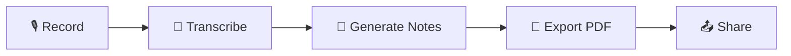
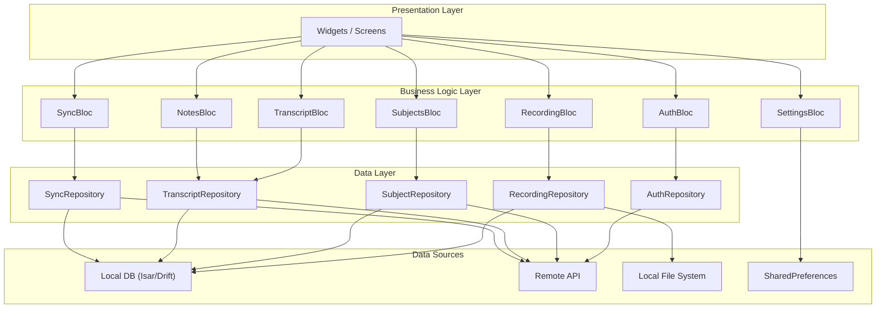
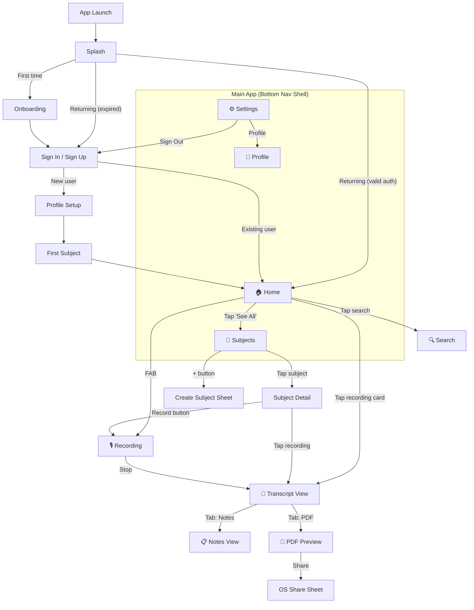
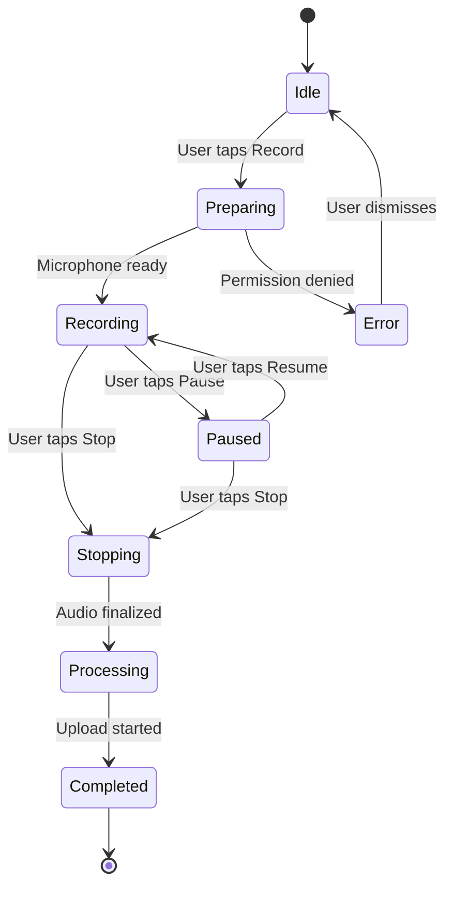
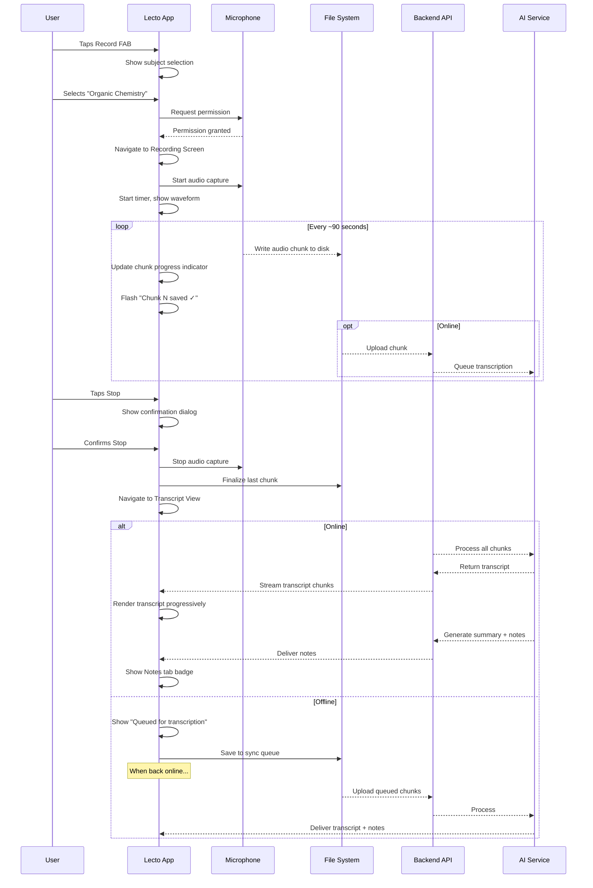

# Lecto — Frontend Specification Document

> **Version:** 1.0.0  
> **Last Updated:** 2026-07-07  
> **Platform:** Flutter (iOS & Android)  
> **Dart SDK:** ≥ 3.4.0 | **Flutter SDK:** ≥ 3.22  
> **Status:** Draft — Approved for Development

---

## Table of Contents

1. [Product Overview](#1-product-overview)
2. [Design System](#2-design-system)
3. [Screen-by-Screen Specification](#3-screen-by-screen-specification)
4. [State Management](#4-state-management)
5. [Navigation Architecture](#5-navigation-architecture)
6. [Component Library](#6-component-library)
7. [Offline UI/UX](#7-offline-uiux)
8. [Recording UX Deep Dive](#8-recording-ux-deep-dive)
9. [Error States & Empty States](#9-error-states--empty-states)
10. [Responsive Design](#10-responsive-design)
11. [Performance Guidelines](#11-performance-guidelines)
12. [Accessibility](#12-accessibility)
13. [Appendix](#13-appendix)

---

## 1. Product Overview

### 1.1 What is Lecto?

Lecto is a premium mobile application that empowers students to **record lectures**, **auto-generate accurate transcripts**, and **produce structured AI-powered study notes** — all from a single tap. The app prioritizes a frictionless, beautiful, and fast experience for students aged 18–30 who study across irregular hours and environments.

### 1.2 Core User Flows



### 1.3 Design Philosophy

| Principle | Description |
|---|---|
| **Night-First** | Dark mode is the default — students study late |
| **One-Tap Core** | Recording starts in ≤ 1 tap from any screen |
| **Offline-Ready** | Full recording capability without internet |
| **Progressive Disclosure** | Show complexity only when the user needs it |
| **Micro-Delight** | Subtle animations that feel alive, never distracting |

---

## 2. Design System

### 2.1 Color Palette

#### 2.1.1 Dark Mode (Default)

| Token | Hex | Usage |
|---|---|---|
| `surface.background` | `#0A0E1A` | App scaffold background |
| `surface.card` | `#111827` | Cards, bottom sheets, dialogs |
| `surface.elevated` | `#1A2235` | Elevated cards, FABs, app bar |
| `surface.overlay` | `#1F2A40` | Overlays, modals, dropdown menus |
| `primary.default` | `#6366F1` | Primary buttons, active icons, links |
| `primary.light` | `#818CF8` | Hover/focus rings, secondary emphasis |
| `primary.dark` | `#4F46E5` | Pressed state, active tab indicator |
| `primary.subtle` | `#6366F1` @ 12% | Chip backgrounds, subtle highlights |
| `accent.coral` | `#F97066` | Recording state, destructive actions |
| `accent.amber` | `#F59E0B` | Warnings, processing/pending states |
| `accent.emerald` | `#10B981` | Success states, online indicator |
| `accent.cyan` | `#06B6D4` | Informational, transcript highlights |
| `accent.violet` | `#A78BFA` | AI-generated content indicator |
| `text.primary` | `#F9FAFB` | Headings, primary body text |
| `text.secondary` | `#9CA3AF` | Captions, labels, placeholders |
| `text.tertiary` | `#6B7280` | Disabled text, timestamps |
| `text.inverse` | `#111827` | Text on light/primary backgrounds |
| `border.default` | `#1F2937` | Card borders, dividers |
| `border.focus` | `#6366F1` | Input focus rings |
| `border.error` | `#EF4444` | Validation errors |

#### 2.1.2 Light Mode

| Token | Hex | Usage |
|---|---|---|
| `surface.background` | `#F9FAFB` | App scaffold background |
| `surface.card` | `#FFFFFF` | Cards, bottom sheets |
| `surface.elevated` | `#FFFFFF` | Elevated surfaces (shadow-differentiated) |
| `surface.overlay` | `#F3F4F6` | Overlays, dropdowns |
| `primary.default` | `#4F46E5` | Primary buttons, links |
| `primary.light` | `#6366F1` | Hover state |
| `primary.dark` | `#4338CA` | Pressed state |
| `primary.subtle` | `#4F46E5` @ 8% | Chip backgrounds |
| `text.primary` | `#111827` | Headings, body text |
| `text.secondary` | `#6B7280` | Captions, labels |
| `text.tertiary` | `#9CA3AF` | Disabled text |
| `border.default` | `#E5E7EB` | Card borders, dividers |

#### 2.1.3 Subject Folder Colors

Each subject can be assigned one of 12 curated colors:

| Name | Hex | Preview Use |
|---|---|---|
| Indigo | `#6366F1` | Default |
| Rose | `#F43F5E` | |
| Amber | `#F59E0B` | |
| Emerald | `#10B981` | |
| Cyan | `#06B6D4` | |
| Violet | `#8B5CF6` | |
| Pink | `#EC4899` | |
| Orange | `#F97316` | |
| Teal | `#14B8A6` | |
| Sky | `#0EA5E9` | |
| Lime | `#84CC16` | |
| Fuchsia | `#D946EF` | |

#### 2.1.4 Semantic Colors

```dart
// theme/colors.dart
abstract class LectoColors {
  // Status
  static const success = Color(0xFF10B981);
  static const warning = Color(0xFFF59E0B);
  static const error   = Color(0xFFEF4444);
  static const info    = Color(0xFF06B6D4);

  // Recording
  static const recording    = Color(0xFFF97066);
  static const recordingBg  = Color(0x1AF97066); // 10% opacity
  static const paused       = Color(0xFFF59E0B);
  static const processing   = Color(0xFFA78BFA);
}
```

### 2.2 Typography

**Font Family:** `Inter` (Google Fonts) — clean, highly legible, excellent on mobile screens.

**Fallback Stack:** `Inter, -apple-system, SF Pro Text, Roboto, sans-serif`

#### Type Scale

| Token | Size | Weight | Line Height | Letter Spacing | Usage |
|---|---|---|---|---|---|
| `display.lg` | 32px | 700 (Bold) | 40px | -0.5px | Hero headings (onboarding) |
| `display.md` | 28px | 700 | 36px | -0.4px | Screen titles |
| `display.sm` | 24px | 600 (Semi) | 32px | -0.3px | Section headers |
| `heading.lg` | 20px | 600 | 28px | -0.2px | Card titles, dialog headers |
| `heading.md` | 18px | 600 | 24px | -0.1px | Subsection headers |
| `heading.sm` | 16px | 600 | 22px | 0 | List item titles |
| `body.lg` | 16px | 400 (Regular) | 24px | 0 | Primary body text |
| `body.md` | 14px | 400 | 20px | 0.1px | Secondary body text, descriptions |
| `body.sm` | 12px | 400 | 16px | 0.2px | Captions, metadata |
| `label.lg` | 14px | 500 (Medium) | 20px | 0.1px | Button labels, tab labels |
| `label.md` | 12px | 500 | 16px | 0.3px | Badges, chips, small buttons |
| `label.sm` | 10px | 500 | 14px | 0.4px | Overline, micro labels |
| `mono.md` | 14px | 400 | 20px | 0 | Timestamps, code, duration |

```dart
// theme/typography.dart
class LectoTypography {
  static const fontFamily = 'Inter';

  static final displayLg = TextStyle(
    fontFamily: fontFamily,
    fontSize: 32,
    fontWeight: FontWeight.w700,
    height: 1.25,       // 40px line-height
    letterSpacing: -0.5,
  );
  // ... repeat for all tokens
}
```

### 2.3 Spacing System (8px Grid)

All spacing, padding, and margin values **must** be multiples of 4px, with preference for 8px increments.

| Token | Value | Usage |
|---|---|---|
| `space.xxs` | 2px | Icon-to-text micro gap |
| `space.xs` | 4px | Tight internal padding |
| `space.sm` | 8px | Default internal padding, list gaps |
| `space.md` | 12px | Input internal padding |
| `space.lg` | 16px | Card padding, section gaps |
| `space.xl` | 24px | Section-to-section spacing |
| `space.2xl` | 32px | Major section breaks |
| `space.3xl` | 40px | Screen-level top/bottom padding |
| `space.4xl` | 48px | Onboarding illustration spacing |
| `space.5xl` | 64px | Hero element breathing room |

**Screen Edge Inset:** 20px horizontal padding on phone, 32px on tablet.

```dart
// theme/spacing.dart
abstract class LectoSpacing {
  static const double xxs = 2;
  static const double xs  = 4;
  static const double sm  = 8;
  static const double md  = 12;
  static const double lg  = 16;
  static const double xl  = 24;
  static const double xxl = 32;
  static const double xxxl = 40;
  static const double screenEdge = 20;
  static const double screenEdgeTablet = 32;
}
```

### 2.4 Border Radius

| Token | Value | Usage |
|---|---|---|
| `radius.xs` | 4px | Chips, badges, small tags |
| `radius.sm` | 8px | Input fields, small buttons |
| `radius.md` | 12px | Cards, dialogs, dropdowns |
| `radius.lg` | 16px | Bottom sheets, large cards |
| `radius.xl` | 20px | Modals, floating panels |
| `radius.full` | 999px | Pills, avatars, circular FAB |

```dart
abstract class LectoRadius {
  static const double xs   = 4;
  static const double sm   = 8;
  static const double md   = 12;
  static const double lg   = 16;
  static const double xl   = 20;
  static const double full = 999;
}
```

### 2.5 Shadow / Elevation System

Dark mode relies more on **surface color layering** than shadows. Light mode uses traditional box shadows.

| Level | Dark Mode | Light Mode |
|---|---|---|
| **Elevation 0** | `surface.background` (`#0A0E1A`) | No shadow |
| **Elevation 1** | `surface.card` (`#111827`) | `0 1px 3px rgba(0,0,0,0.08)` |
| **Elevation 2** | `surface.elevated` (`#1A2235`) | `0 4px 12px rgba(0,0,0,0.10)` |
| **Elevation 3** | `surface.overlay` (`#1F2A40`) | `0 8px 24px rgba(0,0,0,0.12)` |
| **Elevation 4** | `#243049` | `0 12px 32px rgba(0,0,0,0.16)` |

```dart
abstract class LectoShadows {
  static final elevation1 = BoxShadow(
    color: Colors.black.withOpacity(0.08),
    blurRadius: 3, offset: const Offset(0, 1),
  );
  static final elevation2 = BoxShadow(
    color: Colors.black.withOpacity(0.10),
    blurRadius: 12, offset: const Offset(0, 4),
  );
  static final elevation3 = BoxShadow(
    color: Colors.black.withOpacity(0.12),
    blurRadius: 24, offset: const Offset(0, 8),
  );
}
```

### 2.6 Icon Style

- **Library:** Lucide Icons (`lucide_icons` package) — consistent outlined style
- **Default size:** 24px
- **Stroke width:** 1.5px
- **Active color:** `primary.default`
- **Inactive color:** `text.tertiary`
- **Touch target:** Icon buttons must be wrapped in a 48×48 minimum hit area

| Context | Size | Example Icons |
|---|---|---|
| Bottom nav | 24px | `home`, `folder`, `mic`, `settings` |
| App bar actions | 24px | `search`, `filter`, `more-vertical` |
| Card actions | 20px | `play`, `share`, `download`, `trash-2` |
| Empty state | 48px | `folder-open`, `mic-off`, `file-text` |
| Onboarding | 64px | Feature illustrations |

### 2.7 Animation Guidelines

#### Principles

1. **Purposeful** — Every animation communicates state change or spatial relationship
2. **Fast** — ≤ 300ms for micro-interactions; ≤ 500ms for page transitions
3. **Interruptible** — User can begin a new interaction without waiting
4. **Consistent** — Same type of change = same animation curve

#### Duration Tokens

| Token | Value | Usage |
|---|---|---|
| `duration.instant` | 100ms | Opacity changes, color transitions |
| `duration.fast` | 200ms | Button press, icon swaps, toggles |
| `duration.normal` | 300ms | Page transitions, card expansion |
| `duration.slow` | 500ms | Bottom sheet reveal, modal entrance |
| `duration.emphasis` | 800ms | Onboarding illustration entrance |

#### Curve Tokens

| Token | Curve | Usage |
|---|---|---|
| `curve.standard` | `Curves.easeInOut` | Default for most transitions |
| `curve.enter` | `Curves.easeOut` | Elements appearing on screen |
| `curve.exit` | `Curves.easeIn` | Elements leaving the screen |
| `curve.spring` | `SpringDescription(mass: 1, stiffness: 300, damping: 20)` | Bouncy micro-interactions (FAB press) |
| `curve.emphasized` | `Curves.easeInOutCubicEmphasized` | Hero transitions, shared elements |

#### Specific Animations

| Element | Animation | Duration | Notes |
|---|---|---|---|
| Record button press | Scale 1.0 → 0.92 → 1.0 | 200ms | Spring curve |
| Recording pulse | Concentric circles radiating outward | 1500ms loop | `accent.coral` at 20% → 0% opacity |
| Waveform bars | Amplitude-mapped bar height changes | Per-frame (60fps) | Smooth interpolation |
| Page transition | Shared axis (horizontal) | 300ms | Material 3 forward/backward |
| Bottom sheet | Slide up from bottom + fade | 400ms | `curve.enter` |
| Card appear (list) | Staggered fade-in + slide up | 200ms each, 50ms stagger | On first load only |
| Skeleton loader | Shimmer gradient sweep | 1500ms loop | Left-to-right, `surface.card` → `surface.elevated` |
| Chunk complete | Subtle pulse + checkmark morph | 600ms | `accent.emerald` |
| Sync indicator | Rotating arrow icon | 800ms loop | During active sync |
| Tab switch | Cross-fade content | 200ms | No spatial animation |

---

## 3. Screen-by-Screen Specification

### 3.0 Screen Inventory & Status Matrix

| # | Screen | Route | Priority | Auth Required |
|---|---|---|---|---|
| 1 | Splash | `/splash` | P0 | No |
| 2 | Welcome (Onboarding) | `/onboarding` | P0 | No |
| 3 | Sign Up / Sign In | `/auth` | P0 | No |
| 4 | Profile Setup | `/auth/profile-setup` | P1 | Yes |
| 5 | First Subject Creation | `/auth/first-subject` | P1 | Yes |
| 6 | Home / Dashboard | `/home` | P0 | Yes |
| 7 | Subjects List | `/subjects` | P0 | Yes |
| 8 | Subject Detail | `/subjects/:id` | P0 | Yes |
| 9 | Recording | `/recording` | P0 | Yes |
| 10 | Transcript View | `/recordings/:id/transcript` | P0 | Yes |
| 11 | Summary/Notes View | `/recordings/:id/notes` | P0 | Yes |
| 12 | PDF Preview | `/recordings/:id/pdf` | P1 | Yes |
| 13 | Settings | `/settings` | P1 | Yes |
| 14 | Profile | `/profile` | P1 | Yes |

---

### 3.1 Splash Screen

**Route:** `/splash`  
**Duration:** 1.5–2.5 seconds (or until auth state resolved, whichever is longer)

#### Layout

```
┌─────────────────────────────┐
│                             │
│                             │
│                             │
│        ┌───────────┐        │
│        │   LECTO   │        │
│        │   LOGO    │        │
│        └───────────┘        │
│                             │
│     "Record. Transcribe.    │
│          Learn."            │
│                             │
│                             │
│      ───── loader ─────     │
│                             │
└─────────────────────────────┘
```

#### Widget Tree

```dart
Scaffold(
  backgroundColor: LectoColors.surface.background,
  body: Center(
    child: Column(
      mainAxisSize: MainAxisSize.min,
      children: [
        // Animated logo: scale 0.8→1.0 + fade 0→1 over 800ms
        AnimatedLectoLogo(size: 96),
        SizedBox(height: LectoSpacing.lg),
        // Tagline fades in after 400ms delay
        FadeIn(
          delay: Duration(milliseconds: 400),
          child: Text(
            'Record. Transcribe. Learn.',
            style: LectoTypography.bodyMd.copyWith(
              color: LectoColors.text.secondary,
            ),
          ),
        ),
        SizedBox(height: LectoSpacing.xxl),
        // Subtle 3-dot loading indicator
        LectoLoadingDots(),
      ],
    ),
  ),
)
```

#### Animation Sequence

1. **0ms:** Screen appears with solid `surface.background`
2. **0–800ms:** Logo scales from 0.8→1.0 with fade-in, `curve.emphasized`
3. **400–800ms:** Tagline fades in
4. **800ms+:** Loading dots pulse
5. **On auth resolved:** Navigate to `/onboarding` (first launch) or `/home` (returning user) with a fade transition

#### States

| State | Behavior |
|---|---|
| First launch | Navigate → `/onboarding` |
| Returning user (auth valid) | Navigate → `/home` |
| Returning user (auth expired) | Navigate → `/auth` |
| No network | Still proceed — app works offline |

#### Accessibility

- Logo: `Semantics(label: 'Lecto app logo')`
- Tagline: readable by screen reader
- Loading indicator: `Semantics(label: 'Loading application')`

---

### 3.2 Welcome / Onboarding Screens

**Route:** `/onboarding`  
**Structure:** 3 swipeable pages + skip/next controls

#### Layout

```
┌──────────────────────────────────┐
│                        [Skip]    │
│                                  │
│     ┌────────────────────────┐   │
│     │                        │   │
│     │     ILLUSTRATION       │   │
│     │      (Lottie/SVG)      │   │
│     │                        │   │
│     └────────────────────────┘   │
│                                  │
│         Feature Title            │
│    Description text goes here    │
│    explaining the feature in     │
│    two short lines maximum.      │
│                                  │
│          ●  ○  ○                 │
│                                  │
│     ┌────────────────────┐       │
│     │    Get Started     │       │
│     └────────────────────┘       │
│                                  │
└──────────────────────────────────┘
```

#### Page Content

| Page | Illustration Concept | Title | Description |
|---|---|---|---|
| 1 | Microphone with sound waves | **Record Effortlessly** | "Capture every lecture with crystal-clear audio. Works offline — never miss a word." |
| 2 | Document with AI sparkle | **Instant Transcripts** | "AI transcribes your recordings automatically. Searchable, timestamped, and accurate." |
| 3 | Notebook with structured notes | **Smart Study Notes** | "Get AI-generated summaries, key points, and assignments — ready to review." |

#### Widget Tree

```dart
Scaffold(
  body: SafeArea(
    child: Column(
      children: [
        // Top bar with Skip button
        Align(
          alignment: Alignment.topRight,
          child: TextButton(
            onPressed: () => navigateToAuth(),
            child: Text('Skip', style: LectoTypography.labelLg),
          ),
        ),
        // PageView
        Expanded(
          child: PageView.builder(
            controller: _pageController,
            itemCount: 3,
            itemBuilder: (ctx, index) => OnboardingPage(
              illustration: illustrations[index],  // Lottie or SVG
              title: titles[index],
              description: descriptions[index],
            ),
          ),
        ),
        // Dot indicators
        SmoothPageIndicator(
          controller: _pageController,
          count: 3,
          effect: WormEffect(
            dotHeight: 8, dotWidth: 8,
            activeDotColor: LectoColors.primary.default_,
            dotColor: LectoColors.border.default_,
          ),
        ),
        SizedBox(height: LectoSpacing.xl),
        // CTA Button — changes text on last page
        Padding(
          padding: EdgeInsets.symmetric(horizontal: LectoSpacing.screenEdge),
          child: LectoButton.primary(
            label: isLastPage ? 'Get Started' : 'Next',
            onPressed: isLastPage ? navigateToAuth : nextPage,
            fullWidth: true,
          ),
        ),
        SizedBox(height: LectoSpacing.xxl),
      ],
    ),
  ),
)
```

#### Interactions

| Gesture | Action |
|---|---|
| Swipe left | Next page |
| Swipe right | Previous page |
| Tap "Skip" | Navigate to auth screen |
| Tap "Next" | Animate to next page |
| Tap "Get Started" (page 3) | Navigate to auth screen |

#### Animations

- Illustrations: Lottie animations that play when page is active, pause when off-screen
- Page transition: Parallax effect — illustration moves at 0.7× speed, text at 1.0×
- Dot indicator: Smooth worm animation between dots
- Button label change: Cross-fade text transition

#### Accessibility

- Each page fully readable by TalkBack/VoiceOver
- Page swipe announced: "Page 1 of 3", "Page 2 of 3"
- Skip button: clear label
- Illustrations: `Semantics(label: 'Illustration of recording a lecture')`

---

### 3.3 Sign Up / Sign In

**Route:** `/auth`

#### Layout

```
┌─────────────────────────────────┐
│                                 │
│         LECTO LOGO (small)      │
│                                 │
│        Welcome to Lecto         │
│   Your lecture companion 📚     │
│                                 │
│  ┌───────────────────────────┐  │
│  │ 🔵  Continue with Google  │  │
│  └───────────────────────────┘  │
│  ┌───────────────────────────┐  │
│  │ 🍎  Continue with Apple   │  │
│  └───────────────────────────┘  │
│                                 │
│  ──────── or ────────           │
│                                 │
│  ┌───────────────────────────┐  │
│  │ ✉️  Email                  │  │
│  └───────────────────────────┘  │
│  ┌───────────────────────────┐  │
│  │ 🔒  Password              │  │
│  └───────────────────────────┘  │
│                                 │
│  ┌───────────────────────────┐  │
│  │       Sign In             │  │
│  └───────────────────────────┘  │
│                                 │
│  Don't have an account?         │
│  [Sign Up] | [Forgot Password?] │
│                                 │
│  By continuing you agree to     │
│  Terms of Service & Privacy     │
│                                 │
└─────────────────────────────────┘
```

#### Widget Tree

```dart
Scaffold(
  body: SafeArea(
    child: SingleChildScrollView(
      padding: EdgeInsets.symmetric(
        horizontal: LectoSpacing.screenEdge,
      ),
      child: Column(
        children: [
          SizedBox(height: LectoSpacing.xxxl),
          LectoLogo(size: 48),
          SizedBox(height: LectoSpacing.xl),
          Text('Welcome to Lecto', style: LectoTypography.displayMd),
          SizedBox(height: LectoSpacing.sm),
          Text('Your lecture companion 📚',
            style: LectoTypography.bodyMd.copyWith(
              color: LectoColors.text.secondary)),
          SizedBox(height: LectoSpacing.xxl),

          // Social Auth Buttons
          LectoSocialButton(
            provider: AuthProvider.google,
            label: 'Continue with Google',
            onPressed: () => authBloc.add(GoogleSignIn()),
          ),
          SizedBox(height: LectoSpacing.sm),
          LectoSocialButton(
            provider: AuthProvider.apple,  // iOS only
            label: 'Continue with Apple',
            onPressed: () => authBloc.add(AppleSignIn()),
          ),

          SizedBox(height: LectoSpacing.xl),
          LectoDividerWithText(text: 'or'),
          SizedBox(height: LectoSpacing.xl),

          // Email & Password
          LectoTextField(
            label: 'Email',
            keyboardType: TextInputType.emailAddress,
            prefixIcon: Lucide.mail,
            validator: EmailValidator.validate,
          ),
          SizedBox(height: LectoSpacing.lg),
          LectoTextField(
            label: 'Password',
            obscureText: true,
            prefixIcon: Lucide.lock,
            suffixIcon: Lucide.eye / Lucide.eyeOff,  // toggle
          ),
          SizedBox(height: LectoSpacing.xl),

          LectoButton.primary(
            label: isSignUp ? 'Create Account' : 'Sign In',
            onPressed: () => authBloc.add(EmailSignIn(...)),
            fullWidth: true,
            isLoading: state.isLoading,
          ),

          SizedBox(height: LectoSpacing.lg),

          // Toggle & Forgot
          Row(
            mainAxisAlignment: MainAxisAlignment.center,
            children: [
              Text(isSignUp
                ? 'Already have an account? '
                : "Don't have an account? "),
              GestureDetector(
                onTap: toggleAuthMode,
                child: Text(
                  isSignUp ? 'Sign In' : 'Sign Up',
                  style: LectoTypography.labelLg.copyWith(
                    color: LectoColors.primary.default_),
                ),
              ),
            ],
          ),

          SizedBox(height: LectoSpacing.lg),
          // Terms
          Text.rich(/* Terms & Privacy link */),
        ],
      ),
    ),
  ),
)
```

#### States

| State | Visual |
|---|---|
| **Default** | Form visible, buttons enabled |
| **Loading** | Tapped button shows spinner, form disabled |
| **Validation Error** | Red border on invalid fields, error text below |
| **Auth Error** | Snackbar at top: "Invalid credentials" / "Account exists" |
| **Success** | Navigate to `/auth/profile-setup` (new) or `/home` (existing) |

#### Platform-Specific

- **Apple Sign-In** button: shown only on iOS (`Platform.isIOS`)
- **Google Sign-In**: shown on both platforms
- Keyboard-aware: `SingleChildScrollView` prevents content from being hidden behind keyboard

#### Accessibility

- Form fields: proper labels for screen readers
- Error messages: announced via `Semantics(liveRegion: true)`
- Password toggle: `Semantics(label: 'Show password / Hide password')`
- Social buttons: clear provider name in semantics

---

### 3.4 Profile Setup

**Route:** `/auth/profile-setup`  
**Trigger:** After first sign-up only

#### Layout

```
┌─────────────────────────────────┐
│ ←                               │
│                                 │
│       👤 (Avatar picker)        │
│        Tap to add photo         │
│                                 │
│    Let's set up your profile    │
│                                 │
│  ┌───────────────────────────┐  │
│  │  Full Name *              │  │
│  └───────────────────────────┘  │
│  ┌───────────────────────────┐  │
│  │  University / Institution │  │
│  └───────────────────────────┘  │
│  ┌───────────────────────────┐  │
│  │  Year / Level (dropdown)  │  │
│  └───────────────────────────┘  │
│                                 │
│  ┌───────────────────────────┐  │
│  │       Continue →          │  │
│  └───────────────────────────┘  │
│                                 │
│          Skip for now           │
│                                 │
└─────────────────────────────────┘
```

#### Details

- **Avatar:** Circular `80px` container. Tap opens bottom sheet with options: Camera, Gallery, Remove. Cropped to circle.
- **Name:** Required field. Validation: non-empty, ≤ 50 characters.
- **University:** Optional autocomplete text field. Free-form text.
- **Year/Level:** Optional. Dropdown with: Freshman, Sophomore, Junior, Senior, Graduate, Post-Graduate, Other.
- **Continue:** Enabled only when name is filled. Navigates to `/auth/first-subject`.
- **Skip for now:** Still requires name. Skips to `/home`.

---

### 3.5 First Subject Creation

**Route:** `/auth/first-subject`  
**Trigger:** After profile setup (first-time only)

#### Layout

```
┌──────────────────────────────────┐
│ ←                                │
│                                  │
│    📁 Create Your First Subject  │
│                                  │
│    Organize your recordings by   │
│    subject for easy access.      │
│                                  │
│  ┌────────────────────────────┐  │
│  │  Subject Name *            │  │
│  └────────────────────────────┘  │
│                                  │
│  Choose a color:                 │
│  ┌──┐ ┌──┐ ┌──┐ ┌──┐ ┌──┐ ┌──┐ │
│  │  │ │  │ │  │ │  │ │  │ │  │  │
│  └──┘ └──┘ └──┘ └──┘ └──┘ └──┘  │
│  ┌──┐ ┌──┐ ┌──┐ ┌──┐ ┌──┐ ┌──┐ │
│  │  │ │  │ │  │ │  │ │  │ │  │  │
│  └──┘ └──┘ └──┘ └──┘ └──┘ └──┘  │
│                                  │
│  Choose an icon:                 │
│  [📐] [🧪] [📖] [💻] [🎨] [🔬] │
│  [📊] [🌍] [⚖️] [🧬] [🎵] [📝] │
│                                  │
│  ┌────────────────────────────┐  │
│  │     Create Subject  →     │  │
│  └────────────────────────────┘  │
│                                  │
└──────────────────────────────────┘
```

#### Color Picker Widget

```dart
SubjectColorPicker(
  colors: LectoSubjectColors.all,        // 12 colors
  selectedColor: selectedColor,
  onColorSelected: (color) => setState(() => selectedColor = color),
  itemSize: 40,                           // 40px circles
  spacing: LectoSpacing.sm,
  selectedIndicator: Icon(Lucide.check, size: 20, color: Colors.white),
)
```

- Selected color shows a white checkmark inside the circle
- Each circle has a 2px white border when selected

---

### 3.6 Home / Dashboard

**Route:** `/home`  
**Bottom Nav Tab:** Index 0 (Home icon)

#### Layout

```
┌──────────────────────────────────┐
│  Good evening, Alex 👋           │
│  ┌──────────────────────────┐    │
│  │ 🔍 Search recordings...  │    │
│  └──────────────────────────┘    │
│                                  │
│  ┌──────────┐  ┌──────────┐     │
│  │ 12       │  │ 4h 23m   │     │
│  │ Recordings│  │ Total    │     │
│  │ this week │  │ Recorded │     │
│  └──────────┘  └──────────┘     │
│  ┌──────────┐  ┌──────────┐     │
│  │ 8        │  │ 3        │     │
│  │ Notes    │  │ Subjects │     │
│  │ Generated│  │          │     │
│  └──────────┘  └──────────┘     │
│                                  │
│  Recent Recordings        See all│
│  ┌────────────────────────────┐  │
│  │ 🔴 Intro to Psych  ·  35m │  │
│  │    Today, 2:30 PM         │  │
│  │    ████████░░ Transcribing │  │
│  └────────────────────────────┘  │
│  ┌────────────────────────────┐  │
│  │ ✅ Organic Chem    ·  48m │  │
│  │    Yesterday, 10:00 AM    │  │
│  │    Transcript · Notes     │  │
│  └────────────────────────────┘  │
│  ┌────────────────────────────┐  │
│  │ ✅ Linear Algebra  ·  52m │  │
│  │    Jul 4, 9:15 AM         │  │
│  │    Transcript · Notes     │  │
│  └────────────────────────────┘  │
│                                  │
│              ┌───┐               │
│──────────────│🎙️│───────────────│
│  🏠  📁  [  │   │  ]  ⚙️  👤   │
│              └───┘               │
└──────────────────────────────────┘
```

#### Widget Tree

```dart
Scaffold(
  body: SafeArea(
    child: CustomScrollView(
      slivers: [
        // Greeting header
        SliverToBoxAdapter(
          child: Padding(
            padding: EdgeInsets.all(LectoSpacing.screenEdge),
            child: Column(
              crossAxisAlignment: CrossAxisAlignment.start,
              children: [
                Text(_greeting(), style: LectoTypography.displaySm),
                SizedBox(height: LectoSpacing.lg),
                LectoSearchBar(
                  hint: 'Search recordings...',
                  onTap: () => navigateToSearch(),
                ),
              ],
            ),
          ),
        ),

        // Stats Grid
        SliverToBoxAdapter(
          child: Padding(
            padding: EdgeInsets.symmetric(horizontal: LectoSpacing.screenEdge),
            child: StatsGrid(
              stats: [
                StatItem(value: '12', label: 'Recordings\nthis week', icon: Lucide.mic),
                StatItem(value: '4h 23m', label: 'Total\nRecorded', icon: Lucide.clock),
                StatItem(value: '8', label: 'Notes\nGenerated', icon: Lucide.fileText),
                StatItem(value: '3', label: 'Subjects', icon: Lucide.folder),
              ],
            ),
          ),
        ),

        // Recent Recordings Section Header
        SliverToBoxAdapter(
          child: SectionHeader(
            title: 'Recent Recordings',
            trailing: TextButton(child: Text('See all'), onPressed: ...),
          ),
        ),

        // Recent Recordings List
        SliverList(
          delegate: SliverChildBuilderDelegate(
            (context, index) => RecordingCard(recording: recordings[index]),
            childCount: min(recordings.length, 5),
          ),
        ),

        // Bottom padding for FAB clearance
        SliverToBoxAdapter(child: SizedBox(height: 100)),
      ],
    ),
  ),
  floatingActionButton: RecordFAB(onPressed: startRecording),
  floatingActionButtonLocation: FloatingActionButtonLocation.centerDocked,
  bottomNavigationBar: LectoBottomNav(currentIndex: 0),
)
```

#### Stats Grid

A 2×2 grid of `StatCard` widgets:

```dart
class StatCard extends StatelessWidget {
  // Container:
  //   - Background: surface.card
  //   - Border: 1px border.default
  //   - Radius: radius.md (12px)
  //   - Padding: lg (16px)
  //
  // Layout:
  //   Column(crossAxisAlignment: start)
  //     Icon(icon, color: primary.default, size: 20)
  //     SizedBox(height: sm)
  //     Text(value, style: headingLg)
  //     Text(label, style: bodySm, color: text.secondary)
}
```

#### Recording Card

```dart
class RecordingCard extends StatelessWidget {
  // Container:
  //   - Background: surface.card
  //   - Border: 1px border.default
  //   - Radius: radius.md (12px)
  //   - Padding: lg (16px)
  //   - Margin: horizontal screenEdge, vertical xs
  //
  // Layout:
  //   Row
  //     SubjectColorDot(size: 12, color: subject.color)
  //     SizedBox(width: sm)
  //     Expanded(
  //       Column(crossAxisAlignment: start)
  //         Row
  //           Text(title, style: headingSm)
  //           Spacer()
  //           Text(duration, style: mono.md, color: text.secondary)
  //         Text(dateFormatted, style: bodySm, color: text.secondary)
  //         SizedBox(height: xs)
  //         StatusRow  // ← shows processing bar OR "Transcript · Notes" chips
  //     )
  //     Icon(Lucide.chevronRight, color: text.tertiary)
}
```

#### States

| State | Visual |
|---|---|
| **Loading** | Skeleton shimmer for stats + 3 recording card skeletons |
| **Empty (new user)** | `EmptyState` illustration with "Record your first lecture" CTA |
| **Data loaded** | Stats + recording list |
| **Error** | Inline error card with retry button |
| **Offline** | `OfflineBanner` at top; data from local cache |

#### Greeting Logic

```dart
String _greeting() {
  final hour = DateTime.now().hour;
  if (hour < 12) return 'Good morning, $firstName 👋';
  if (hour < 17) return 'Good afternoon, $firstName 👋';
  return 'Good evening, $firstName 👋';
}
```

#### Navigation

| Action | Destination |
|---|---|
| Tap search bar | Full-screen search overlay |
| Tap stat card | Relevant filtered view |
| Tap recording card | Recording detail (transcript view) |
| Tap "See all" | Subjects list with all recordings tab |
| Tap FAB (🎙️) | Recording screen |
| Bottom nav tabs | Respective screens |

---

### 3.7 Subjects List

**Route:** `/subjects`  
**Bottom Nav Tab:** Index 1 (Folder icon)

#### Layout

```
┌──────────────────────────────────┐
│  Subjects                    [+] │
│  ┌──────────────────────────┐    │
│  │ 🔍 Search subjects...    │    │
│  └──────────────────────────┘    │
│                                  │
│  ┌──────────┐  ┌──────────┐     │
│  │  🧪      │  │  📐      │     │
│  │ Organic  │  │ Linear   │     │
│  │ Chemistry│  │ Algebra  │     │
│  │ 12 recs  │  │ 8 recs   │     │
│  └──────────┘  └──────────┘     │
│  ┌──────────┐  ┌──────────┐     │
│  │  🧠      │  │  💻      │     │
│  │ Intro to │  │ Data     │     │
│  │ Psych    │  │ Struct.  │     │
│  │ 6 recs   │  │ 15 recs  │     │
│  └──────────┘  └──────────┘     │
│                                  │
│              ┌───┐               │
│──────────────│🎙️│───────────────│
│  🏠  📁  [  │   │  ]  ⚙️  👤   │
│              └───┘               │
└──────────────────────────────────┘
```

#### Widget Tree

```dart
Scaffold(
  appBar: LectoAppBar(
    title: 'Subjects',
    actions: [
      IconButton(
        icon: Icon(Lucide.plus),
        onPressed: () => showCreateSubjectSheet(),
      ),
    ],
  ),
  body: Column(
    children: [
      // Search bar
      Padding(
        padding: EdgeInsets.all(LectoSpacing.screenEdge),
        child: LectoSearchBar(hint: 'Search subjects...'),
      ),
      // Grid
      Expanded(
        child: GridView.builder(
          padding: EdgeInsets.symmetric(horizontal: LectoSpacing.screenEdge),
          gridDelegate: SliverGridDelegateWithFixedCrossAxisCount(
            crossAxisCount: 2,
            crossAxisSpacing: LectoSpacing.sm,
            mainAxisSpacing: LectoSpacing.sm,
            childAspectRatio: 1.1,
          ),
          itemCount: subjects.length,
          itemBuilder: (ctx, i) => SubjectCard(subject: subjects[i]),
        ),
      ),
    ],
  ),
)
```

#### Subject Card

```dart
class SubjectCard extends StatelessWidget {
  // Container:
  //   - Background: surface.card
  //   - Border: 1px border.default
  //   - Border-top: 3px solid subject.color  ← colored accent bar
  //   - Radius: radius.md (12px)
  //   - Padding: lg (16px)
  //
  // Layout:
  //   Column(crossAxisAlignment: start)
  //     Text(subject.icon, fontSize: 28)   // Emoji icon
  //     Spacer()
  //     Text(subject.name, style: headingSm, maxLines: 2)
  //     SizedBox(height: xs)
  //     Text('${subject.recordingCount} recordings',
  //          style: bodySm, color: text.secondary)
  //
  // Interactions:
  //   onTap → navigate to /subjects/:id
  //   onLongPress → show context menu (Rename, Change Color, Delete)
}
```

#### States

| State | Visual |
|---|---|
| **Loading** | Grid of 4 skeleton cards with shimmer |
| **Empty** | `EmptyState(icon: Lucide.folderPlus, title: 'No subjects yet', subtitle: 'Create your first subject to organize recordings', cta: 'Create Subject')` |
| **Data** | Grid of subject cards |
| **Search no results** | "No subjects match your search" with clear button |

#### Create Subject Bottom Sheet

Triggered by `+` button. Same form as First Subject Creation (§3.5) but as a modal bottom sheet:

```dart
LectoBottomSheet(
  title: 'New Subject',
  children: [
    LectoTextField(label: 'Subject Name'),
    SizedBox(height: LectoSpacing.lg),
    SubjectColorPicker(...),
    SizedBox(height: LectoSpacing.lg),
    SubjectIconPicker(...),
    SizedBox(height: LectoSpacing.xl),
    LectoButton.primary(label: 'Create', fullWidth: true),
  ],
)
```

---

### 3.8 Subject Detail

**Route:** `/subjects/:id`

#### Layout

```
┌──────────────────────────────────┐
│ ←  Organic Chemistry    ⋮       │
│  ┌──────────────────────────┐    │
│  │ 🔍 Search recordings...  │    │
│  └──────────────────────────┘    │
│                                  │
│  Sort: Recent ▼  │  Filter ▼    │
│                                  │
│  Today                           │
│  ┌────────────────────────────┐  │
│  │ Lecture 12: Esters   48m  │  │
│  │ 2:30 PM · ✅ Notes ready  │  │
│  └────────────────────────────┘  │
│                                  │
│  Yesterday                       │
│  ┌────────────────────────────┐  │
│  │ Lecture 11: Ketones  52m  │  │
│  │ 10:00 AM · ✅ Notes ready │  │
│  └────────────────────────────┘  │
│  ┌────────────────────────────┐  │
│  │ Lab Session 5        35m  │  │
│  │ 8:15 AM · 🔄 Processing  │  │
│  └────────────────────────────┘  │
│                                  │
│  Jul 4, 2026                     │
│  ┌────────────────────────────┐  │
│  │ Lecture 10: Alcohols 45m  │  │
│  │ 2:30 PM · ✅ Notes ready  │  │
│  └────────────────────────────┘  │
│                                  │
│           [🎙️ Record]           │
└──────────────────────────────────┘
```

#### Widget Tree

```dart
Scaffold(
  appBar: LectoAppBar(
    title: subject.name,
    leading: BackButton(),
    actions: [
      PopupMenuButton(
        itemBuilder: (_) => [
          PopupMenuItem(child: Text('Rename')),
          PopupMenuItem(child: Text('Change Color')),
          PopupMenuItem(child: Text('Delete'), isDestructive: true),
        ],
      ),
    ],
  ),
  body: Column(
    children: [
      Padding(
        padding: EdgeInsets.symmetric(horizontal: LectoSpacing.screenEdge),
        child: LectoSearchBar(hint: 'Search recordings...'),
      ),
      SizedBox(height: LectoSpacing.sm),
      SortFilterBar(
        sortOptions: ['Recent', 'Oldest', 'Duration', 'Name'],
        filterOptions: ['All', 'With Notes', 'Processing', 'No Transcript'],
        onSortChanged: (sort) => bloc.add(SortChanged(sort)),
        onFilterChanged: (filter) => bloc.add(FilterChanged(filter)),
      ),
      Expanded(
        child: ListView.builder(
          // Grouped by date with sticky headers
          itemCount: groupedRecordings.length,
          itemBuilder: (ctx, i) {
            final group = groupedRecordings[i];
            if (group.isHeader) {
              return DateSectionHeader(date: group.date);
            }
            return RecordingListTile(recording: group.recording);
          },
        ),
      ),
    ],
  ),
  // Contextual FAB — record into this subject
  floatingActionButton: LectoButton.primary(
    label: '🎙️ Record',
    icon: Lucide.mic,
    onPressed: () => startRecording(subjectId: subject.id),
  ),
)
```

#### Sort & Filter Bar

```dart
class SortFilterBar extends StatelessWidget {
  // Layout:
  //   Row(
  //     horizontal padding: screenEdge
  //     children:
  //       FilterChip(label: 'Sort: ${current}', icon: Lucide.arrowUpDown)
  //       SizedBox(width: sm)
  //       FilterChip(label: 'Filter', icon: Lucide.filter)
  //       Spacer()
  //       Text('${count} recordings', style: bodySm)
  //   )
  //
  // Tapping a chip opens a dropdown/bottom sheet with options
}
```

#### Recording List Tile

```dart
class RecordingListTile extends StatelessWidget {
  // Container:
  //   - Background: surface.card
  //   - Radius: radius.md
  //   - Padding: lg
  //   - Margin: horizontal screenEdge, vertical xs (4px)
  //
  // Layout:
  //   Row
  //     Column(crossAxisAlignment: start, expanded)
  //       Text(recording.title, style: headingSm)
  //       SizedBox(height: xxs)
  //       Row
  //         Text(timeFormatted, style: bodySm, color: text.secondary)
  //         Text(' · ')
  //         RecordingStatusBadge(status)
  //     Text(durationFormatted, style: mono.md, color: text.secondary)
  //     Icon(Lucide.chevronRight, color: text.tertiary, size: 20)
  //
  // Swipe actions (Dismissible):
  //   Swipe right → Share
  //   Swipe left → Delete (with confirmation)
}
```

#### States

| State | Visual |
|---|---|
| **Loading** | 5 skeleton list tiles with shimmer |
| **Empty** | `EmptyState(icon: Lucide.mic, title: 'No recordings yet', subtitle: 'Record your first ${subject.name} lecture', cta: 'Start Recording')` |
| **Data** | Grouped list with date headers |
| **Search no results** | "No recordings match" with clear search |
| **Error** | Error banner with retry |

---

### 3.9 Recording Screen

**Route:** `/recording`  
**Entry:** FAB from any screen, contextual record button from subject detail

> [!IMPORTANT]
> This is the most critical screen in the app. It must be rock-solid, distraction-free, and communicate recording state with absolute clarity.

#### Layout — Recording Active

```
┌──────────────────────────────────┐
│ ←  Recording          ● LIVE    │
│                                  │
│        ┌─────────────┐           │
│        │  Subject:    │           │
│        │  Organic Chem│           │
│        └─────────────┘           │
│                                  │
│           01:23:45               │
│                                  │
│  ┌────────────────────────────┐  │
│  │ ▎▎▌▎▌▎▎▌▌▎▎▌▎▎▌▎▎▌▌▎▎▎▌▎ │  │
│  │ ▎▎▌▎▌▎▎▌▌▎▎▌▎▎▌▎▎▌▌▎▎▎▌▎ │  │
│  │        WAVEFORM              │  │
│  │ ▎▎▌▎▌▎▎▌▌▎▎▌▎▎▌▎▎▌▌▎▎▎▌▎ │  │
│  └────────────────────────────┘  │
│                                  │
│  Chunk 3 of ?     ████████░░    │
│  ~90s per chunk                  │
│                                  │
│                                  │
│         ┌──┐ ┌────┐ ┌──┐        │
│         │⏸│ │ ⏹ │ │📋│        │
│         └──┘ └────┘ └──┘        │
│        Pause  Stop   Note       │
│                                  │
│  🔴 Recording · Offline ready   │
│                                  │
└──────────────────────────────────┘
```

#### Widget Tree

```dart
Scaffold(
  backgroundColor: LectoColors.surface.background,
  appBar: LectoAppBar(
    title: 'Recording',
    leading: BackButton(onPressed: showStopConfirmation),
    actions: [
      RecordingLiveIndicator(), // Pulsing red dot + "LIVE"
    ],
  ),
  body: Column(
    children: [
      SizedBox(height: LectoSpacing.xl),

      // Subject chip
      SubjectChip(subject: selectedSubject),
      SizedBox(height: LectoSpacing.xxl),

      // Timer
      RecordingTimer(
        elapsed: state.elapsed,
        style: LectoTypography.displayLg.copyWith(
          fontFamily: 'Inter',
          fontFeatures: [FontFeature.tabularFigures()],
          fontSize: 48,
          color: LectoColors.text.primary,
        ),
      ),
      SizedBox(height: LectoSpacing.xxl),

      // Waveform visualization
      Expanded(
        child: Padding(
          padding: EdgeInsets.symmetric(horizontal: LectoSpacing.screenEdge),
          child: RecordingWaveform(
            amplitudeStream: recorder.amplitudeStream,
            color: LectoColors.accent.coral,
            barWidth: 3,
            barSpacing: 2,
            barRadius: BorderRadius.circular(LectoRadius.xs),
          ),
        ),
      ),
      SizedBox(height: LectoSpacing.xl),

      // Chunk progress
      ChunkProgressIndicator(
        currentChunk: state.currentChunk,
        chunkProgress: state.chunkProgress,  // 0.0 - 1.0
        chunkDuration: Duration(seconds: 90),
      ),
      SizedBox(height: LectoSpacing.xxl),

      // Control buttons
      RecordingControls(
        isRecording: state.isRecording,
        isPaused: state.isPaused,
        onPause: () => bloc.add(PauseRecording()),
        onResume: () => bloc.add(ResumeRecording()),
        onStop: () => showStopConfirmation(),
        onAddNote: () => showAddNoteSheet(),
      ),
      SizedBox(height: LectoSpacing.lg),

      // Status bar
      RecordingStatusBar(
        isRecording: state.isRecording,
        isOffline: !connectivity.isOnline,
      ),
      SizedBox(height: LectoSpacing.xl),
    ],
  ),
)
```

#### Full recording screen specification continues in [§8 Recording UX Deep Dive](#8-recording-ux-deep-dive).

---

### 3.10 Transcript View

**Route:** `/recordings/:id/transcript`

#### Layout

```
┌──────────────────────────────────┐
│ ←  Lecture 12         📤  ⋮     │
│  ┌────┐ ┌────────┐ ┌─────┐      │
│  │ 📝 │ │ 📋 Notes│ │ PDF │     │
│  └────┘ └────────┘ └─────┘      │
│  Transcript   Notes    PDF       │
│                                  │
│  [00:00]                         │
│  Welcome to today's lecture on   │
│  ester synthesis. We'll be       │
│  covering three main reaction    │
│  pathways...                     │
│                                  │
│  [02:15]                         │
│  The Fischer esterification is   │
│  perhaps the most fundamental    │
│  approach. It involves the       │
│  acid-catalyzed reaction of a    │
│  carboxylic acid with an         │
│  alcohol...                      │
│                                  │
│  [05:42]                         │
│  Now let's look at the           │
│  mechanism step by step.         │
│  First, the carbonyl oxygen...   │
│                                  │
│  ▶ Play from here               │
│                                  │
└──────────────────────────────────┘
```

#### Widget Tree

```dart
DefaultTabController(
  length: 3,
  child: Scaffold(
    appBar: LectoAppBar(
      title: recording.title,
      actions: [
        IconButton(icon: Icon(Lucide.share2), onPressed: shareTranscript),
        PopupMenuButton(...),
      ],
      bottom: TabBar(
        tabs: [
          Tab(icon: Icon(Lucide.fileText), text: 'Transcript'),
          Tab(icon: Icon(Lucide.lightbulb), text: 'Notes'),
          Tab(icon: Icon(Lucide.fileDown), text: 'PDF'),
        ],
        indicatorColor: LectoColors.primary.default_,
        labelColor: LectoColors.primary.default_,
        unselectedLabelColor: LectoColors.text.secondary,
      ),
    ),
    body: TabBarView(
      children: [
        TranscriptTab(transcript: recording.transcript),
        NotesTab(notes: recording.notes),
        PdfPreviewTab(recording: recording),
      ],
    ),
  ),
)
```

#### Transcript Tab Content

```dart
class TranscriptTab extends StatelessWidget {
  // Uses TranscriptRenderer — see Component Library §6
  //
  // Layout:
  //   SelectableRegion wrapping a ListView
  //     for each TranscriptChunk:
  //       Column
  //         TimestampBadge(timestamp)   // Tappable — seeks audio
  //         SizedBox(height: xs)
  //         MarkdownBody(chunk.text)    // flutter_markdown
  //         SizedBox(height: lg)
  //
  // Interactions:
  //   - Tap timestamp → play audio from that point
  //   - Long-press text → select & copy
  //   - Scroll position → highlight corresponding timestamp
  //   - Floating "Play from here" button appears at scroll position
  //
  // Audio playback bar (when playing):
  //   Sticky bottom bar with:
  //     Play/Pause | Progress slider | Current time / Total time
}
```

#### States

| State | Visual |
|---|---|
| **Loading / Transcribing** | Skeleton text blocks + progress bar "Transcribing... 65%" |
| **Partial** | Show completed chunks, "More coming..." at bottom |
| **Complete** | Full transcript rendered |
| **Error** | Error card with "Retry Transcription" button |
| **Empty** | "Transcript not available. Tap to retry." |

---

### 3.11 Summary / Notes View

**Route:** `/recordings/:id/notes`  
**Also accessible as:** Tab 2 within the recording detail screen

#### Layout

```
┌──────────────────────────────────┐
│                                  │
│  ✨ AI-Generated Notes           │
│                                  │
│  ┌────────────────────────────┐  │
│  │ 📋 Key Points              │  │
│  │                            │  │
│  │ • Fischer esterification   │  │
│  │   is acid-catalyzed        │  │
│  │ • Reaction requires        │  │
│  │   removal of water         │  │
│  │ • Le Chatelier's principle │  │
│  │   drives equilibrium       │  │
│  └────────────────────────────┘  │
│                                  │
│  ┌────────────────────────────┐  │
│  │ 📝 Summary                 │  │
│  │                            │  │
│  │ This lecture covered three │  │
│  │ main ester synthesis       │  │
│  │ pathways: Fischer          │  │
│  │ esterification, acid       │  │
│  │ chloride method, and...    │  │
│  └────────────────────────────┘  │
│                                  │
│  ┌────────────────────────────┐  │
│  │ 📌 Assignments & Action    │  │
│  │                            │  │
│  │ □ Complete problem set 7   │  │
│  │ □ Read Chapter 14, §3-5   │  │
│  │ □ Lab report due Friday    │  │
│  └────────────────────────────┘  │
│                                  │
│  ┌────────────────────────────┐  │
│  │ ❓ Review Questions        │  │
│  │                            │  │
│  │ 1. What is the role of     │  │
│  │    acid catalyst?          │  │
│  │ 2. Why must water be       │  │
│  │    removed?                │  │
│  └────────────────────────────┘  │
│                                  │
│  ┌──────────┐  ┌──────────┐     │
│  │ 📤 Share │  │ 📄 PDF   │     │
│  └──────────┘  └──────────┘     │
│                                  │
└──────────────────────────────────┘
```

#### Notes Section Cards

Each section is a collapsible `LectoCard`:

```dart
class NotesSectionCard extends StatelessWidget {
  final String icon;      // Emoji
  final String title;     // "Key Points", "Summary", etc.
  final Widget content;   // Markdown or checkbox list
  final bool isExpanded;

  // Container:
  //   - Background: surface.card
  //   - Border: 1px border.default
  //   - Left border: 3px accent.violet (AI indicator)
  //   - Radius: radius.md
  //   - Padding: lg
  //
  // Header row:
  //   Row
  //     Text(icon + ' ' + title, style: headingMd)
  //     Spacer()
  //     AnimatedRotation(
  //       turns: isExpanded ? 0.5 : 0,
  //       child: Icon(Lucide.chevronDown),
  //     )
  //
  // onTap → toggles expansion with AnimatedSize
}
```

#### Assignment Checkboxes

Interactive checkboxes that persist state locally:

```dart
CheckboxListTile(
  value: assignment.isCompleted,
  onChanged: (v) => bloc.add(ToggleAssignment(assignment.id)),
  title: Text(
    assignment.text,
    style: assignment.isCompleted
      ? LectoTypography.bodyMd.copyWith(
          decoration: TextDecoration.lineThrough,
          color: LectoColors.text.tertiary)
      : LectoTypography.bodyMd,
  ),
)
```

#### States

| State | Visual |
|---|---|
| **Generating** | Animated AI sparkle icon + "Generating study notes..." + skeleton cards |
| **Complete** | All sections rendered |
| **Partial** | Available sections shown, remaining show "Generating..." |
| **Error** | "Could not generate notes. Tap to retry." |
| **Not available** | "Notes require a transcript. Transcription in progress..." |

---

### 3.12 PDF Preview

**Route:** `/recordings/:id/pdf`

#### Layout

```
┌──────────────────────────────────┐
│ ←  PDF Preview      📤  📥      │
│                                  │
│  ┌────────────────────────────┐  │
│  │                            │  │
│  │     PDF Page Preview       │  │
│  │     (rendered pages)       │  │
│  │                            │  │
│  │     Pinch to zoom          │  │
│  │     Swipe to navigate      │  │
│  │                            │  │
│  └────────────────────────────┘  │
│                                  │
│        Page 1 of 3               │
│                                  │
│  ┌──────────┐  ┌──────────┐     │
│  │ 📤 Share │  │ 📥 Save  │     │
│  └──────────┘  └──────────┘     │
│                                  │
└──────────────────────────────────┘
```

#### Implementation

```dart
Scaffold(
  appBar: LectoAppBar(
    title: 'PDF Preview',
    actions: [
      IconButton(icon: Icon(Lucide.share2), onPressed: sharePdf),
      IconButton(icon: Icon(Lucide.download), onPressed: downloadPdf),
    ],
  ),
  body: Column(
    children: [
      Expanded(
        // Use pdfx or syncfusion_flutter_pdfviewer
        child: PdfViewer(
          document: pdfDocument,
          enablePinchZoom: true,
        ),
      ),
      // Page indicator
      Padding(
        padding: EdgeInsets.all(LectoSpacing.lg),
        child: Text('Page $current of $total', style: LectoTypography.bodySm),
      ),
      // Action buttons
      Padding(
        padding: EdgeInsets.symmetric(
          horizontal: LectoSpacing.screenEdge,
          vertical: LectoSpacing.lg,
        ),
        child: Row(
          children: [
            Expanded(child: LectoButton.secondary(label: '📤 Share', onPressed: sharePdf)),
            SizedBox(width: LectoSpacing.sm),
            Expanded(child: LectoButton.primary(label: '📥 Save', onPressed: downloadPdf)),
          ],
        ),
      ),
    ],
  ),
)
```

#### States

| State | Visual |
|---|---|
| **Generating PDF** | Loading spinner + "Building your PDF..." |
| **Ready** | PDF viewer with interactive pages |
| **Error** | "Could not generate PDF. Tap to retry." |

---

### 3.13 Settings

**Route:** `/settings`  
**Bottom Nav Tab:** Index 3 (Settings icon)

#### Layout & Sections

```dart
Scaffold(
  appBar: LectoAppBar(title: 'Settings'),
  body: ListView(
    children: [
      // ── ACCOUNT ──
      SettingsSection(
        title: 'Account',
        tiles: [
          SettingsTile.navigation(
            leading: Icon(Lucide.user),
            title: 'Profile',
            onPressed: () => navigateTo('/profile'),
          ),
          SettingsTile.navigation(
            leading: Icon(Lucide.creditCard),
            title: 'Subscription',
            value: 'Free Plan',
          ),
        ],
      ),

      // ── RECORDING ──
      SettingsSection(
        title: 'Recording',
        tiles: [
          SettingsTile.switchTile(
            leading: Icon(Lucide.mic),
            title: 'High Quality Audio',
            description: 'Records at 44.1kHz. Uses more storage.',
            value: settings.highQualityAudio,
            onToggle: (v) => bloc.add(ToggleHighQuality(v)),
          ),
          SettingsTile.navigation(
            leading: Icon(Lucide.hardDrive),
            title: 'Storage',
            value: '2.4 GB of 5 GB used',
          ),
          SettingsTile.switchTile(
            leading: Icon(Lucide.wifiOff),
            title: 'Auto-Transcribe on Wi-Fi',
            description: 'Queue transcriptions until Wi-Fi available',
            value: settings.autoTranscribeWifi,
          ),
        ],
      ),

      // ── APPEARANCE ──
      SettingsSection(
        title: 'Appearance',
        tiles: [
          SettingsTile.navigation(
            leading: Icon(Lucide.palette),
            title: 'Theme',
            value: 'Dark',  // Dark / Light / System
            onPressed: () => showThemePicker(),
          ),
        ],
      ),

      // ── NOTIFICATIONS ──
      SettingsSection(
        title: 'Notifications',
        tiles: [
          SettingsTile.switchTile(
            leading: Icon(Lucide.bell),
            title: 'Transcription Complete',
            value: settings.notifyTranscription,
          ),
          SettingsTile.switchTile(
            leading: Icon(Lucide.bellRing),
            title: 'Notes Ready',
            value: settings.notifyNotes,
          ),
        ],
      ),

      // ── ABOUT ──
      SettingsSection(
        title: 'About',
        tiles: [
          SettingsTile.navigation(title: 'Terms of Service'),
          SettingsTile.navigation(title: 'Privacy Policy'),
          SettingsTile.navigation(title: 'Version', value: '1.0.0 (42)'),
        ],
      ),

      // ── DANGER ZONE ──
      SettingsSection(
        title: '',
        tiles: [
          SettingsTile(
            leading: Icon(Lucide.logOut, color: LectoColors.error),
            title: Text('Sign Out', style: TextStyle(color: LectoColors.error)),
            onPressed: () => showSignOutConfirmation(),
          ),
        ],
      ),
    ],
  ),
)
```

---

### 3.14 Profile

**Route:** `/profile`  
**Bottom Nav Tab:** Index 4 (User icon)

#### Layout

```
┌──────────────────────────────────┐
│ ←  Profile               ✏️     │
│                                  │
│           ┌─────┐                │
│           │ 👤  │                │
│           └─────┘                │
│         Alex Johnson             │
│     alex@university.edu          │
│     MIT · Junior                 │
│                                  │
│  ┌──────────┐ ┌──────────┐      │
│  │ 47       │ │ 12h 30m  │      │
│  │Total Recs│ │ Recorded │      │
│  └──────────┘ └──────────┘      │
│  ┌──────────┐ ┌──────────┐      │
│  │ 38       │ │ 5        │      │
│  │ Notes    │ │ Subjects │      │
│  └──────────┘ └──────────┘      │
│                                  │
│  ──── Subscription ────          │
│  ┌────────────────────────────┐  │
│  │ FREE PLAN                  │  │
│  │ 5 recordings / month       │  │
│  │ ┌──────────────────────┐   │  │
│  │ │  Upgrade to Pro 🚀   │   │  │
│  │ └──────────────────────┘   │  │
│  └────────────────────────────┘  │
│                                  │
│  ──── Storage ────               │
│  ████████████░░░░  2.4 / 5 GB   │
│                                  │
└──────────────────────────────────┘
```

---

## 4. State Management

### 4.1 Architecture: BLoC + Repository Pattern

Lecto uses the **BLoC (Business Logic Component)** pattern via the `flutter_bloc` package. This provides:

- Clear separation of UI and business logic
- Testable state transitions
- Event-driven architecture matching the recording/processing pipeline



### 4.2 State Categories

#### 4.2.1 Auth State

```dart
@freezed
class AuthState with _$AuthState {
  const factory AuthState.initial() = _Initial;
  const factory AuthState.loading() = _Loading;
  const factory AuthState.authenticated({
    required User user,
    required bool isNewUser,
  }) = _Authenticated;
  const factory AuthState.unauthenticated() = _Unauthenticated;
  const factory AuthState.error(String message) = _Error;
}
```

#### 4.2.2 Recording State

```dart
@freezed
class RecordingState with _$RecordingState {
  const factory RecordingState({
    @Default(RecordingStatus.idle) RecordingStatus status,
    @Default(Duration.zero) Duration elapsed,
    @Default(0) int currentChunk,
    @Default(0.0) double chunkProgress,
    @Default(0.0) double currentAmplitude,
    String? selectedSubjectId,
    String? recordingId,
    @Default(false) bool isOffline,
    String? errorMessage,
  }) = _RecordingState;
}

enum RecordingStatus {
  idle,         // Not recording
  preparing,    // Initializing microphone
  recording,    // Actively recording
  paused,       // Recording paused
  stopping,     // Finalizing recording
  processing,   // Uploading/processing chunks
  completed,    // All done
  error,        // Error occurred
}
```

#### 4.2.3 Sync State

```dart
@freezed
class SyncState with _$SyncState {
  const factory SyncState({
    @Default(SyncStatus.idle) SyncStatus status,
    @Default(0) int pendingUploads,
    @Default(0) int pendingTranscriptions,
    @Default(0.0) double uploadProgress,  // Overall progress
    DateTime? lastSyncedAt,
    @Default([]) List<SyncQueueItem> queue,
  }) = _SyncState;
}

enum SyncStatus {
  idle,
  syncing,
  waitingForNetwork,
  error,
  complete,
}
```

#### 4.2.4 UI State (per screen)

Each screen BLoC manages its own UI state:

```dart
// Example: SubjectsState
@freezed
class SubjectsState with _$SubjectsState {
  const factory SubjectsState({
    @Default(DataStatus.loading) DataStatus status,
    @Default([]) List<Subject> subjects,
    @Default('') String searchQuery,
    String? errorMessage,
  }) = _SubjectsState;
}

enum DataStatus { loading, loaded, empty, error }
```

### 4.3 State Persistence Strategy

| State Category | Persistence | Storage |
|---|---|---|
| Auth token | Persisted | `flutter_secure_storage` |
| User profile | Persisted | Local DB (Isar) + API sync |
| Subjects | Persisted | Local DB + API sync |
| Recordings metadata | Persisted | Local DB + API sync |
| Audio files | Persisted | Local file system |
| Transcripts | Persisted | Local DB + API sync |
| Notes | Persisted | Local DB + API sync |
| Recording state | **Not persisted** | In-memory (BLoC) |
| UI state (scroll, search) | **Not persisted** | In-memory |
| Settings/preferences | Persisted | `SharedPreferences` |
| Sync queue | Persisted | Local DB |
| Theme preference | Persisted | `SharedPreferences` |

### 4.4 BLoC Event Naming Convention

```
// Pattern: [Entity][Action]
// Events
class SubjectsEvent {}
class LoadSubjects extends SubjectsEvent {}
class CreateSubject extends SubjectsEvent { final String name; final Color color; }
class DeleteSubject extends SubjectsEvent { final String id; }
class SearchSubjects extends SubjectsEvent { final String query; }

// Pattern: [Entity]State (single immutable class with status enum)
```

---

## 5. Navigation Architecture

### 5.1 Bottom Navigation Bar

```
┌────────┬────────┬────────┬────────┬────────┐
│  Home  │Subjects│  🎙️   │Settings│Profile │
│  🏠   │  📁   │ (FAB)  │  ⚙️   │  👤   │
└────────┴────────┴────────┴────────┴────────┘
   Tab 0   Tab 1   (overlay) Tab 2    Tab 3
```

- **FAB** is a floating action button docked in the center of the bottom bar
- FAB is **not** a tab — it opens the recording screen as a **full-screen overlay/route**
- Each tab maintains its own navigation stack
- Bottom bar is visible on: Home, Subjects, Settings, Profile
- Bottom bar is **hidden** on: Recording, Transcript/Notes detail, PDF Preview, Auth flow, Onboarding

#### Implementation

```dart
class LectoBottomNav extends StatelessWidget {
  final int currentIndex;

  // Style:
  //   - Background: surface.elevated
  //   - Height: 64px + safe area bottom
  //   - Items: 4 items + center FAB notch
  //   - Active icon: primary.default, label visible
  //   - Inactive icon: text.tertiary, label visible but subtle
  //   - FAB: 56px diameter, primary.default background
  //         Icon: Lucide.mic, color: white
  //         Elevation: 4
  //
  // Widget: BottomAppBar with FloatingActionButton.large
}
```

### 5.2 Navigation Flow Diagram



### 5.3 Router Configuration (GoRouter)

```dart
final router = GoRouter(
  initialLocation: '/splash',
  redirect: (context, state) {
    final authState = context.read<AuthBloc>().state;
    final isAuth = authState is Authenticated;
    final isAuthRoute = state.matchedLocation.startsWith('/auth');
    final isSplash = state.matchedLocation == '/splash';

    if (isSplash) return null; // Let splash handle routing
    if (!isAuth && !isAuthRoute) return '/auth';
    if (isAuth && isAuthRoute) return '/home';
    return null;
  },
  routes: [
    GoRoute(path: '/splash', builder: (_, __) => SplashScreen()),
    GoRoute(path: '/onboarding', builder: (_, __) => OnboardingScreen()),
    GoRoute(path: '/auth', builder: (_, __) => AuthScreen(),
      routes: [
        GoRoute(path: 'profile-setup', builder: (_, __) => ProfileSetupScreen()),
        GoRoute(path: 'first-subject', builder: (_, __) => FirstSubjectScreen()),
      ],
    ),

    // Main app shell with bottom nav
    ShellRoute(
      builder: (_, __, child) => MainShell(child: child),
      routes: [
        GoRoute(path: '/home', builder: (_, __) => HomeScreen()),
        GoRoute(path: '/subjects', builder: (_, __) => SubjectsListScreen()),
        GoRoute(path: '/settings', builder: (_, __) => SettingsScreen()),
        GoRoute(path: '/profile', builder: (_, __) => ProfileScreen()),
      ],
    ),

    // Full-screen routes (no bottom nav)
    GoRoute(path: '/subjects/:id', builder: (_, state) =>
      SubjectDetailScreen(id: state.pathParameters['id']!)),
    GoRoute(path: '/recording', builder: (_, __) => RecordingScreen()),
    GoRoute(path: '/recordings/:id/transcript', builder: (_, state) =>
      TranscriptScreen(id: state.pathParameters['id']!)),
    GoRoute(path: '/recordings/:id/notes', builder: (_, state) =>
      NotesScreen(id: state.pathParameters['id']!)),
    GoRoute(path: '/recordings/:id/pdf', builder: (_, state) =>
      PdfPreviewScreen(id: state.pathParameters['id']!)),
  ],
);
```

### 5.4 Deep Linking

| Deep Link | Screen | Parameters |
|---|---|---|
| `lecto://recording/:id` | Transcript View | Recording ID |
| `lecto://subjects/:id` | Subject Detail | Subject ID |
| `lecto://record` | Recording Screen | — |
| `lecto://record?subject=:id` | Recording Screen | Pre-selected subject |

### 5.5 Back Button Handling

| Screen | Android Back | iOS Swipe Back |
|---|---|---|
| Home | Exit app (double-tap) | N/A (root) |
| Other tabs | Switch to Home tab | N/A (root) |
| Subject Detail | → Subjects List | Standard |
| Recording (active) | Show stop confirmation dialog | Disabled during recording |
| Transcript View | → Previous screen (Subject Detail or Home) | Standard |
| Auth screens | Exit app | N/A |
| Bottom sheets | Dismiss | Dismiss |

---

## 6. Component Library

### 6.1 LectoButton

```dart
class LectoButton extends StatelessWidget {
  // Variants:
  //   LectoButton.primary()   — Filled, primary color
  //   LectoButton.secondary() — Outlined, primary border
  //   LectoButton.ghost()     — No background, text only
  //   LectoButton.icon()      — Icon-only button (circular)
  //   LectoButton.danger()    — Filled, error color

  final String? label;
  final IconData? icon;
  final VoidCallback? onPressed;
  final bool isLoading;
  final bool fullWidth;
  final ButtonSize size; // sm (36px), md (44px), lg (52px)
}
```

#### Specifications

| Variant | Background | Text Color | Border | Height | Padding H |
|---|---|---|---|---|---|
| Primary | `primary.default` | `text.inverse` (#111827) | None | 48px | 24px |
| Secondary | Transparent | `primary.default` | 1.5px `primary.default` | 48px | 24px |
| Ghost | Transparent | `primary.default` | None | 48px | 16px |
| Icon | `surface.elevated` | `text.primary` | None | 48×48px | — |
| Danger | `error` | White | None | 48px | 24px |

**All buttons:** `radius.sm` (8px), `labelLg` typography, ripple effect, disabled state at 40% opacity.

**Loading state:** Button text replaced with 20px `CircularProgressIndicator` (white or primary).

### 6.2 LectoCard

```dart
class LectoCard extends StatelessWidget {
  final Widget child;
  final EdgeInsets? padding;
  final VoidCallback? onTap;
  final VoidCallback? onLongPress;
  final Color? accentColor;       // Top/left accent bar
  final AccentPosition accentPosition; // top, left, none

  // Defaults:
  //   background: surface.card
  //   border: 1px border.default
  //   radius: radius.md (12px)
  //   padding: lg (16px)
  //   onTap: InkWell with ripple
}
```

**Subject Card** and **Recording Card** are specialized compositions of `LectoCard` (see §3.7 and §3.6).

### 6.3 LectoAppBar

```dart
class LectoAppBar extends StatelessWidget implements PreferredSizeWidget {
  final String title;
  final Widget? leading;
  final List<Widget>? actions;
  final PreferredSizeWidget? bottom;  // For TabBar
  final bool centerTitle;

  // Style:
  //   background: surface.background (flat, no elevation in dark mode)
  //   title: displaySm or headingLg depending on context
  //   height: 56px (+ bottom widget if present)
  //   iconTheme: text.primary, 24px
  //   elevation: 0 (dark mode), 1 (light mode)
}
```

### 6.4 RecordingWaveform

```dart
class RecordingWaveform extends StatefulWidget {
  final Stream<double> amplitudeStream;   // dBFS values
  final Color color;                       // accent.coral
  final Color? backgroundColor;            // surface.card
  final double barWidth;                   // 3px
  final double barSpacing;                 // 2px
  final double barMinHeight;               // 4px
  final double barMaxHeight;               // fills parent height
  final BorderRadius? barRadius;           // radius.xs

  // Renders a scrolling waveform visualization:
  //   - New amplitude bars are appended to the right
  //   - Older bars scroll left
  //   - Bar height = map(amplitude, -60dBFS..0dBFS, barMinHeight..barMaxHeight)
  //   - Uses CustomPainter for performance (60fps)
  //   - Gradient: color at full opacity (top) to color at 40% (bottom)
  //   - When paused: bars freeze, color dims to text.tertiary
  //   - When idle: flat line with subtle breathing animation
}
```

### 6.5 ChunkProgressIndicator

```dart
class ChunkProgressIndicator extends StatelessWidget {
  final int currentChunk;
  final double chunkProgress;     // 0.0 - 1.0
  final Duration chunkDuration;   // ~90 seconds

  // Layout:
  //   Column
  //     Row
  //       Text('Chunk $currentChunk', style: labelMd, color: text.secondary)
  //       Spacer()
  //       Text('~${chunkDuration.inSeconds}s per chunk',
  //            style: bodySm, color: text.tertiary)
  //     SizedBox(height: xs)
  //     ClipRRect(radius: radius.full)
  //       LinearProgressIndicator(
  //         value: chunkProgress,
  //         backgroundColor: border.default,
  //         valueColor: primary.default,
  //         minHeight: 6,
  //       )
  //
  // Animation:
  //   - Progress bar animates smoothly
  //   - On chunk completion: brief pulse animation (emerald flash)
  //   - Chunk counter increments with number flip animation
}
```

### 6.6 TranscriptRenderer

```dart
class TranscriptRenderer extends StatelessWidget {
  final List<TranscriptChunk> chunks;
  final Duration? currentPlaybackPosition;
  final Function(Duration)? onTimestampTap;

  // Renders transcript as a scrollable list of timestamped paragraphs
  // Uses flutter_markdown for rich text rendering
  //
  // Each chunk:
  //   Column
  //     GestureDetector(onTap: () => onTimestampTap(chunk.timestamp))
  //       Container(
  //         padding: EdgeInsets.symmetric(h: sm, v: xxs),
  //         decoration: BoxDecoration(
  //           color: primary.subtle,
  //           radius: radius.xs,
  //         ),
  //         child: Text(
  //           formatTimestamp(chunk.timestamp),  // [HH:MM:SS]
  //           style: mono.md.copyWith(color: primary.default),
  //         ),
  //       )
  //     SizedBox(height: xs)
  //     SelectableText(
  //       chunk.text,
  //       style: bodyLg,
  //     )
  //     SizedBox(height: lg)
  //
  // Active chunk (during playback) is highlighted with:
  //   - Left border: 2px primary.default
  //   - Background: primary.subtle (very faint)
}
```

### 6.7 EmptyState

```dart
class EmptyState extends StatelessWidget {
  final IconData icon;
  final String title;
  final String subtitle;
  final String? ctaLabel;
  final VoidCallback? onCtaPressed;

  // Layout:
  //   Center(
  //     Column(mainAxisSize: min)
  //       Container(
  //         width: 80, height: 80,
  //         decoration: BoxDecoration(
  //           color: surface.elevated,
  //           shape: BoxShape.circle,
  //         ),
  //         child: Icon(icon, size: 40, color: text.tertiary),
  //       )
  //       SizedBox(height: xl)
  //       Text(title, style: headingLg, textAlign: center)
  //       SizedBox(height: sm)
  //       Text(subtitle, style: bodyMd, color: text.secondary, textAlign: center)
  //       if (ctaLabel != null) ...[
  //         SizedBox(height: xl),
  //         LectoButton.primary(label: ctaLabel, onPressed: onCtaPressed),
  //       ]
  //   )
}
```

### 6.8 ErrorState

```dart
class ErrorState extends StatelessWidget {
  final String title;
  final String message;
  final VoidCallback? onRetry;

  // Layout:
  //   Center(
  //     Column(mainAxisSize: min)
  //       Icon(Lucide.alertTriangle, size: 48, color: error)
  //       SizedBox(height: xl)
  //       Text(title, style: headingLg, textAlign: center)
  //       SizedBox(height: sm)
  //       Text(message, style: bodyMd, color: text.secondary, textAlign: center)
  //       SizedBox(height: xl)
  //       LectoButton.secondary(
  //         label: 'Try Again',
  //         icon: Lucide.refreshCw,
  //         onPressed: onRetry,
  //       )
  //   )
}
```

### 6.9 LoadingState (Skeleton)

```dart
class LectoSkeleton extends StatelessWidget {
  final double width;
  final double height;
  final BorderRadius? borderRadius;

  // Renders a shimmer placeholder:
  //   - Base color: surface.card
  //   - Highlight color: surface.elevated
  //   - Animation: gradient sweep left→right, 1500ms, infinite loop
  //   - Uses shimmer package or custom ShaderMask
}

// Prebuilt skeletons:
class SkeletonRecordingCard extends StatelessWidget { ... }
class SkeletonSubjectCard extends StatelessWidget { ... }
class SkeletonTranscript extends StatelessWidget { ... }
class SkeletonStatCard extends StatelessWidget { ... }
```

### 6.10 OfflineBanner

```dart
class OfflineBanner extends StatelessWidget {
  // Full-width banner at top of screen content (below app bar)
  //
  // Layout:
  //   AnimatedSlide + AnimatedOpacity
  //     Container(
  //       color: warning at 15% opacity
  //       padding: EdgeInsets.symmetric(h: screenEdge, v: sm)
  //       child: Row(
  //         Icon(Lucide.wifiOff, size: 16, color: warning)
  //         SizedBox(width: sm)
  //         Text('You are offline. Recordings are saved locally.',
  //              style: bodySm, color: warning)
  //       )
  //     )
  //
  // Behavior:
  //   - Slides in from top when offline detected
  //   - Slides out when back online (after brief "Back online ✓" message)
  //   - 300ms transition
}
```

### 6.11 SubjectColorPicker

```dart
class SubjectColorPicker extends StatelessWidget {
  final List<Color> colors;
  final Color selectedColor;
  final ValueChanged<Color> onColorSelected;
  final double itemSize;      // 40px
  final double spacing;       // 8px

  // Layout:
  //   Wrap(spacing, runSpacing: spacing)
  //     for each color:
  //       GestureDetector(
  //         onTap: () => onColorSelected(color),
  //         child: AnimatedContainer(
  //           duration: 200ms,
  //           width: itemSize, height: itemSize,
  //           decoration: BoxDecoration(
  //             color: color,
  //             shape: BoxShape.circle,
  //             border: isSelected
  //               ? Border.all(color: Colors.white, width: 2.5)
  //               : null,
  //           ),
  //           child: isSelected
  //             ? Icon(Lucide.check, color: Colors.white, size: 20)
  //             : null,
  //         ),
  //       )
  //
  // Accessibility: Semantics(label: 'Color: ${colorName}', selected: isSelected)
}
```

### 6.12 SortFilterBar

```dart
class SortFilterBar extends StatelessWidget {
  final List<String> sortOptions;
  final List<String> filterOptions;
  final String currentSort;
  final String currentFilter;
  final ValueChanged<String> onSortChanged;
  final ValueChanged<String> onFilterChanged;
  final int resultCount;

  // Layout:
  //   Padding(h: screenEdge, v: sm)
  //     Row
  //       LectoFilterChip(
  //         label: 'Sort: $currentSort',
  //         icon: Lucide.arrowUpDown,
  //         onTap: () => showSortBottomSheet(),
  //       )
  //       SizedBox(width: sm)
  //       LectoFilterChip(
  //         label: currentFilter == 'All' ? 'Filter' : currentFilter,
  //         icon: Lucide.filter,
  //         isActive: currentFilter != 'All',
  //         onTap: () => showFilterBottomSheet(),
  //       )
  //       Spacer()
  //       Text('$resultCount recordings', style: bodySm, color: text.secondary)
}
```

### 6.13 LectoSearchBar

```dart
class LectoSearchBar extends StatelessWidget {
  final String hint;
  final VoidCallback? onTap;
  final ValueChanged<String>? onChanged;
  final bool autoFocus;

  // Style:
  //   Container(
  //     height: 48,
  //     decoration: BoxDecoration(
  //       color: surface.elevated,
  //       borderRadius: radius.sm,
  //       border: Border.all(color: border.default),
  //     ),
  //     child: Row
  //       Icon(Lucide.search, color: text.tertiary, size: 20)
  //       SizedBox(width: sm)
  //       Text(hint, style: bodyMd, color: text.tertiary)
  //       // Or TextField if interactive
  //   )
}
```

### 6.14 LectoTextField

```dart
class LectoTextField extends StatelessWidget {
  final String label;
  final String? hint;
  final IconData? prefixIcon;
  final Widget? suffixIcon;
  final bool obscureText;
  final TextInputType? keyboardType;
  final String? errorText;
  final String? Function(String?)? validator;

  // Style:
  //   Column(crossAxisAlignment: start)
  //     Text(label, style: labelMd, color: text.secondary)
  //     SizedBox(height: xs)
  //     TextFormField(
  //       decoration: InputDecoration(
  //         filled: true,
  //         fillColor: surface.elevated,
  //         border: OutlineInputBorder(
  //           borderRadius: radius.sm,
  //           borderSide: BorderSide(color: border.default),
  //         ),
  //         focusedBorder: OutlineInputBorder(
  //           borderSide: BorderSide(color: primary.default, width: 1.5),
  //         ),
  //         errorBorder: OutlineInputBorder(
  //           borderSide: BorderSide(color: error, width: 1.5),
  //         ),
  //         contentPadding: EdgeInsets.all(md),
  //         hintStyle: bodyMd, color: text.tertiary,
  //       ),
  //     )
  //     if (errorText != null)
  //       Text(errorText, style: bodySm, color: error)
}
```

### 6.15 Component Summary Table

| Component | File Path | Dependencies |
|---|---|---|
| `LectoButton` | `lib/ui/components/lecto_button.dart` | — |
| `LectoCard` | `lib/ui/components/lecto_card.dart` | — |
| `LectoAppBar` | `lib/ui/components/lecto_app_bar.dart` | — |
| `LectoTextField` | `lib/ui/components/lecto_text_field.dart` | — |
| `LectoSearchBar` | `lib/ui/components/lecto_search_bar.dart` | — |
| `LectoBottomNav` | `lib/ui/components/lecto_bottom_nav.dart` | — |
| `LectoBottomSheet` | `lib/ui/components/lecto_bottom_sheet.dart` | — |
| `LectoDividerWithText` | `lib/ui/components/lecto_divider.dart` | — |
| `LectoSocialButton` | `lib/ui/components/lecto_social_button.dart` | — |
| `LectoFilterChip` | `lib/ui/components/lecto_filter_chip.dart` | — |
| `RecordingWaveform` | `lib/ui/components/recording_waveform.dart` | `CustomPainter` |
| `ChunkProgressIndicator` | `lib/ui/components/chunk_progress.dart` | — |
| `TranscriptRenderer` | `lib/ui/components/transcript_renderer.dart` | `flutter_markdown` |
| `EmptyState` | `lib/ui/components/empty_state.dart` | — |
| `ErrorState` | `lib/ui/components/error_state.dart` | — |
| `LectoSkeleton` | `lib/ui/components/lecto_skeleton.dart` | `shimmer` |
| `OfflineBanner` | `lib/ui/components/offline_banner.dart` | `connectivity_plus` |
| `SubjectColorPicker` | `lib/ui/components/subject_color_picker.dart` | — |
| `SortFilterBar` | `lib/ui/components/sort_filter_bar.dart` | — |
| `RecordingLiveIndicator` | `lib/ui/components/recording_live_indicator.dart` | — |
| `RecordingControls` | `lib/ui/components/recording_controls.dart` | — |
| `RecordingTimer` | `lib/ui/components/recording_timer.dart` | — |
| `StatCard` | `lib/ui/components/stat_card.dart` | — |
| `DateSectionHeader` | `lib/ui/components/date_section_header.dart` | — |
| `RecordingStatusBadge` | `lib/ui/components/recording_status_badge.dart` | — |
| `NotesSectionCard` | `lib/ui/components/notes_section_card.dart` | — |

---

## 7. Offline UI/UX

### 7.1 Connectivity Detection

```dart
// Uses connectivity_plus package
// Monitored via ConnectivityBloc / SyncBloc
// Checks: Wi-Fi, Cellular, None
// Also performs periodic HTTP ping to verify actual internet access
```

### 7.2 Offline Visual Indicators

#### OfflineBanner (Global)

Positioned below the AppBar on all screens via a global listener:

```
┌──────────────────────────────────┐
│  AppBar                          │
├──────────────────────────────────┤
│  ⚡ You're offline. Recordings   │
│     saved locally.               │
├──────────────────────────────────┤
│  Screen content...               │
└──────────────────────────────────┘
```

- Appears with slide-down animation (300ms)
- Background: `warning` at 12% opacity
- Icon + text in `warning` color
- Disappears when online, briefly shows "Back online ✓" in `success` color for 2s

#### Recording Screen — Offline State

```
┌──────────────────────────────────┐
│  Recording           ● LIVE     │
│  ⚡ Offline — Recording locally  │
│                                  │
│  (normal recording UI)           │
│                                  │
│  🔴 Recording · Offline ⚡      │
└──────────────────────────────────┘
```

- Recording works identically offline — this is emphasized to the user
- Status bar shows "Offline ⚡" instead of "Ready to sync"

### 7.3 Feature Availability Matrix

| Feature | Online | Offline |
|---|---|---|
| Record audio | ✅ Full | ✅ Full |
| View recordings list | ✅ Live | ✅ Cached |
| Play audio | ✅ Stream/Local | ✅ Local only |
| Transcription | ✅ Real-time | ❌ Queued |
| View existing transcripts | ✅ Live | ✅ Cached |
| Generate notes | ✅ Real-time | ❌ Queued |
| View existing notes | ✅ Live | ✅ Cached |
| Create subject | ✅ Synced | ✅ Local (syncs later) |
| Export PDF | ✅ Full | ✅ If data cached |
| Sign in/up | ✅ | ❌ Disabled |
| Edit profile | ✅ | ❌ Disabled |

### 7.4 Grayed-Out Features

Unavailable features are **not hidden** — they are shown with reduced opacity (40%) and a tap produces a snackbar:

```dart
// When user taps a disabled-offline feature:
LectoSnackbar.show(
  message: 'This feature requires internet. Queued for when you\'re back online.',
  icon: Lucide.wifiOff,
  duration: Duration(seconds: 3),
);
```

### 7.5 Sync Queue Visualization

When the user comes back online, pending items are synced. The sync state is shown:

#### In-App Sync Indicator

```
┌──────────────────────────────────┐
│  AppBar                          │
├──────────────────────────────────┤
│  🔄 Syncing 3 items...  65%     │
│  ████████████░░░░░░              │
├──────────────────────────────────┤
│  Screen content...               │
└──────────────────────────────────┘
```

- Appears as a slim banner below AppBar
- Progress bar: `primary.default` fill
- Shows count of remaining items
- On completion: brief "All synced ✓" in success color, then dismisses

#### Settings → Storage Section

Shows detailed queue:

```
Pending Uploads
  ┌────────────────────────────────┐
  │ 🎙️ Lecture 12 (chunk 3/5)     │
  │    ████████░░  60%             │
  │ 🎙️ Lab Session 5 (queued)     │
  │    ░░░░░░░░░░  waiting         │
  └────────────────────────────────┘
```

---

## 8. Recording UX Deep Dive

### 8.1 Recording Lifecycle



### 8.2 Pre-Recording Flow

1. User taps FAB (🎙️) from any screen
2. **Subject Selection Sheet** appears (if not launched from a subject):
   ```
   ┌────────────────────────────────┐
   │  Select Subject                │
   │                                │
   │  ┌──────────────────────────┐  │
   │  │ 🧪 Organic Chemistry    │  │
   │  └──────────────────────────┘  │
   │  ┌──────────────────────────┐  │
   │  │ 📐 Linear Algebra       │  │
   │  └──────────────────────────┘  │
   │  ┌──────────────────────────┐  │
   │  │ + Create New Subject     │  │
   │  └──────────────────────────┘  │
   │                                │
   │  ┌──────────────────────────┐  │
   │  │  Start Recording  🎙️    │  │
   │  └──────────────────────────┘  │
   └────────────────────────────────┘
   ```
3. Check microphone permission → request if needed
4. Initialize audio recorder
5. Transition to recording screen with hero animation on the mic icon

### 8.3 Waveform Animation

```dart
class WaveformPainter extends CustomPainter {
  final List<double> amplitudes;  // Circular buffer of recent amplitudes
  final Color color;
  final double barWidth;
  final double barSpacing;

  @override
  void paint(Canvas canvas, Size size) {
    final paint = Paint()
      ..shader = LinearGradient(
        begin: Alignment.topCenter,
        end: Alignment.bottomCenter,
        colors: [color, color.withOpacity(0.4)],
      ).createShader(Rect.fromLTWH(0, 0, size.width, size.height));

    final barCount = (size.width / (barWidth + barSpacing)).floor();
    final centerY = size.height / 2;

    for (int i = 0; i < barCount && i < amplitudes.length; i++) {
      final amplitude = amplitudes[i];
      // Map amplitude (-60dBFS to 0dBFS) → bar height (4px to size.height)
      final normalizedAmp = ((amplitude + 60) / 60).clamp(0.0, 1.0);
      final barHeight = max(4.0, normalizedAmp * size.height * 0.9);

      final x = i * (barWidth + barSpacing);
      final rect = RRect.fromRectAndRadius(
        Rect.fromCenter(
          center: Offset(x + barWidth / 2, centerY),
          width: barWidth,
          height: barHeight,
        ),
        Radius.circular(barWidth / 2),
      );

      canvas.drawRRect(rect, paint);
    }
  }

  @override
  bool shouldRepaint(WaveformPainter old) => true; // 60fps updates
}
```

**Performance considerations:**
- Use `RepaintBoundary` to isolate waveform repaints
- Amplitude stream delivers values at ~30Hz (every ~33ms)
- Interpolate between samples for smooth 60fps rendering
- Circular buffer of last `barCount` amplitudes — no list growth

### 8.4 Chunk Completion Visual

When a chunk boundary is reached (~90 seconds):

1. **Progress bar flashes `accent.emerald`** for 600ms
2. **Chunk counter increments** with a flip/slide animation
3. **Subtle haptic feedback** (`HapticFeedback.lightImpact()`)
4. **Brief status text:** "Chunk 3 saved ✓" fades in/out over 2 seconds

```dart
// Chunk completion animation
TweenAnimationBuilder<double>(
  tween: Tween(begin: 0.0, end: 1.0),
  duration: Duration(milliseconds: 600),
  builder: (context, value, child) {
    return Container(
      decoration: BoxDecoration(
        gradient: LinearGradient(
          colors: [
            LectoColors.accent.emerald.withOpacity(0.3 * (1 - value)),
            LectoColors.primary.default_,
          ],
        ),
      ),
    );
  },
)
```

### 8.5 Background Recording Notification

When the user navigates away from the recording screen while recording:

```
┌─────────────────────────────────────┐
│ 🔴 Lecto — Recording in progress   │
│    Organic Chemistry · 01:23:45     │
│    [Pause]  [Stop]                  │
└─────────────────────────────────────┘
```

- **Android:** Foreground service notification (persistent, cannot be dismissed)
- **iOS:** Limited background audio session (continues recording)
- Notification actions: Pause/Resume, Stop
- Tapping notification body → opens recording screen

### 8.6 Lock Screen Controls

- **Android:** Media session controls on lock screen and notification shade
- **iOS:** Control Center / lock screen controls via `AVAudioSession`
- Controls shown: Pause/Resume, Stop
- Metadata: "Recording — Organic Chemistry | 01:23:45"

### 8.7 Timer Display

```dart
class RecordingTimer extends StatelessWidget {
  final Duration elapsed;

  // Format: HH:MM:SS (always shows hours)
  // Font: Inter with tabular figures (monospaced numbers)
  // Size: 48px, weight: 300 (Light) — for elegant appearance
  // Color: text.primary
  //
  // The colon ":" blinks (opacity 1→0.3→1) every second during active recording
  // During pause: timer text color changes to text.secondary
  //               "PAUSED" label appears below in accent.amber
  //
  // Format function:
  String _format(Duration d) {
    final h = d.inHours.toString().padLeft(2, '0');
    final m = (d.inMinutes % 60).toString().padLeft(2, '0');
    final s = (d.inSeconds % 60).toString().padLeft(2, '0');
    return '$h:$m:$s';
  }
}
```

### 8.8 Pause/Resume Behavior

| Action | Visual Change | Audio |
|---|---|---|
| **Tap Pause** | Waveform freezes & dims; Timer stops & shows "PAUSED" in amber; Pause icon → Play icon; Recording indicator changes from red pulse to static amber | Stop capturing audio |
| **Tap Resume** | Waveform resumes; Timer continues; Play icon → Pause icon; Indicator returns to red pulse | Resume capturing — seamless splice |

Pause icon button has a subtle scale animation on state change.

### 8.9 Stop Confirmation Dialog

Triggered by: Stop button, back button, or swipe-to-close attempt.

```
┌───────────────────────────────────┐
│                                   │
│       Stop Recording?             │
│                                   │
│   Your recording will be saved    │
│   and queued for transcription.   │
│                                   │
│   Duration: 01:23:45              │
│   Chunks: 5 completed             │
│                                   │
│  ┌─────────────┐ ┌────────────┐   │
│  │   Cancel     │ │    Stop    │   │
│  └─────────────┘ └────────────┘   │
│                                   │
│  ┌─────────────────────────────┐  │
│  │   Discard Recording 🗑️     │  │
│  └─────────────────────────────┘  │
│                                   │
└───────────────────────────────────┘
```

- **Cancel:** Returns to recording (resumes if was recording)
- **Stop:** Saves recording, navigates to transcript view
- **Discard:** Shows secondary confirmation: "Are you sure? This cannot be undone." with destructive red button

### 8.10 Recording Controls Layout

```dart
class RecordingControls extends StatelessWidget {
  // Layout:
  //   Row(mainAxisAlignment: center)
  //     // Pause/Resume button
  //     IconButton.outlined(
  //       size: 56px,
  //       icon: isPaused ? Lucide.play : Lucide.pause,
  //       onPressed: isPaused ? onResume : onPause,
  //     )
  //     SizedBox(width: xl)
  //     // Stop button (large, prominent)
  //     Container(
  //       size: 72px,
  //       decoration: BoxDecoration(
  //         shape: circle,
  //         color: accent.coral,
  //         shadow: elevation3,
  //       ),
  //       child: Icon(Lucide.square, color: white, size: 28),  // Rounded square
  //     )
  //     SizedBox(width: xl)
  //     // Add Note button
  //     IconButton.outlined(
  //       size: 56px,
  //       icon: Lucide.stickyNote,
  //       onPressed: onAddNote,
  //     )
  //
  //   Row(mainAxisAlignment: center)
  //     Text('Pause', style: bodySm)
  //     SizedBox(width: ...)
  //     Text('Stop', style: bodySm)
  //     SizedBox(width: ...)
  //     Text('Note', style: bodySm)
}
```

---

## 9. Error States & Empty States

### 9.1 Error Scenarios

| Scenario | Location | Title | Message | CTA |
|---|---|---|---|---|
| Network request failed | Any data screen | "Connection Error" | "Unable to load data. Please check your connection." | "Try Again" |
| Microphone permission denied | Recording screen | "Microphone Access Needed" | "Lecto needs microphone access to record lectures. Please enable it in Settings." | "Open Settings" |
| Recording failed to start | Recording screen | "Recording Error" | "Unable to start recording. Please try again." | "Try Again" |
| Transcription failed | Transcript view | "Transcription Failed" | "We couldn't transcribe this recording. This may be due to audio quality." | "Retry" |
| Notes generation failed | Notes view | "Note Generation Failed" | "AI couldn't generate notes. Please try again." | "Retry" |
| PDF generation failed | PDF preview | "PDF Error" | "Unable to create PDF. Please try again." | "Retry" |
| Storage full | Recording / Settings | "Storage Full" | "Your device storage is full. Free up space to continue recording." | "Manage Storage" |
| Sign-in failed | Auth screen | (inline) | "Invalid email or password" / "Network error" | — |
| Upload failed | Sync indicator | (snackbar) | "Upload failed. Will retry automatically." | "Retry Now" |
| Auth token expired | Any screen | "Session Expired" | "Your session has expired. Please sign in again." | "Sign In" |

### 9.2 Error UI Patterns

#### Inline Error (within content area)

Used when the error replaces content on the current screen:

```dart
ErrorState(
  title: 'Connection Error',
  message: 'Unable to load data. Please check your connection.',
  onRetry: () => bloc.add(Reload()),
)
```

#### Snackbar Error (non-blocking)

Used for transient errors that don't block the UI:

```dart
LectoSnackbar.error(
  message: 'Upload failed. Will retry automatically.',
  action: SnackBarAction(label: 'Retry Now', onPressed: retryUpload),
  duration: Duration(seconds: 5),
)
```

Snackbar styling:
- Background: `surface.elevated`
- Left border: 3px `error`
- Icon: `Lucide.alertCircle` in `error` color
- Appears at bottom, above bottom nav (if present)
- Slide-up entrance, slide-down exit

#### Dialog Error (blocking)

Used for critical errors requiring user acknowledgment:

```dart
LectoDialog(
  icon: Lucide.alertTriangle,
  iconColor: LectoColors.error,
  title: 'Session Expired',
  message: 'Your session has expired. Please sign in again.',
  primaryAction: DialogAction(label: 'Sign In', onPressed: navigateToAuth),
)
```

### 9.3 Empty States

| Screen | Icon | Title | Subtitle | CTA |
|---|---|---|---|---|
| Home (no recordings) | `Lucide.mic` | "Record your first lecture" | "Tap the mic button to start capturing your lectures." | "Start Recording" |
| Subjects (no subjects) | `Lucide.folderPlus` | "No subjects yet" | "Create subjects to organize your recordings by class." | "Create Subject" |
| Subject Detail (no recordings) | `Lucide.mic` | "No recordings" | "Record your first ${subject.name} lecture." | "Start Recording" |
| Transcript (processing) | `Lucide.loader` (animated) | "Transcribing..." | "Your transcript is being generated. This usually takes a few minutes." | — |
| Notes (not generated) | `Lucide.sparkles` | "No notes yet" | "Notes will be generated once the transcript is ready." | — |
| Search (no results) | `Lucide.searchX` | "No results" | "Try a different search term." | "Clear Search" |

Each empty state follows the `EmptyState` component pattern from §6.7 with:
- A 80px circular icon container
- Title in `headingLg`
- Subtitle in `bodyMd`, `text.secondary`
- Optional CTA button below

---

## 10. Responsive Design

### 10.1 Breakpoints

| Breakpoint | Width | Layout Adjustments |
|---|---|---|
| **Phone (compact)** | < 600px | Single column, bottom nav, standard padding |
| **Large Phone** | 600–719px | Wider cards, more grid columns where applicable |
| **Tablet (medium)** | 720–1023px | Side navigation rail, two-column layouts |
| **Tablet landscape** | ≥ 1024px | Permanent side nav, three-column where applicable |

```dart
extension ResponsiveExtension on BuildContext {
  bool get isCompact => MediaQuery.of(this).size.width < 600;
  bool get isMedium =>
    MediaQuery.of(this).size.width >= 720 &&
    MediaQuery.of(this).size.width < 1024;
  bool get isExpanded => MediaQuery.of(this).size.width >= 1024;
}
```

### 10.2 Tablet Adaptations

#### Navigation

- **Phone:** Bottom navigation bar
- **Tablet Portrait:** Navigation rail (left side, icons + labels)
- **Tablet Landscape:** Permanent side drawer with full labels

```dart
class AdaptiveShell extends StatelessWidget {
  @override
  Widget build(BuildContext context) {
    if (context.isCompact) {
      return Scaffold(
        body: child,
        bottomNavigationBar: LectoBottomNav(),
        floatingActionButton: RecordFAB(),
      );
    }

    return Scaffold(
      body: Row(
        children: [
          LectoNavigationRail(extended: context.isExpanded),
          Expanded(child: child),
        ],
      ),
    );
  }
}
```

#### Subject Grid

- **Phone:** 2 columns
- **Tablet Portrait:** 3 columns
- **Tablet Landscape:** 4 columns

```dart
gridDelegate: SliverGridDelegateWithFixedCrossAxisCount(
  crossAxisCount: context.isExpanded ? 4 : context.isMedium ? 3 : 2,
  crossAxisSpacing: LectoSpacing.sm,
  mainAxisSpacing: LectoSpacing.sm,
  childAspectRatio: 1.1,
),
```

#### Recording Screen (Tablet)

Two-column layout on tablets:

```
┌────────────────────────────────────────────────┐
│ ←  Recording                       ● LIVE     │
│                                                │
│  ┌──────────────────┐ ┌──────────────────────┐ │
│  │                  │ │                      │ │
│  │   Timer +        │ │    Waveform          │ │
│  │   Controls       │ │    Visualization     │ │
│  │                  │ │    (larger)           │ │
│  │                  │ │                      │ │
│  │   Subject chip   │ │                      │ │
│  │   Chunk progress │ │                      │ │
│  │                  │ │                      │ │
│  └──────────────────┘ └──────────────────────┘ │
│                                                │
└────────────────────────────────────────────────┘
```

### 10.3 Landscape Mode Handling

| Screen | Landscape Behavior |
|---|---|
| **Onboarding** | Illustration left, text right (side-by-side) |
| **Auth** | Form centered with max width 400px |
| **Home** | Stats in single row (4 columns), recordings below |
| **Recording** | See tablet layout above |
| **Transcript** | Text width capped at 680px for readability |
| All others | Content centered with max width constraint |

```dart
// Max content width constraint
ConstrainedBox(
  constraints: BoxConstraints(maxWidth: 680),
  child: content,
)
```

### 10.4 Dynamic Font Scaling

Lecto respects the system font scale (`MediaQuery.textScaleFactor`) with safeguards:

```dart
MediaQuery(
  data: MediaQuery.of(context).copyWith(
    textScaler: TextScaler.linear(
      MediaQuery.of(context).textScaler.scale(1.0).clamp(0.8, 1.5),
    ),
  ),
  child: child,
)
```

- Minimum scale: 0.8× (prevent unreadable UI)
- Maximum scale: 1.5× (prevent layout overflow)
- All layouts tested at 1.0× and 1.3× scale

### 10.5 Safe Area Handling

```dart
// Always use SafeArea for screen scaffolds:
SafeArea(
  // Bottom: true only when there's no bottom nav bar on that screen
  bottom: !hasBottomNav,
  child: screenContent,
)

// Bottom nav bar handles its own safe area:
class LectoBottomNav extends StatelessWidget {
  @override
  Widget build(BuildContext context) {
    final bottomPadding = MediaQuery.of(context).padding.bottom;
    return Container(
      height: 64 + bottomPadding,
      padding: EdgeInsets.only(bottom: bottomPadding),
      child: navContent,
    );
  }
}
```

---

## 11. Performance Guidelines

### 11.1 Image & Asset Optimization

| Asset Type | Format | Max Size | Strategy |
|---|---|---|---|
| App icon | PNG | — | Platform standard sizes |
| Illustrations (onboarding) | Lottie JSON or SVG | < 50KB each | Vector, no raster |
| Subject icons | Emoji (system) | — | No asset needed |
| User avatars | WebP | ≤ 100KB | Compress on upload, cache locally |
| PDF thumbnails | WebP | ≤ 50KB | Generate on demand, cache |

```dart
// Use cached_network_image for any remote images:
CachedNetworkImage(
  imageUrl: user.avatarUrl,
  placeholder: (_, __) => LectoSkeleton(width: 80, height: 80),
  errorWidget: (_, __, ___) => DefaultAvatar(),
  memCacheWidth: 160,  // 2x for retina
)
```

### 11.2 List Virtualization

All long lists use `ListView.builder` or `SliverList` — never `Column` with children for dynamic lists.

```dart
// ❌ Bad — renders all items at once
Column(children: recordings.map((r) => RecordingCard(r)).toList())

// ✅ Good — renders only visible items
ListView.builder(
  itemCount: recordings.length,
  itemBuilder: (ctx, i) => RecordingCard(recordings[i]),
)
```

For the transcript view (potentially very long):

```dart
// Use SliverList with estimated extent for smooth scrolling
CustomScrollView(
  slivers: [
    SliverList(
      delegate: SliverChildBuilderDelegate(
        (context, index) => TranscriptChunkWidget(chunks[index]),
        childCount: chunks.length,
      ),
    ),
  ],
)
```

### 11.3 Lazy Loading

```dart
// Pagination for recordings list
class RecordingsBloc {
  static const pageSize = 20;

  Future<void> _onLoadMore(LoadMoreRecordings event, emit) async {
    if (state.hasReachedMax) return;

    final recordings = await repository.getRecordings(
      subjectId: state.subjectId,
      offset: state.recordings.length,
      limit: pageSize,
    );

    emit(state.copyWith(
      recordings: [...state.recordings, ...recordings],
      hasReachedMax: recordings.length < pageSize,
    ));
  }
}

// In UI — trigger load more when near bottom:
NotificationListener<ScrollNotification>(
  onNotification: (notification) {
    if (notification.metrics.pixels >=
        notification.metrics.maxScrollExtent - 200) {
      bloc.add(LoadMoreRecordings());
    }
    return false;
  },
  child: listView,
)
```

### 11.4 Memory Management During Recording

> [!CAUTION]
> Recording is the most memory-critical flow. Audio buffers can grow rapidly.

| Concern | Strategy |
|---|---|
| Audio buffer | Write to file in real-time; never hold full recording in memory |
| Waveform data | Fixed-size circular buffer (last 200 samples only) |
| File handles | Close completed chunk files promptly |
| UI updates | Throttle waveform UI updates to 30Hz max |
| Screen dimming | Request `WakeLock` to prevent screen sleep; release on stop |
| Background | Use `IsolateChannel` for audio encoding if needed |

```dart
// Circular buffer for waveform
class CircularBuffer<T> {
  final List<T?> _buffer;
  int _head = 0;
  int _count = 0;

  CircularBuffer(int capacity) : _buffer = List.filled(capacity, null);

  void add(T item) {
    _buffer[_head] = item;
    _head = (_head + 1) % _buffer.length;
    if (_count < _buffer.length) _count++;
  }

  List<T> toList() { /* ordered snapshot */ }
}
```

### 11.5 Build Optimization

```dart
// Use const constructors everywhere possible
const SizedBox(height: LectoSpacing.lg);        // ✅
const Icon(Lucide.mic, size: 24);                // ✅

// Use RepaintBoundary for frequently updating widgets
RepaintBoundary(child: RecordingWaveform(...));   // ✅

// Avoid unnecessary rebuilds — use BlocSelector
BlocSelector<RecordingBloc, RecordingState, Duration>(
  selector: (state) => state.elapsed,
  builder: (context, elapsed) => RecordingTimer(elapsed: elapsed),
)
```

---

## 12. Accessibility

### 12.1 Screen Reader Support

Every interactive element and meaningful visual must have semantic labels:

```dart
// Buttons
Semantics(
  button: true,
  label: 'Start recording',
  child: RecordFAB(),
)

// Status indicators
Semantics(
  label: 'Recording in progress. Duration: 1 hour 23 minutes 45 seconds',
  liveRegion: true,  // Announces changes automatically
  child: RecordingTimer(elapsed: elapsed),
)

// Cards
Semantics(
  label: 'Organic Chemistry. 12 recordings. Tap to open.',
  child: SubjectCard(subject),
)

// Waveform (decorative during recording, informational for status)
Semantics(
  label: 'Audio level visualization',
  excludeSemantics: true,  // Decorative — timer provides the info
  child: RecordingWaveform(),
)
```

### 12.2 Contrast Ratios

All text-background combinations must meet **WCAG 2.1 AA** standards:

| Element | Foreground | Background | Contrast Ratio | Passes |
|---|---|---|---|---|
| Primary text (dark) | `#F9FAFB` | `#0A0E1A` | 17.4:1 | ✅ AAA |
| Secondary text (dark) | `#9CA3AF` | `#0A0E1A` | 6.8:1 | ✅ AA |
| Tertiary text (dark) | `#6B7280` | `#0A0E1A` | 4.2:1 | ✅ AA (large text) |
| Primary text (light) | `#111827` | `#F9FAFB` | 17.4:1 | ✅ AAA |
| Secondary text (light) | `#6B7280` | `#F9FAFB` | 5.7:1 | ✅ AA |
| Button text on primary | `#111827` | `#6366F1` | 4.5:1 | ✅ AA |
| Error text | `#EF4444` | `#0A0E1A` | 5.2:1 | ✅ AA |

> [!NOTE]
> Tertiary text (`#6B7280`) should only be used for non-essential information (timestamps, counts) at normal text size. For body text, use `text.secondary` or higher.

### 12.3 Touch Target Sizes

All interactive elements must meet a **minimum 48×48px** touch target:

```dart
// Icon buttons — even if icon is 24px, touch target is 48px
IconButton(
  icon: Icon(Lucide.search, size: 24),
  iconSize: 24,
  padding: EdgeInsets.all(12),  // (48 - 24) / 2 = 12
  constraints: BoxConstraints(minWidth: 48, minHeight: 48),
  onPressed: ...,
)

// Small chips/badges that are tappable — wrap in larger hit area
GestureDetector(
  behavior: HitTestBehavior.opaque,
  child: Padding(
    padding: EdgeInsets.all(8),  // Extends hit area
    child: Chip(label: Text('Filter')),
  ),
)

// List items — entire row is tappable, natural height ≥ 48px
ListTile(
  minVerticalPadding: 12,  // Ensures ≥ 48px height
  ...
)
```

### 12.4 Semantic Labeling Standards

| Widget | Required Semantics |
|---|---|
| Navigation tabs | `Semantics(selected: isActive, label: 'Tab name')` |
| Toggle switches | `Semantics(toggled: value, label: 'Setting name')` |
| Progress bars | `Semantics(value: '65%', label: 'Upload progress')` |
| Loading states | `Semantics(label: 'Loading', liveRegion: true)` |
| Error messages | `Semantics(label: errorText, liveRegion: true)` |
| Recording status | `Semantics(label: 'Recording active/paused', liveRegion: true)` |
| Color picker | `Semantics(label: 'Select Indigo color', selected: isSelected)` |
| Page indicators | `Semantics(label: 'Page 1 of 3')` |

### 12.5 Focus Management

```dart
// Auto-focus first field on form screens
@override
void initState() {
  super.initState();
  WidgetsBinding.instance.addPostFrameCallback((_) {
    FocusScope.of(context).requestFocus(_emailFocusNode);
  });
}

// Move focus after async action completion
void _onSignInSuccess() {
  // Announce to screen reader
  SemanticsService.announce('Signed in successfully', TextDirection.ltr);
}

// Trap focus in modals/dialogs (handled by Flutter's Dialog/BottomSheet)
```

### 12.6 Reduced Motion

```dart
// Check if user prefers reduced motion
final reduceMotion = MediaQuery.of(context).disableAnimations;

// Adjust animations accordingly
Duration get animationDuration =>
  reduceMotion ? Duration.zero : Duration(milliseconds: 300);

// Skip decorative animations (waveform, pulse) but keep functional ones
if (!reduceMotion) {
  // Play waveform animation
} else {
  // Show static level indicator
}
```

---

## 13. Appendix

### 13.1 Recommended Packages

| Package | Version | Purpose |
|---|---|---|
| `flutter_bloc` | ^8.1 | State management |
| `go_router` | ^14.0 | Declarative routing |
| `freezed` + `freezed_annotation` | ^2.5 | Immutable state classes |
| `json_serializable` | ^6.8 | JSON serialization |
| `google_fonts` | ^6.2 | Inter font family |
| `lucide_icons` | ^0.0.4 | Icon set |
| `cached_network_image` | ^3.3 | Image caching |
| `flutter_markdown` | ^0.7 | Markdown rendering |
| `connectivity_plus` | ^6.0 | Network detection |
| `flutter_secure_storage` | ^9.2 | Secure auth token storage |
| `isar` | ^4.0 | Local database |
| `record` | ^5.1 | Audio recording |
| `just_audio` | ^0.9 | Audio playback |
| `path_provider` | ^2.1 | File system paths |
| `share_plus` | ^9.0 | OS share sheet |
| `smooth_page_indicator` | ^1.2 | Onboarding dot indicator |
| `shimmer` | ^3.0 | Skeleton loading effects |
| `lottie` | ^3.1 | Lottie animations |
| `wakelock_plus` | ^1.2 | Prevent sleep during recording |

### 13.2 Project Structure

```
lib/
├── main.dart
├── app.dart                           # MaterialApp + Router
├── injection.dart                     # Dependency injection
│
├── core/
│   ├── theme/
│   │   ├── lecto_theme.dart           # ThemeData builder
│   │   ├── colors.dart                # LectoColors
│   │   ├── typography.dart            # LectoTypography
│   │   ├── spacing.dart               # LectoSpacing
│   │   ├── radius.dart                # LectoRadius
│   │   └── shadows.dart               # LectoShadows
│   ├── router/
│   │   └── app_router.dart            # GoRouter config
│   ├── constants/
│   │   └── app_constants.dart
│   └── utils/
│       ├── date_formatter.dart
│       ├── duration_formatter.dart
│       └── validators.dart
│
├── ui/
│   ├── components/                    # Reusable widgets (see §6)
│   │   ├── lecto_button.dart
│   │   ├── lecto_card.dart
│   │   ├── lecto_app_bar.dart
│   │   ├── lecto_text_field.dart
│   │   ├── lecto_search_bar.dart
│   │   ├── lecto_bottom_nav.dart
│   │   ├── lecto_bottom_sheet.dart
│   │   ├── recording_waveform.dart
│   │   ├── chunk_progress.dart
│   │   ├── transcript_renderer.dart
│   │   ├── empty_state.dart
│   │   ├── error_state.dart
│   │   ├── lecto_skeleton.dart
│   │   ├── offline_banner.dart
│   │   ├── subject_color_picker.dart
│   │   ├── sort_filter_bar.dart
│   │   └── ...
│   └── screens/
│       ├── splash/
│       │   └── splash_screen.dart
│       ├── onboarding/
│       │   ├── onboarding_screen.dart
│       │   └── onboarding_page.dart
│       ├── auth/
│       │   ├── auth_screen.dart
│       │   ├── profile_setup_screen.dart
│       │   └── first_subject_screen.dart
│       ├── home/
│       │   ├── home_screen.dart
│       │   └── widgets/
│       │       ├── stats_grid.dart
│       │       └── recent_recordings.dart
│       ├── subjects/
│       │   ├── subjects_list_screen.dart
│       │   ├── subject_detail_screen.dart
│       │   └── widgets/
│       │       └── subject_card.dart
│       ├── recording/
│       │   ├── recording_screen.dart
│       │   └── widgets/
│       │       ├── recording_controls.dart
│       │       └── recording_timer.dart
│       ├── transcript/
│       │   └── transcript_screen.dart
│       ├── notes/
│       │   └── notes_screen.dart
│       ├── pdf/
│       │   └── pdf_preview_screen.dart
│       ├── settings/
│       │   └── settings_screen.dart
│       └── profile/
│           └── profile_screen.dart
│
├── blocs/
│   ├── auth/
│   │   ├── auth_bloc.dart
│   │   ├── auth_event.dart
│   │   └── auth_state.dart
│   ├── recording/
│   │   ├── recording_bloc.dart
│   │   ├── recording_event.dart
│   │   └── recording_state.dart
│   ├── subjects/
│   ├── transcript/
│   ├── notes/
│   ├── sync/
│   └── settings/
│
├── data/
│   ├── repositories/
│   │   ├── auth_repository.dart
│   │   ├── recording_repository.dart
│   │   ├── subject_repository.dart
│   │   ├── transcript_repository.dart
│   │   └── sync_repository.dart
│   ├── datasources/
│   │   ├── local/
│   │   │   ├── database.dart          # Isar schemas
│   │   │   └── file_storage.dart
│   │   └── remote/
│   │       └── api_client.dart
│   └── models/
│       ├── user.dart
│       ├── subject.dart
│       ├── recording.dart
│       ├── transcript.dart
│       ├── note.dart
│       └── sync_queue_item.dart
│
└── services/
    ├── audio_recorder_service.dart
    ├── audio_player_service.dart
    ├── notification_service.dart
    ├── connectivity_service.dart
    └── analytics_service.dart
```

### 13.3 Theme Implementation

```dart
// core/theme/lecto_theme.dart
class LectoTheme {
  static ThemeData dark() {
    return ThemeData(
      brightness: Brightness.dark,
      useMaterial3: true,
      fontFamily: 'Inter',
      scaffoldBackgroundColor: const Color(0xFF0A0E1A),
      colorScheme: const ColorScheme.dark(
        primary: Color(0xFF6366F1),
        onPrimary: Color(0xFF111827),
        secondary: Color(0xFF818CF8),
        surface: Color(0xFF111827),
        onSurface: Color(0xFFF9FAFB),
        error: Color(0xFFEF4444),
        onError: Colors.white,
        outline: Color(0xFF1F2937),
      ),
      appBarTheme: const AppBarTheme(
        backgroundColor: Color(0xFF0A0E1A),
        elevation: 0,
        scrolledUnderElevation: 0,
        titleTextStyle: TextStyle(
          fontFamily: 'Inter',
          fontSize: 20,
          fontWeight: FontWeight.w600,
          color: Color(0xFFF9FAFB),
        ),
        iconTheme: IconThemeData(color: Color(0xFFF9FAFB), size: 24),
      ),
      cardTheme: CardTheme(
        color: const Color(0xFF111827),
        elevation: 0,
        shape: RoundedRectangleBorder(
          borderRadius: BorderRadius.circular(12),
          side: const BorderSide(color: Color(0xFF1F2937)),
        ),
      ),
      inputDecorationTheme: InputDecorationTheme(
        filled: true,
        fillColor: const Color(0xFF1A2235),
        border: OutlineInputBorder(
          borderRadius: BorderRadius.circular(8),
          borderSide: const BorderSide(color: Color(0xFF1F2937)),
        ),
        focusedBorder: OutlineInputBorder(
          borderRadius: BorderRadius.circular(8),
          borderSide: const BorderSide(color: Color(0xFF6366F1), width: 1.5),
        ),
        contentPadding: const EdgeInsets.all(12),
      ),
      bottomNavigationBarTheme: const BottomNavigationBarThemeData(
        backgroundColor: Color(0xFF1A2235),
        selectedItemColor: Color(0xFF6366F1),
        unselectedItemColor: Color(0xFF6B7280),
      ),
    );
  }

  static ThemeData light() {
    return ThemeData(
      brightness: Brightness.light,
      useMaterial3: true,
      fontFamily: 'Inter',
      scaffoldBackgroundColor: const Color(0xFFF9FAFB),
      colorScheme: const ColorScheme.light(
        primary: Color(0xFF4F46E5),
        onPrimary: Colors.white,
        secondary: Color(0xFF6366F1),
        surface: Color(0xFFFFFFFF),
        onSurface: Color(0xFF111827),
        error: Color(0xFFEF4444),
        outline: Color(0xFFE5E7EB),
      ),
      // ... mirror of dark theme with light values
    );
  }
}
```

### 13.4 Key User Flow Diagram



### 13.5 Design Token Export Reference

All design tokens are defined in the `core/theme/` directory and should be the **single source of truth**. Never use raw hex values or pixel sizes in widget code — always reference the token constants.

```dart
// ✅ Correct — using tokens
Container(
  padding: EdgeInsets.all(LectoSpacing.lg),
  decoration: BoxDecoration(
    color: Theme.of(context).colorScheme.surface,
    borderRadius: BorderRadius.circular(LectoRadius.md),
  ),
  child: Text('Hello', style: LectoTypography.headingSm),
)

// ❌ Wrong — raw values
Container(
  padding: EdgeInsets.all(16),
  decoration: BoxDecoration(
    color: Color(0xFF111827),
    borderRadius: BorderRadius.circular(12),
  ),
  child: Text('Hello', style: TextStyle(fontSize: 16, fontWeight: FontWeight.w600)),
)
```

---

> **Document maintainer:** Engineering Team  
> **Next review:** Before Sprint 2 kickoff  
> **Related docs:** Backend API Spec, Infrastructure Runbook, Branding Guidelines
