# Lecto — Product Requirements Document (PRD)

> **Version**: 1.0.0-draft  
> **Last Updated**: July 7, 2026  
> **Author**: Product & Engineering Team  
> **Status**: 🟡 Draft — Awaiting Stakeholder Review  
> **Target Platform**: iOS & Android (Flutter/Dart)  
> **Target Release**: V1 — Q4 2026

---

## Table of Contents

1. [Executive Summary](#1-executive-summary)
2. [Problem Statement](#2-problem-statement)
3. [Product Vision & Principles](#3-product-vision--principles)
4. [Target Users & Personas](#4-target-users--personas)
5. [User Journey Maps](#5-user-journey-maps)
6. [V1 Feature Specifications](#6-v1-feature-specifications)
   - 6.1 [Recording Engine](#61-recording-engine)
   - 6.2 [Transcript Generation](#62-transcript-generation)
   - 6.3 [AI-Powered Summary & Notes](#63-ai-powered-summary--notes)
   - 6.4 [Subject & Folder Organization](#64-subject--folder-organization)
   - 6.5 [PDF Export](#65-pdf-export)
7. [Data Flow & System Architecture](#7-data-flow--system-architecture)
8. [Offline-First Architecture](#8-offline-first-architecture)
9. [Edge Cases & Exception Handling](#9-edge-cases--exception-handling)
10. [Data Retention & Storage Policy](#10-data-retention--storage-policy)
11. [User Stories & Acceptance Criteria](#11-user-stories--acceptance-criteria)
12. [Non-Functional Requirements](#12-non-functional-requirements)
13. [Success Metrics & KPIs](#13-success-metrics--kpis)
14. [Competitive Analysis](#14-competitive-analysis)
15. [Risks & Mitigations](#15-risks--mitigations)
16. [Release Plan & Milestones](#16-release-plan--milestones)
17. [Future Vision (Post-V1)](#17-future-vision-post-v1)
18. [Open Questions & Decisions](#18-open-questions--decisions)
19. [Suggested Improvements & Identified Ambiguities](#19-suggested-improvements--identified-ambiguities)
20. [Appendices](#20-appendices)

---

## 1. Executive Summary

**Lecto** is a mobile-first application designed to transform the way students capture, process, and study from lectures. A student places their phone near the speaker, presses **Record**, and Lecto handles everything else — chunking audio in the background, generating accurate transcripts via cloud speech-to-text, and producing beautifully structured study notes, summaries, and actionable items powered by Gemini AI.

The core thesis is simple: **students should listen and engage, not frantically take notes.** Lecto captures everything, processes it intelligently, and delivers organized, study-ready materials — including exportable PDFs — directly to the student's device.

### Why Now?

- **Speech-to-text accuracy** has crossed the reliability threshold (Whisper, Google Cloud STT) making automated transcription viable for lecture-length content.
- **Large Language Models** (Gemini) can now extract structure, meaning, and action items from unstructured transcripts with high fidelity.
- **Students are still using fragmented toolchains** — voice memos + manual notes + separate summary apps — creating friction and data loss.
- **No existing solution** combines offline-first recording, real-time chunked transcription, and AI-powered academic note generation in a single, student-focused mobile experience.

### V1 Scope

Version 1 delivers a focused, complete experience around five pillars:

| # | Pillar | Description |
|---|--------|-------------|
| 1 | **Recording** | Continuous audio capture with 10–20 min chunking, offline support, and background resilience |
| 2 | **Transcription** | Chunked speech-to-text via Google Cloud STT or Whisper API, outputting structured Markdown |
| 3 | **AI Notes** | Gemini-powered summaries, key concepts, assignments, action items, and topic breakdowns |
| 4 | **Organization** | Subject folders, clean onboarding, sorting and searching within a session |
| 5 | **PDF Export** | Beautifully formatted PDF generation of notes and summaries |

---

## 2. Problem Statement

### The Student's Dilemma

In any lecture or workshop setting, students face a fundamental conflict:

> **"Do I listen and engage, or do I write things down?"**

Research consistently shows that the act of trying to capture everything in notes reduces comprehension and engagement. Yet without notes, critical information — formulas, assignment due dates, nuanced explanations — is lost.

### Current Pain Points

| Pain Point | Description | Impact |
|------------|-------------|--------|
| **Split Attention** | Students juggle listening, understanding, and writing simultaneously | Reduced comprehension by up to 40% (Mueller & Oppenheimer, 2014) |
| **Incomplete Notes** | Handwritten or typed notes capture only 20–40% of lecture content | Missing critical details, especially toward end of sessions |
| **No Searchability** | Handwritten notes are not searchable; recordings are linear and un-indexed | Hours wasted finding specific information during revision |
| **Fragmented Tools** | Voice memos, note apps, to-do apps, and file storage are all separate | Context switching, data scattered across 3–5 apps |
| **Post-Lecture Work** | Students spend 30–60 minutes reorganizing and expanding notes after each lecture | Time drain that compounds across 4–6 daily lectures |
| **Missed Assignments** | Verbal assignment mentions are easily forgotten if not immediately captured | Late submissions, grade penalties |
| **Revision Difficulty** | Raw recordings are 60–90 minutes long with no structure | Students rarely re-listen to full recordings |

### The Opportunity

Lecto eliminates this dilemma entirely. The student simply records and engages. AI handles the rest:

- **100% content capture** via continuous recording
- **Structured, searchable transcripts** generated automatically
- **Intelligent summaries** that extract what matters
- **Zero post-lecture work** — notes are ready when the lecture ends

---

## 3. Product Vision & Principles

### Vision Statement

> *Empower every learner to be fully present in the moment, knowing that nothing will be lost and everything will be organized.*

### Design Principles

| Principle | Meaning |
|-----------|---------|
| **🎯 One-Tap Simplicity** | Recording starts with a single tap. No configuration, no friction. |
| **📡 Offline-First, Always** | The app must never fail because of connectivity. Recording is sacred — it happens locally, always. |
| **🧠 AI as Study Partner** | AI doesn't just transcribe — it understands, structures, and highlights what matters. |
| **🗂️ Organized by Default** | Content is automatically organized. Users shouldn't have to "file" things. |
| **🔒 Data Integrity Above All** | Audio is the ground truth. It is never deleted until transcription is confirmed successful. |
| **🔋 Respectful of Resources** | Battery, storage, and data usage must be managed responsibly. |
| **🎓 Built for Students** | Every decision optimizes for the student's workflow, not generic productivity. |

---

## 4. Target Users & Personas

### Persona 1: Sarah — The Overwhelmed Undergrad

```
Name:       Sarah Ahmed
Age:        20
Role:       2nd-year Computer Science Student
University: Large public university (500+ students per lecture)
Devices:    iPhone 14, MacBook Air
```

**Context & Behavior**
- Attends 5 lectures/day, each 50–75 minutes
- Currently records audio on Voice Memos and takes handwritten notes simultaneously
- Spends ~45 minutes after each lecture rewriting and organizing notes
- Frequently misses assignment deadlines mentioned verbally in class
- Has poor WiFi in the lecture hall basement

**Pain Points**
- "I can never keep up with the professor — by the time I finish writing one point, they've moved to the next."
- "I have 200+ untitled voice memos and I can never find anything."
- "My notes from week 1 look great, but by week 10 I've given up."

**What She Needs from Lecto**
- Reliable offline recording in the lecture hall
- Automatic transcription so she can stop frantically writing
- Assignment extraction — she wants to *never* miss a due date again
- Subject-based organization that mirrors her course schedule

**Success Metric**: Sarah reduces post-lecture work from 45 minutes to < 5 minutes.

---

### Persona 2: David — The Working Professional in Workshops

```
Name:       David Kim
Age:        32
Role:       Marketing Manager attending industry workshops & certifications
Devices:    Samsung Galaxy S24, Windows laptop
```

**Context & Behavior**
- Attends 2–3 full-day workshops per month (6–8 hours each)
- Takes photos of slides but rarely reviews them
- Needs to report key takeaways to his team after each workshop
- Often in conference centers with unreliable WiFi
- Values polished, shareable output

**Pain Points**
- "I sit through an 8-hour workshop and can barely remember the afternoon sessions."
- "My boss asks for a summary and I spend 2 hours writing one from memory."
- "I take photos of every slide but never organize them."

**What He Needs from Lecto**
- Long-duration recording (6+ hours) that doesn't drain battery
- AI-generated summary he can share with his team immediately
- Professional PDF export for stakeholder reporting
- Reliable chunked processing — he doesn't want to wait hours for a single giant file

**Success Metric**: David produces a shareable workshop summary within 10 minutes of the session ending.

---

### Persona 3: Priya — The Graduate Researcher

```
Name:       Priya Sharma
Age:        26
Role:       PhD Candidate in Molecular Biology
Devices:    Pixel 8 Pro, Linux workstation
```

**Context & Behavior**
- Attends weekly 2-hour research seminars with highly technical vocabulary
- Needs to capture exact terminology, gene names, and methodology details
- Reviews transcripts weeks later when writing literature reviews
- Often records guest lectures from visiting professors (one-time opportunity)
- Extremely careful about data — cannot afford to lose a recording

**Pain Points**
- "I attend a guest lecture from a Nobel laureate and my phone runs out of storage mid-recording."
- "General transcription tools butcher scientific terminology."
- "I need the full transcript, not just a summary — the nuances matter in my field."

**What She Needs from Lecto**
- Storage warnings before they become critical
- Full verbatim transcripts, not just summaries
- Reliable recovery if the app crashes mid-recording
- Clear indication of when audio files can be safely deleted

**Success Metric**: Priya has zero data loss across 50+ recorded sessions and can search transcripts for specific terms.

---

### Persona 4 (Secondary): Prof. Lee — The Instructor

```
Name:       Prof. James Lee
Age:        55
Role:       University Professor, Physics Department
Note:       Secondary persona — not a primary user, but his cooperation matters
```

**Relevance**: Prof. Lee's students use Lecto in his lectures. While he's not a user of the app, his concerns about recording in classrooms (consent, copyright, misuse) must be considered in product design and communication. Lecto should make it easy for students to communicate that they're recording for personal study notes, not redistribution.

---

## 5. User Journey Maps

### Primary Journey: First-Time Recording

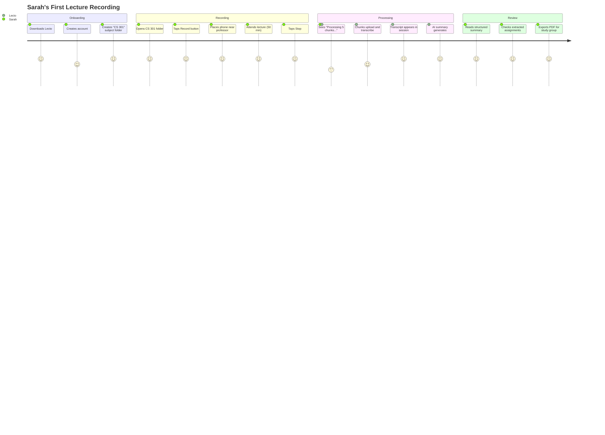

### Offline Journey: No Internet During Lecture

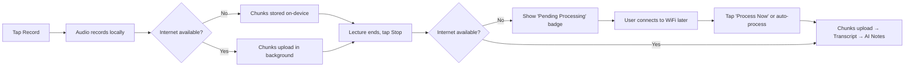

---

## 6. V1 Feature Specifications

---

### 6.1 Recording Engine

> **Priority**: P0 — Critical  
> **Owner**: Mobile Engineering  

#### 6.1.1 Overview

The recording engine is the heart of Lecto. It must be absolutely reliable — a student who presses record must have 100% confidence that their audio is being captured, regardless of network conditions, app state, or device constraints.

#### 6.1.2 Functional Requirements

| ID | Requirement | Priority | Notes |
|----|------------|----------|-------|
| REC-001 | User taps a single button to start recording | P0 | Prominent FAB or center-screen button |
| REC-002 | Audio is captured at 16kHz, 16-bit mono (speech-optimized) | P0 | Reduces file size vs. 44.1kHz stereo; sufficient for STT |
| REC-003 | Recording runs as a foreground service with persistent notification | P0 | Prevents OS from killing the process |
| REC-004 | Audio is chunked every 10 minutes by default | P0 | Configurable: 10, 15, or 20 min via settings |
| REC-005 | Each chunk is saved as a separate file immediately on completion | P0 | Format: `{session_id}_chunk_{N}.wav` or `.m4a` |
| REC-006 | Recording continues uninterrupted across chunk boundaries | P0 | No audible gap or lost audio between chunks |
| REC-007 | User can pause and resume recording | P1 | Paused time is excluded from chunk timing |
| REC-008 | User taps Stop to end the recording session | P0 | Final partial chunk is saved immediately |
| REC-009 | A live timer shows elapsed recording time | P0 | Format: `HH:MM:SS` |
| REC-010 | Audio waveform or level indicator shown during recording | P1 | Visual confirmation that audio is being captured |
| REC-011 | Recording works entirely offline — no network dependency | P0 | Core offline-first requirement |
| REC-012 | User can lock screen while recording continues | P0 | Background audio recording via foreground service |
| REC-013 | Recording survives app being sent to background | P0 | Foreground service ensures continuity |
| REC-014 | If app is force-killed, all completed chunks are preserved | P0 | Each chunk is a finalized file on disk |
| REC-015 | If app is force-killed mid-chunk, partial audio is recoverable | P0 | Write audio buffer to disk periodically (every 5–10 sec) |
| REC-016 | Maximum single session duration: 8 hours | P1 | Covers full-day workshops; warn at 7h 45m |
| REC-017 | Minimum recording: 5 seconds before a valid chunk is created | P2 | Prevents accidental tap-and-stop creating junk files |
| REC-018 | Multiple recording sessions cannot run simultaneously | P0 | Enforce single-session constraint |

#### 6.1.3 Audio Format Decision

| Format | Pros | Cons | Recommendation |
|--------|------|------|----------------|
| **WAV (PCM)** | Lossless, simplest to implement, best STT compatibility | Large file size (~1.9 MB/min at 16kHz/16-bit mono) | ✅ V1 Default — simplicity and reliability first |
| **AAC/M4A** | ~10x smaller than WAV, hardware encoder available | Slightly more complex, potential encoding edge cases | Consider as V1.1 optimization |
| **Opus** | Excellent compression, open format | Less universal hardware support, Flutter plugin maturity | Post-V1 |

**V1 Decision**: Use **WAV (PCM, 16kHz, 16-bit, mono)** for maximum reliability and STT compatibility. File size (~1.9 MB/min, ~114 MB/hour) is manageable for sessions up to 8 hours (~912 MB). Audio is treated as ephemeral — deleted after successful transcription.

#### 6.1.4 Chunk Management

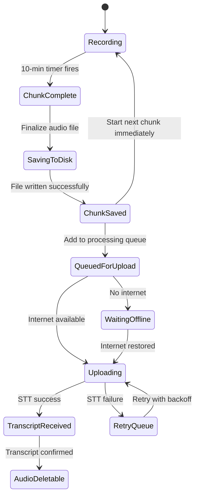

**Chunk File Naming Convention**:
```
{subject_id}/{session_id}/audio/chunk_{NNN}_{timestamp_start}_{timestamp_end}.wav
```

Example:
```
cs301/sess_20261015_0900/audio/chunk_001_0000_0600.wav
cs301/sess_20261015_0900/audio/chunk_002_0600_1200.wav
```

#### 6.1.5 Background Recording Behavior

| Scenario | Expected Behavior |
|----------|-------------------|
| App in foreground | Full UI: timer, waveform, pause/stop buttons |
| App in background | Foreground service continues recording; persistent notification shows timer and stop button |
| Screen locked | Recording continues; notification accessible from lock screen |
| Phone call received | **Pause** recording automatically; **resume** when call ends; notify user |
| Low battery (< 15%) | Show warning; continue recording but suggest stopping soon |
| Low battery (< 5%) | Show urgent warning; auto-save current chunk; suggest stopping |
| Storage < 500 MB remaining | Warn user with estimated remaining recording time |
| Storage < 100 MB remaining | Force-stop recording; save all current data; show error |
| Notification dismissed by user | Recording continues; notification re-appears (foreground service) |

---

### 6.2 Transcript Generation

> **Priority**: P0 — Critical  
> **Owner**: Mobile Engineering + Backend  

#### 6.2.1 Overview

Each audio chunk is sent to a Speech-to-Text (STT) service for transcription. The resulting text is structured as Markdown and appended to a session-level `main.md` file. The transcript is the first derivative of the raw audio and serves as the input for AI summarization.

#### 6.2.2 STT Provider Strategy

| Provider | Pros | Cons | V1 Role |
|----------|------|------|---------|
| **Google Cloud Speech-to-Text V2** | Excellent accuracy, multi-language, real-time and batch modes, punctuation, speaker diarization | Cost (~$0.016/15s for enhanced model), requires GCP setup | **Primary** |
| **OpenAI Whisper API** | High accuracy, simple API, handles noisy audio well, 25 MB file limit per request | No streaming, English-heavy training, rate limits | **Fallback** |
| **On-device Whisper (whisper.cpp)** | Free, offline transcription, privacy-preserving | Slow on mobile (5–15x real-time), high battery drain, large model files | **Post-V1** |

**V1 Decision**: Google Cloud Speech-to-Text V2 as primary, with Whisper API as automatic fallback if Google fails. Audio chunks at 10 minutes / 16kHz mono WAV ≈ 19 MB, within Whisper's 25 MB limit.

#### 6.2.3 Functional Requirements

| ID | Requirement | Priority | Notes |
|----|------------|----------|-------|
| TRX-001 | Each completed audio chunk is automatically queued for transcription | P0 | Queue is persistent (survives app restart) |
| TRX-002 | Chunks are uploaded to STT service via backend proxy | P0 | Client → Backend → STT; avoids exposing API keys on device |
| TRX-003 | Transcription result is returned as structured text with timestamps | P0 | Word-level or segment-level timestamps |
| TRX-004 | Transcript text is formatted as Markdown | P0 | Paragraphs, headings inferred from pauses/topic shifts |
| TRX-005 | Each chunk's transcript is appended to the session's `main.md` | P0 | With chunk separator: `---` and timestamp header |
| TRX-006 | Transcript includes paragraph breaks based on natural speech pauses | P1 | Improves readability |
| TRX-007 | Speaker diarization labels (Speaker 1, Speaker 2) when available | P2 | Useful for Q&A sections; depends on STT capability |
| TRX-008 | If primary STT fails, automatically retry with fallback provider | P0 | Google → Whisper fallback chain |
| TRX-009 | Individual chunk failures do not block processing of other chunks | P0 | Partial results are shown; failed chunks display retry button |
| TRX-010 | User can manually trigger retry for failed chunks | P0 | UI shows per-chunk status with retry action |
| TRX-011 | Transcript processing status visible per session | P0 | States: Pending, Uploading, Processing, Completed, Failed |
| TRX-012 | Transcripts are stored locally on-device | P0 | SQLite or local file; survives app restart |
| TRX-013 | User can view transcript as it builds (chunk by chunk) | P1 | Real-time append to session view |
| TRX-014 | Audio chunk is marked as safe-to-delete only after transcript is confirmed stored locally | P0 | Critical data integrity rule |
| TRX-015 | Language detection or manual language selection | P1 | Default: English; allow user override in settings |

#### 6.2.4 `main.md` File Structure

Each recording session produces a single `main.md` file with the following structure:

```markdown
# Lecture: [Session Name]
**Date**: October 15, 2026  
**Subject**: CS 301 — Data Structures  
**Duration**: 52 minutes  
**Chunks Processed**: 6/6 ✅

---

## Chunk 1 — 00:00 to 10:00

[Transcript paragraph text from first chunk. Natural paragraph
breaks based on speech pauses. Formatted as flowing prose with
proper punctuation and capitalization.]

[Next paragraph in the same chunk...]

---

## Chunk 2 — 10:00 to 20:00

[Transcript text from second chunk...]

---

## Chunk 3 — 20:00 to 30:00

[Transcript text from third chunk...]

...
```

#### 6.2.5 Transcript Processing Pipeline

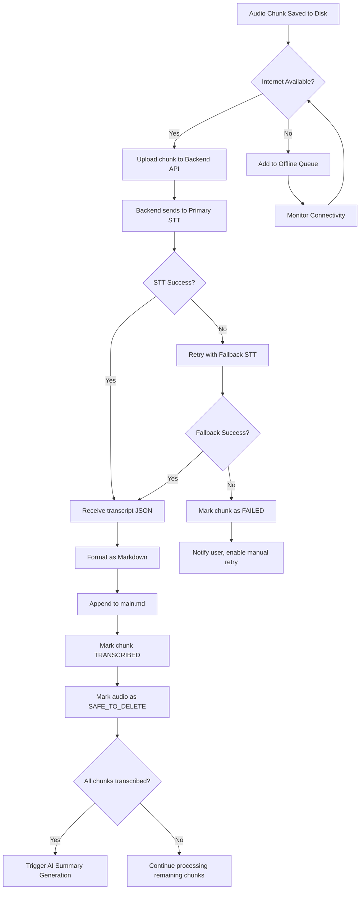

#### 6.2.6 Retry & Backoff Strategy

| Attempt | Delay | Action |
|---------|-------|--------|
| 1st retry | 5 seconds | Retry same provider |
| 2nd retry | 15 seconds | Retry same provider |
| 3rd retry | 60 seconds | Switch to fallback provider |
| 4th retry | 5 minutes | Retry fallback provider |
| 5th retry | 30 minutes | Mark as failed, notify user |
| Manual | User-initiated | User taps "Retry" — resets attempt counter |

Retries use **exponential backoff with jitter** to avoid thundering herd:
```
delay = min(base_delay * 2^attempt + random(0, 1000ms), max_delay)
```

---

### 6.3 AI-Powered Summary & Notes

> **Priority**: P0 — Critical  
> **Owner**: Backend + AI Engineering  

#### 6.3.1 Overview

Once the complete transcript (`main.md`) is available, Gemini AI processes it to produce structured study notes. This is the highest-value feature — transforming raw lecture text into actionable study material.

#### 6.3.2 AI Provider

| Provider | Model | V1 Role |
|----------|-------|---------|
| **Google Gemini** | Gemini 1.5 Flash (cost-effective for long context) | **Primary** |
| **Google Gemini** | Gemini 1.5 Pro (higher quality, higher cost) | **Fallback for complex/long lectures** |

**Context Window**: Gemini 1.5 Flash supports 1M tokens. A 2-hour lecture transcript ≈ 20,000–30,000 words ≈ ~40,000 tokens. Well within limits even for very long sessions.

#### 6.3.3 Generated Output Structure

The AI generates a structured notes document with the following sections:

```markdown
# 📝 Lecture Notes: [Auto-detected or User-provided Title]
**Subject**: CS 301 — Data Structures  
**Date**: October 15, 2026  
**Duration**: 52 minutes  
**Lecturer**: [Auto-detected if mentioned]

---

## 📌 Summary
A 3–5 paragraph executive summary of the lecture covering the main
narrative arc, key conclusions, and overall takeaways. Written in
clear, concise academic language.

---

## 🔑 Key Concepts

### 1. [Concept Name]
- Definition / Explanation
- Why it matters
- Related concepts mentioned

### 2. [Concept Name]
- Definition / Explanation
- ...

---

## 📋 Topic Breakdown

| # | Topic | Time Range | Key Points |
|---|-------|------------|------------|
| 1 | Introduction to Binary Trees | 00:00–12:30 | Definition, terminology, types |
| 2 | Tree Traversal Algorithms | 12:30–28:00 | Inorder, preorder, postorder |
| 3 | Balanced vs Unbalanced Trees | 28:00–42:00 | Performance implications, AVL intro |
| 4 | Q&A and Examples | 42:00–52:00 | Student questions, exam hints |

---

## 📅 Assignments & Due Dates

| Assignment | Due Date | Details |
|-----------|----------|---------|
| Problem Set 5 | Oct 22, 2026 | Binary tree implementation, Ch. 7 exercises |
| Reading | Before next class | Textbook Ch. 8, sections 8.1–8.4 |

> *If no assignments were mentioned, this section displays:*
> *"No assignments or deadlines were mentioned in this lecture."*

---

## ✅ Action Items
- [ ] Review binary tree terminology from textbook
- [ ] Practice inorder traversal on paper before next class
- [ ] Start Problem Set 5 (due Oct 22)
- [ ] Read Chapter 8, sections 8.1–8.4

---

## 💡 Notable Quotes & Statements
> "This will definitely be on the exam." — 34:12

> "The key insight is that balanced trees give you O(log n) guarantees." — 22:45

---

## 🔗 References Mentioned
- Textbook: *Introduction to Algorithms* (Cormen et al.), Chapter 7
- Paper: "Self-Adjusting Binary Search Trees" — Sleator & Tarjan, 1985
```

#### 6.3.4 Functional Requirements

| ID | Requirement | Priority | Notes |
|----|------------|----------|-------|
| AI-001 | AI summary generation triggers automatically when all chunks are transcribed | P0 | Can also be triggered manually |
| AI-002 | Full `main.md` transcript is sent to Gemini as context | P0 | Via backend proxy |
| AI-003 | AI output includes all sections defined in §6.3.3 | P0 | Summary, Key Concepts, Topics, Assignments, Actions |
| AI-004 | Output is structured Markdown stored as `notes.md` alongside `main.md` | P0 | Both files belong to the session |
| AI-005 | AI generation shows progress indicator | P1 | "Generating summary...", "Extracting key concepts..." |
| AI-006 | If AI generation fails, user can retry | P0 | Transcript is preserved; only AI step retries |
| AI-007 | AI does not hallucinate content not in the transcript | P0 | Prompt engineering constraint; include instruction in system prompt |
| AI-008 | User can regenerate notes (e.g., with different emphasis) | P2 | "Focus more on formulas" — future enhancement |
| AI-009 | AI respects lecture language (English V1; multi-language post-V1) | P1 | Notes generated in same language as transcript |
| AI-010 | AI identifies and extracts due dates even if stated informally | P1 | "next Tuesday" → resolved to actual date using session date |
| AI-011 | Processing time for AI notes: < 60 seconds for a 1-hour lecture | P1 | Performance target |
| AI-012 | AI output is editable by the user after generation | P2 | Users can correct or add to generated notes |

#### 6.3.5 Prompt Engineering Guidelines

The system prompt sent to Gemini must:

1. **Ground the AI in the transcript** — "You are analyzing a lecture transcript. Only include information that appears in the transcript. Do not add external knowledge or speculate."
2. **Define output format precisely** — Provide the exact Markdown template as a formatting instruction.
3. **Handle edge cases**:
   - Very short recordings (< 5 minutes): Generate abbreviated notes, skip topic breakdown table
   - Poor quality / garbled transcripts: Note low confidence, still attempt best-effort summary
   - Non-lecture content (e.g., casual conversation): Adapt sections appropriately
4. **Date resolution** — Provide the recording date so relative references ("next Monday", "this Friday") can be resolved to absolute dates.
5. **Academic tone** — Notes should be clear, professional, and study-oriented.

---

### 6.4 Subject & Folder Organization

> **Priority**: P0 — Critical  
> **Owner**: Mobile Engineering + Design  

#### 6.4.1 Overview

Lecto's organizational model mirrors how students think about their academic life: **by subject**. Each subject is a folder containing recording sessions. This simple hierarchy keeps things organized without cognitive overhead.

#### 6.4.2 Information Architecture

```
Lecto Home
├── 📁 CS 301 — Data Structures
│   ├── 📝 Oct 15 — Binary Trees (52 min) ✅
│   ├── 📝 Oct 13 — Linked Lists (48 min) ✅
│   ├── 🔄 Oct 11 — Stacks & Queues (50 min) [Processing...]
│   └── ⏳ Oct 9 — Arrays Review (45 min) [Pending Upload]
├── 📁 MATH 201 — Linear Algebra
│   ├── 📝 Oct 15 — Eigenvalues (75 min) ✅
│   └── ...
├── 📁 PHY 101 — Mechanics
│   └── ...
└── ➕ Create New Subject
```

#### 6.4.3 Functional Requirements

| ID | Requirement | Priority | Notes |
|----|------------|----------|-------|
| ORG-001 | Clean onboarding flow where user creates first subject folder | P0 | Shown after account creation |
| ORG-002 | User can create, rename, and delete subject folders | P0 | Delete requires confirmation; warns about contained recordings |
| ORG-003 | Subject folders display: name, color/icon, recording count, last recorded date | P0 | |
| ORG-004 | Inside a subject folder, recordings are listed with: title, date, duration, status | P0 | |
| ORG-005 | User can sort recordings by: date (default), name, duration | P1 | |
| ORG-006 | User can rename recording sessions | P1 | Default name: date + auto-detected topic |
| ORG-007 | User can move recordings between subject folders | P1 | Drag-and-drop or menu action |
| ORG-008 | User can delete recordings (with confirmation) | P0 | Deletes audio, transcript, and notes |
| ORG-009 | Each subject folder can have a custom color and optional emoji icon | P2 | Personalization |
| ORG-010 | Home screen shows all subjects in a grid or list view | P0 | Toggle between views |
| ORG-011 | "Quick Record" option from home screen without selecting a subject | P1 | Recording assigned to "Unsorted" folder; user can move later |
| ORG-012 | Session detail view shows: audio player, transcript, notes, PDF export | P0 | Tabbed or scrollable layout |
| ORG-013 | Search within a session's transcript | P1 | Full-text search with highlighting |

#### 6.4.4 Onboarding Flow

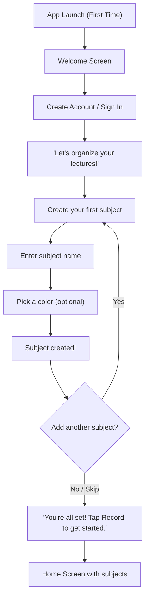

> [!IMPORTANT]
> Onboarding must be completable in **under 60 seconds**. Users should feel productive immediately. Subject creation can also happen later — it should never block the user from recording.

#### 6.4.5 Data Model

| Entity | Fields | Notes |
|--------|--------|-------|
| **Subject** | `id`, `name`, `color`, `emoji`, `created_at`, `updated_at`, `sort_order` | User-created folder |
| **Session** | `id`, `subject_id`, `title`, `started_at`, `ended_at`, `duration_seconds`, `status`, `chunk_count`, `language` | One recording session |
| **AudioChunk** | `id`, `session_id`, `chunk_number`, `file_path`, `start_time`, `end_time`, `size_bytes`, `status`, `transcript_status`, `retry_count` | Individual audio file |
| **Transcript** | `id`, `session_id`, `chunk_id` (nullable for full), `content_md`, `word_count`, `created_at`, `provider` | Markdown transcript |
| **Notes** | `id`, `session_id`, `content_md`, `summary`, `key_concepts_json`, `assignments_json`, `action_items_json`, `created_at`, `ai_model`, `prompt_version` | AI-generated notes |

**Session Status Enum**:

| Status | Meaning |
|--------|---------|
| `RECORDING` | Active recording in progress |
| `RECORDED` | Recording complete, processing not started |
| `PROCESSING` | One or more chunks being transcribed |
| `PARTIALLY_TRANSCRIBED` | Some chunks transcribed, some failed |
| `TRANSCRIBED` | All chunks transcribed, awaiting AI processing |
| `GENERATING_NOTES` | AI is generating summary/notes |
| `COMPLETED` | Transcript + AI notes both available |
| `FAILED` | Critical failure; user intervention needed |

---

### 6.5 PDF Export

> **Priority**: P1 — High  
> **Owner**: Mobile Engineering  

#### 6.5.1 Overview

Users can export their AI-generated notes (and optionally the full transcript) as a beautifully formatted PDF. This serves two purposes: (1) offline access to a polished study document, and (2) shareability with classmates, study groups, or instructors.

#### 6.5.2 Functional Requirements

| ID | Requirement | Priority | Notes |
|----|------------|----------|-------|
| PDF-001 | User can export AI notes as PDF from the session detail view | P0 | Single tap → share sheet or save to device |
| PDF-002 | PDF includes all sections from the AI notes (§6.3.3) | P0 | Properly formatted with headings, tables, checkboxes |
| PDF-003 | PDF has a professional header: Lecto branding, session title, date, subject | P1 | Clean, academic aesthetic |
| PDF-004 | PDF includes page numbers and a table of contents for long documents | P2 | Generated from Markdown headings |
| PDF-005 | User can optionally include the full transcript in the PDF | P1 | Toggle: "Include full transcript" — appended after notes |
| PDF-006 | PDF generation happens on-device (no network required) | P0 | Using Flutter PDF package (e.g., `pdf` or `printing`) |
| PDF-007 | PDF is shareable via system share sheet (WhatsApp, email, Drive, etc.) | P0 | Standard platform share intent |
| PDF-008 | PDF supports both light and dark themes | P2 | User preference or system default |
| PDF-009 | PDF file name format: `Lecto_{Subject}_{Date}_{Title}.pdf` | P1 | Clean, descriptive filename |
| PDF-010 | Export progress indicator for long transcripts | P2 | "Generating PDF..." spinner |

#### 6.5.3 PDF Design Specifications

| Element | Specification |
|---------|---------------|
| **Page Size** | A4 (210 × 297 mm) |
| **Margins** | 20mm all sides |
| **Title Font** | Bold, 18pt, primary brand color |
| **Heading Font** | Bold, 14pt |
| **Body Font** | Regular, 11pt, 1.4 line height |
| **Code/Mono Font** | Monospace, 10pt, light gray background |
| **Header** | Session title (left), Lecto logo (right), horizontal rule |
| **Footer** | Page number (center), "Generated by Lecto" (right) |
| **Tables** | Bordered, alternating row shading |
| **Checkboxes** | Unicode ☐ / ☑ characters |

---

## 7. Data Flow & System Architecture

### 7.1 End-to-End Data Flow

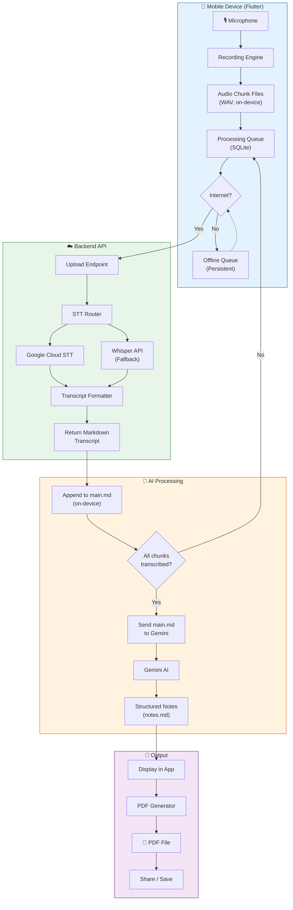

### 7.2 Backend API Endpoints (V1)

| Method | Endpoint | Description |
|--------|----------|-------------|
| `POST` | `/api/v1/auth/register` | Create account |
| `POST` | `/api/v1/auth/login` | Authenticate |
| `POST` | `/api/v1/transcribe/upload` | Upload audio chunk for transcription |
| `GET`  | `/api/v1/transcribe/status/{chunk_id}` | Check transcription status |
| `GET`  | `/api/v1/transcribe/result/{chunk_id}` | Retrieve transcript text |
| `POST` | `/api/v1/ai/generate-notes` | Send full transcript, receive AI notes |
| `GET`  | `/api/v1/ai/status/{session_id}` | Check AI generation status |
| `GET`  | `/api/v1/ai/result/{session_id}` | Retrieve generated notes |

> [!NOTE]
> The backend serves as a **proxy layer** — it holds API keys for STT and AI services, applies rate limiting, manages queues, and returns results. The device stores all persistent data locally. The backend is stateless with respect to user data (V1).

### 7.3 Technology Stack (V1)

| Layer | Technology | Rationale |
|-------|-----------|-----------|
| **Mobile App** | Flutter 3.x / Dart | Cross-platform (iOS + Android) from single codebase |
| **Local Database** | SQLite via `drift` (or `sqflite`) | Mature, reliable, offline-first local storage |
| **Local File Storage** | Device filesystem (app-specific directory) | Audio chunks, transcripts, notes |
| **Audio Recording** | `record` or `flutter_sound` package | Background recording, WAV output |
| **Background Service** | `flutter_foreground_task` | Persistent recording via foreground service |
| **Networking** | `dio` with interceptors | HTTP client with retry, auth, logging |
| **State Management** | `riverpod` or `bloc` | Scalable state management |
| **PDF Generation** | `pdf` + `printing` packages | On-device PDF creation |
| **Backend API** | Node.js (Express) or Python (FastAPI) | Lightweight proxy; TBD |
| **STT Service** | Google Cloud Speech-to-Text V2 | Primary transcription |
| **STT Fallback** | OpenAI Whisper API | Secondary transcription |
| **AI Service** | Google Gemini 1.5 Flash | Summary and notes generation |
| **Auth** | Firebase Auth | Quick implementation, Google/email sign-in |
| **Crash Reporting** | Firebase Crashlytics | Monitor crashes and ANRs |
| **Analytics** | Firebase Analytics | Usage tracking, funnel analysis |

---

## 8. Offline-First Architecture

> [!IMPORTANT]
> This is the most critical architectural requirement. **Lecto must never fail to record because of network conditions.** Many lecture halls, conference centers, and classrooms have poor or no connectivity.

### 8.1 Offline Behavior Matrix

| Feature | Offline Behavior | Online Behavior |
|---------|-----------------|-----------------|
| **Recording** | ✅ Works fully | ✅ Works fully |
| **Audio Chunking** | ✅ Chunks saved to device | ✅ Chunks saved to device |
| **Chunk Upload** | ❌ Queued for later | ✅ Uploaded automatically |
| **Transcription** | ❌ Queued for later | ✅ Processed automatically |
| **AI Notes Generation** | ❌ Queued for later | ✅ Triggered when transcript complete |
| **Viewing Past Transcripts** | ✅ Stored locally | ✅ Stored locally |
| **Viewing Past Notes** | ✅ Stored locally | ✅ Stored locally |
| **PDF Export** | ✅ Generated on-device | ✅ Generated on-device |
| **Subject/Folder Management** | ✅ Local-only | ✅ Local-only |
| **Search** | ✅ Local search | ✅ Local search |

### 8.2 Processing Queue

The processing queue is a persistent, prioritized task queue stored in SQLite:

```sql
CREATE TABLE processing_queue (
    id              TEXT PRIMARY KEY,
    session_id      TEXT NOT NULL,
    chunk_id        TEXT,
    task_type       TEXT NOT NULL,  -- 'TRANSCRIBE' | 'GENERATE_NOTES'
    status          TEXT NOT NULL,  -- 'PENDING' | 'IN_PROGRESS' | 'COMPLETED' | 'FAILED'
    priority        INTEGER DEFAULT 0,
    retry_count     INTEGER DEFAULT 0,
    max_retries     INTEGER DEFAULT 5,
    last_attempt_at TEXT,
    next_retry_at   TEXT,
    error_message   TEXT,
    created_at      TEXT NOT NULL,
    updated_at      TEXT NOT NULL
);
```

### 8.3 Connectivity Detection & Sync Strategy

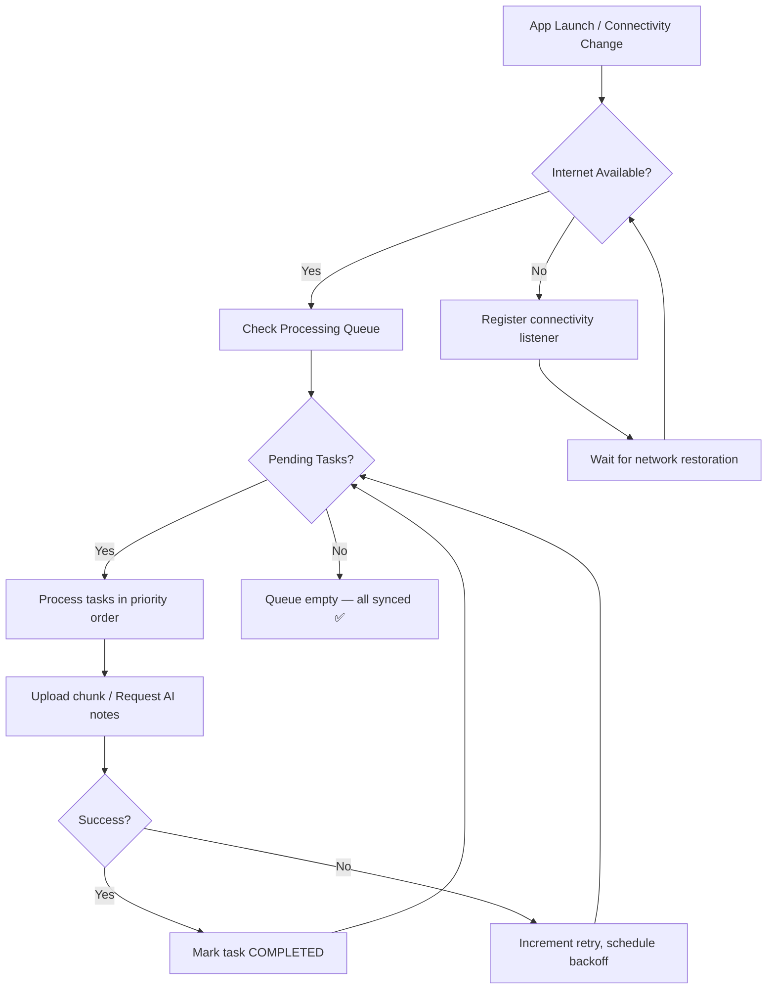

> [!TIP]
> **WiFi vs. Cellular**: By default, large uploads (audio chunks) should only occur over WiFi to avoid consuming mobile data. Users can override this in settings: "Allow processing over cellular data."

---

## 9. Edge Cases & Exception Handling

> [!CAUTION]
> Each edge case below has been individually considered and has a defined recovery path. **No user data should ever be silently lost.**

### 9.1 Comprehensive Edge Case Matrix

| # | Edge Case | Detection | Handling | User Communication |
|---|-----------|-----------|----------|-------------------|
| EC-01 | **No internet during recording** | `Connectivity` plugin check | Record locally; queue all chunks for later processing | "Recording offline. Transcription will start when you're back online." |
| EC-02 | **Internet drops mid-upload** | HTTP timeout / socket error | Pause upload; retry with exponential backoff when connection restores | "Upload paused. Will resume automatically." |
| EC-03 | **Internet drops mid-transcription** | API timeout | Chunk remains in queue; retry when connectivity restores. Audio is preserved. | "Transcription interrupted. Will retry automatically." |
| EC-04 | **App killed during recording** | Foreground service `onDestroy` callback | Finalize current chunk buffer to disk immediately; mark session as `INTERRUPTED` | On next launch: "We recovered your recording from [date]. X chunks saved." |
| EC-05 | **App killed mid-transcription** | Queue persists in SQLite | On next launch, queue manager resumes pending tasks | "Resuming transcription for [session name]..." |
| EC-06 | **Low storage (< 500 MB)** | Periodic filesystem check during recording | Warn user; show estimated remaining recording time | "Storage is low. ~25 minutes of recording space remaining." |
| EC-07 | **Critical storage (< 100 MB)** | Filesystem check | Auto-stop recording; save all current data | "Recording stopped — device storage is critically low. All audio has been saved." |
| EC-08 | **Low battery (< 15%)** | Battery level listener | Show warning; continue recording | "Battery is low. Consider stopping the recording soon." |
| EC-09 | **Critical battery (< 5%)** | Battery level listener | Show urgent warning; auto-save current chunk | "Battery critical. Current audio chunk saved. Plug in to continue." |
| EC-10 | **Poor audio quality / silence** | Audio level monitoring (RMS amplitude) | If sustained silence > 2 min, show subtle indicator; still save audio | Waveform indicator goes flat; tooltip: "Low audio detected — check microphone placement." |
| EC-11 | **STT returns garbled/low-confidence transcript** | Confidence score from STT API | Accept transcript but flag it; store original audio longer | "⚠️ Transcript quality may be low for this section. Original audio preserved." |
| EC-12 | **Partial chunk transcription failure** | Per-chunk status tracking | Retry individual chunk; other chunks unaffected; `main.md` shows placeholder for failed chunk | "Chunk 3 of 5 failed to transcribe. [Retry] [Skip]" |
| EC-13 | **AI summary generation failure** | API error response | Retry up to 3 times; transcript is still available even if summary fails | "Summary generation failed. Your transcript is complete. [Retry Summary]" |
| EC-14 | **Transcript generated → delete audio** | `transcript_status = CONFIRMED` flag | Only delete audio when transcript is confirmed saved to local SQLite AND user has explicitly enabled auto-cleanup (or manual delete) | "Transcript confirmed. Audio file can be safely removed to free X MB." |
| EC-15 | **Phone call during recording** | `PhoneState` listener | Auto-pause recording; auto-resume after call ends | "Recording paused due to phone call. Resumed automatically." |
| EC-16 | **Microphone permission revoked mid-recording** | Permission change listener | Stop recording; save current data | "Microphone access was revoked. Recording stopped. X chunks saved." |
| EC-17 | **Backend service down** | HTTP 5xx responses | Retry with backoff; after 5 failures, notify user | "Our servers are temporarily unavailable. Your recording is safe — processing will resume later." |
| EC-18 | **User closes app before processing completes** | Queue persists independently | Processing continues next time app is opened (or via background sync if enabled) | Badge on session: "Processing pending" |
| EC-19 | **Duplicate chunk upload (idempotency)** | Chunk ID as idempotency key | Backend deduplicates; returns existing transcript if already processed | Transparent to user |
| EC-20 | **Very long recording (> 4 hours)** | Timer check | Continue recording; warn at 7h 45m; hard stop at 8h | "This is a long session! Consider stopping and starting a new one." |
| EC-21 | **Corrupt audio file on disk** | Checksum validation before upload | Mark chunk as `CORRUPT`; skip it; notify user | "One audio chunk was corrupted and cannot be processed. Other chunks are unaffected." |
| EC-22 | **Device restart during recording** | OS kills all processes | Foreground service saves on destroy; on boot, Lecto detects orphaned session | "Lecto recovered a recording from before your device restarted." |

### 9.2 Audio File Lifecycle

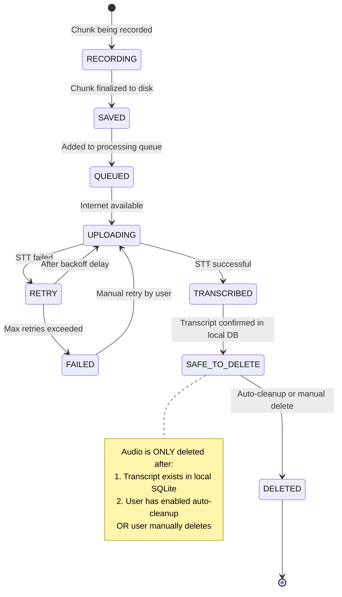

> [!WARNING]
> **Audio files are the REAL ASSETS.** They must never be deleted until the transcript is confirmed stored locally. This is an inviolable rule. A missing transcript can be regenerated from audio; missing audio cannot be recovered.

---

## 10. Data Retention & Storage Policy

### 10.1 Storage Estimation

| Content Type | Size per Hour | 8-Hour Session | 30 Sessions |
|-------------|---------------|----------------|-------------|
| **Raw Audio (WAV)** | ~114 MB | ~912 MB | ~3.4 GB |
| **Transcript (Markdown)** | ~50 KB | ~400 KB | ~1.5 MB |
| **AI Notes (Markdown)** | ~20 KB | ~20 KB | ~600 KB |
| **PDF Export** | ~200 KB | ~200 KB | ~6 MB |
| **Total (with audio)** | ~114 MB | ~913 MB | ~3.4 GB |
| **Total (audio deleted)** | ~270 KB | ~620 KB | ~8 MB |

> [!TIP]
> After successful transcription, deleting audio reduces storage by **99.8%**. This is why the audio cleanup policy is critical.

### 10.2 Retention Rules

| Data Type | Retention Policy | User Control |
|-----------|-----------------|--------------|
| **Audio Chunks** | Retained until transcript is confirmed. Then: user chooses auto-delete or manual delete. | Settings: "Auto-delete audio after successful transcription" (default: OFF) |
| **Transcripts** | Retained indefinitely (local) | User can delete individual sessions |
| **AI Notes** | Retained indefinitely (local) | User can delete or regenerate |
| **PDFs** | Saved to device Downloads folder | Managed by user outside Lecto |
| **Processing Queue** | Cleared after task completion | Automatic |
| **Account Data** | Retained until account deletion | User can delete account |

### 10.3 Storage Management UI

| Threshold | User Experience |
|-----------|----------------|
| **Normal (> 2 GB free)** | No indicators |
| **Low (500 MB – 2 GB free)** | Subtle banner: "Storage getting low. Consider cleaning up old audio files." |
| **Warning (100 – 500 MB free)** | Prominent banner with "Manage Storage" button |
| **Critical (< 100 MB free)** | Block new recordings; show storage management screen |

**Storage Management Screen**:
- Total Lecto storage usage breakdown (audio, transcripts, notes)
- List of sessions with audio still on-device, sorted by size
- Bulk action: "Delete all audio for transcribed sessions" with confirmation
- Per-session: "This session has 456 MB of audio. Transcript is confirmed. [Delete Audio]"

---

## 11. User Stories & Acceptance Criteria

### 11.1 Recording

| ID | User Story | Acceptance Criteria |
|----|-----------|-------------------|
| US-R01 | As a student, I want to start recording a lecture with a single tap so I can capture audio instantly without distraction. | Given I'm on a subject's page, when I tap the Record button, then recording starts within 1 second, a timer is visible, and a foreground notification appears. |
| US-R02 | As a student, I want my recording to continue when I lock my screen or switch apps so I don't have to keep Lecto in the foreground. | Given recording is active, when I lock my screen or switch to another app, then recording continues uninterrupted, confirmed by the persistent notification timer advancing. |
| US-R03 | As a student, I want audio to be chunked automatically so that processing can happen incrementally. | Given recording has been active for 10 minutes (default), when the chunk timer fires, then the current chunk is saved to disk, a new chunk begins recording, and no audio is lost at the boundary. |
| US-R04 | As a student, I want my recording to be saved if the app crashes so I never lose captured audio. | Given the app is force-killed during recording, when I reopen Lecto, then I see a recovery prompt showing the interrupted session with all completed chunks preserved and the partial final chunk recovered. |
| US-R05 | As a student, I want to pause and resume recording so I can skip breaks and irrelevant portions. | Given recording is active, when I tap Pause, then recording pauses (waveform flatlines, timer stops), and when I tap Resume, recording continues into the same chunk (or a new chunk if time warrants). |
| US-R06 | As a student, I want to be warned when my phone is running low on storage so I can take action before recording fails. | Given storage < 500 MB, when I'm recording, then I see a non-intrusive warning with estimated remaining recording time. Given storage < 100 MB, recording auto-stops with all data saved. |
| US-R07 | As a student, I want recording to work completely offline so I can record in lecture halls with no WiFi. | Given my device has no internet connection, when I tap Record, then recording starts normally, chunks are saved locally, and I see a "Processing will start when online" indicator. |

### 11.2 Transcription

| ID | User Story | Acceptance Criteria |
|----|-----------|-------------------|
| US-T01 | As a student, I want each audio chunk to be automatically transcribed so I don't have to do anything manually. | Given a chunk is saved and internet is available, when it enters the processing queue, then it's uploaded and transcribed within 3 minutes, and the result appears in the session view. |
| US-T02 | As a student, I want to see the transcription status for each chunk so I know what's been processed. | Given a session has 5 chunks, when I view the session detail, then I see status indicators for each chunk (Pending, Processing, Completed, Failed) with a clear progress summary ("3 of 5 chunks transcribed"). |
| US-T03 | As a student, I want to retry failed transcription chunks individually so partial failures don't block everything. | Given chunk 3 of 5 has failed, when I view the session, then I see a Retry button on chunk 3, and tapping it re-queues only that chunk for processing. |
| US-T04 | As a student, I want transcripts formatted as readable Markdown so they're easy to study from. | Given a chunk is transcribed, when I view the transcript, then it contains proper paragraphs, punctuation, capitalization, and chunk separators with timestamps. |
| US-T05 | As a student, I want offline-queued chunks to process automatically when I get internet so I don't have to remember to trigger it. | Given I recorded 5 chunks offline and I later connect to WiFi, then Lecto automatically starts processing the queued chunks without any user action, and I receive a notification when transcription is complete. |
| US-T06 | As a student, I want a fallback transcription service so that if one service fails, my transcript still gets generated. | Given the primary STT fails for a chunk after 3 retries, when the fallback is triggered, then the chunk is sent to the alternative STT service. If it succeeds, the transcript is stored normally. |

### 11.3 AI Notes

| ID | User Story | Acceptance Criteria |
|----|-----------|-------------------|
| US-A01 | As a student, I want AI-generated structured notes so I have organized study material without manual effort. | Given all chunks are transcribed for a session, when AI processing completes, then I see structured notes with: Summary, Key Concepts, Topic Breakdown, Assignments, and Action Items. |
| US-A02 | As a student, I want assignments and due dates extracted from the lecture so I never miss a deadline. | Given the lecturer mentions "Problem Set 5 is due next Tuesday", when AI processes the transcript, then the Assignments section contains "Problem Set 5" with the resolved due date. |
| US-A03 | As a student, I want to retry AI note generation if it fails so I don't lose the ability to get notes. | Given AI generation fails, when I view the session, then I see the complete transcript and a "Retry" button for note generation. The transcript is not affected by AI failures. |
| US-A04 | As a student, I want AI notes to only contain information from the lecture so I can trust their accuracy. | Given a transcript about binary trees, when AI generates notes, then the notes contain only information present in the transcript — no external definitions, no hallucinated details. |
| US-A05 | As a student, I want a topic breakdown with timestamps so I can navigate back to specific parts of the lecture. | Given a 50-minute lecture, when I view the AI notes, then the Topic Breakdown table lists 3–6 topics with start/end time ranges and key points for each. |

### 11.4 Organization

| ID | User Story | Acceptance Criteria |
|----|-----------|-------------------|
| US-O01 | As a new user, I want a clean onboarding experience that lets me set up my subjects in under 60 seconds. | Given I install Lecto for the first time, when I complete onboarding, then I have at least one subject folder created and I see the home screen with a clear Record button, all within 60 seconds. |
| US-O02 | As a student, I want to organize my recordings by subject so I can find them easily during revision. | Given I have 3 subjects, when I open a subject folder, then I see only recordings for that subject, sorted by date (most recent first). |
| US-O03 | As a student, I want to start a quick recording without selecting a subject so I can capture audio immediately. | Given I'm on the home screen, when I tap "Quick Record", then recording starts immediately and the session is placed in an "Unsorted" folder that I can reorganize later. |
| US-O04 | As a student, I want to search within a transcript so I can find specific topics or terms quickly. | Given I'm viewing a session transcript, when I tap the search icon and type "eigenvalue", then all occurrences are highlighted and I can navigate between them. |
| US-O05 | As a student, I want to sort my recordings by date, name, or duration so I can find what I need. | Given I'm in a subject folder, when I tap the sort button, then I can choose between Date (default), Name (A–Z), and Duration (longest first). |

### 11.5 PDF Export

| ID | User Story | Acceptance Criteria |
|----|-----------|-------------------|
| US-P01 | As a student, I want to export my AI notes as a PDF so I can share them with classmates or print them. | Given a session has completed AI notes, when I tap "Export PDF", then a professionally formatted PDF is generated and the system share sheet appears. |
| US-P02 | As a student, I want the PDF to include all note sections with proper formatting. | Given I export a PDF, when I open it, then it contains: header with session info, summary, key concepts, topic breakdown table, assignments table, action items, and footer with page numbers. |
| US-P03 | As a student, I want the option to include the full transcript in the PDF for comprehensive study material. | Given I'm exporting a PDF, when I toggle "Include full transcript", then the PDF appends the full transcript after the notes section with proper formatting. |
| US-P04 | As a student, I want PDF export to work offline so I can share notes even without internet. | Given I have no internet, when I export a PDF, then it generates successfully on-device without any network calls. |

---

## 12. Non-Functional Requirements

### 12.1 Performance

| Metric | Target | Notes |
|--------|--------|-------|
| App launch to ready | < 2 seconds | Cold start on mid-range device |
| Tap-to-record latency | < 500 ms | From button press to actual audio capture |
| Chunk boundary gap | < 50 ms | Inaudible; no lost audio |
| Transcript delivery | < 3 minutes per 10-min chunk | Network-dependent; measured over WiFi |
| AI notes generation | < 60 seconds for 1-hour lecture | Backend processing time |
| PDF generation | < 5 seconds for 1-hour lecture notes | On-device |
| Transcript search | < 200 ms for results | Local full-text search |
| App memory usage during recording | < 100 MB | Background-friendly |

### 12.2 Reliability

| Metric | Target |
|--------|--------|
| Recording success rate | > 99.9% (once started, audio is captured) |
| Chunk save success rate | > 99.99% |
| Data loss incidents | 0 (target: zero user data loss) |
| Crash rate | < 0.1% of sessions |
| Background recording survival | > 99% (across OS variations) |

### 12.3 Security & Privacy

| Requirement | Implementation |
|-------------|---------------|
| Audio data in transit | TLS 1.3 encryption |
| Audio data at rest (device) | App-private storage directory; encrypted if device encryption enabled |
| API key protection | Keys stored on backend only; never embedded in client |
| User authentication | Firebase Auth with email/password and Google Sign-In |
| Audio data on backend | Ephemeral — deleted from server within 1 hour of processing |
| GDPR compliance | User can export and delete all data; privacy policy required |
| Recording consent | App displays reminder: "Ensure you have permission to record" before first use |

### 12.4 Accessibility

| Requirement | Implementation |
|-------------|---------------|
| Screen reader support | All UI elements have semantic labels |
| Minimum touch target | 48×48 dp for all interactive elements |
| Color contrast | WCAG 2.1 AA compliance |
| Font scaling | Support up to 200% system font size |
| Haptic feedback | Vibration on record start/stop for confirmation |

### 12.5 Supported Platforms

| Platform | Minimum Version | Notes |
|----------|----------------|-------|
| Android | API 26 (Android 8.0 Oreo) | Foreground service support |
| iOS | iOS 15.0 | Background audio recording support |
| Flutter SDK | 3.22+ | Latest stable |
| Dart SDK | 3.5+ | Null safety, records |

---

## 13. Success Metrics & KPIs

### 13.1 North Star Metric

> **Weekly Active Recordings (WAR)**: Number of unique recording sessions created per week across all users.

This metric captures the core value loop — users who record regularly are getting value from Lecto.

### 13.2 KPI Dashboard

| Category | KPI | Target (3 months post-launch) | Measurement |
|----------|-----|-------------------------------|-------------|
| **Acquisition** | App installs | 10,000 | App store analytics |
| **Acquisition** | Registration rate | > 60% of installs | Firebase Analytics |
| **Activation** | First recording within 24h of install | > 40% | Event tracking |
| **Activation** | Onboarding completion rate | > 80% | Funnel analytics |
| **Engagement** | Weekly Active Recordings (WAR) | 3+ per active user | Session tracking |
| **Engagement** | Weekly Active Users (WAU) | > 30% of total registrations | Firebase Analytics |
| **Engagement** | Average recording duration | > 20 minutes | Session metadata |
| **Engagement** | PDF exports per user per week | > 1 | Event tracking |
| **Quality** | Transcript generation success rate | > 95% | Backend monitoring |
| **Quality** | AI notes generation success rate | > 98% | Backend monitoring |
| **Quality** | Average processing time (record → notes ready) | < 10 minutes for 1-hour lecture | Pipeline monitoring |
| **Retention** | D7 retention | > 35% | Cohort analysis |
| **Retention** | D30 retention | > 20% | Cohort analysis |
| **Reliability** | App crash rate | < 0.1% of sessions | Crashlytics |
| **Reliability** | Data loss incidents | 0 | Error monitoring + user reports |
| **Satisfaction** | App store rating | > 4.3 ★ | App store |
| **Satisfaction** | NPS score | > 40 | In-app survey (after 5th recording) |

### 13.3 Funnel Metrics

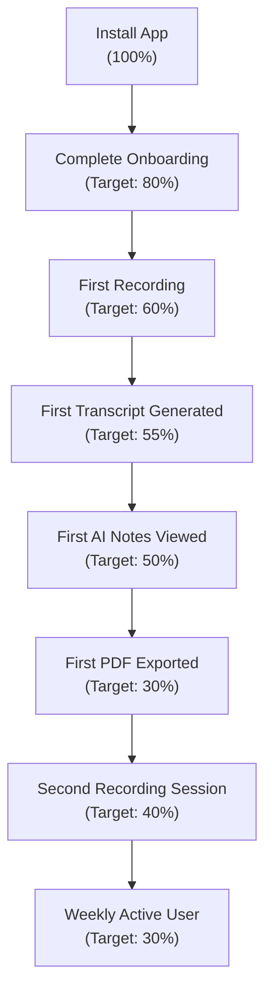

---

## 14. Competitive Analysis

### 14.1 Competitive Landscape

| Feature | **Lecto** (V1) | **Otter.ai** | **Notion AI** | **Rev** | **Whisper (DIY)** | **Apple Voice Memos + ChatGPT** |
|---------|:---------:|:--------:|:---------:|:---:|:----------:|:--------------------:|
| **One-tap recording** | ✅ | ✅ | ❌ | ❌ | ❌ | ✅ (VM) |
| **Offline recording** | ✅ | ⚠️ Limited | ❌ | ❌ | ✅ | ✅ (VM) |
| **Auto-chunking** | ✅ | ❌ | ❌ | ❌ | ❌ | ❌ |
| **Real-time transcription** | ❌ (chunked) | ✅ | ❌ | ❌ | ❌ | ❌ |
| **AI-structured notes** | ✅ | ⚠️ Basic | ✅ | ❌ | ❌ | Manual |
| **Assignment extraction** | ✅ | ❌ | ❌ | ❌ | ❌ | Manual |
| **Academic focus** | ✅ | ⚠️ Business | ❌ General | ❌ General | ❌ | ❌ |
| **Subject organization** | ✅ | ✅ Folders | ✅ Pages | ✅ | ❌ | ❌ |
| **PDF export** | ✅ | ✅ | ✅ | ✅ | ❌ | Manual |
| **Free tier** | TBD | 300 min/mo | Requires subscription | No free tier | Free (self-hosted) | Free (limited) |
| **Offline-first architecture** | ✅ | ❌ | ❌ | ❌ | ✅ | ❌ |
| **Cross-platform** | ✅ iOS + Android | ✅ | ✅ | ✅ Web | ❌ CLI | ❌ Apple only |

### 14.2 Competitive Positioning

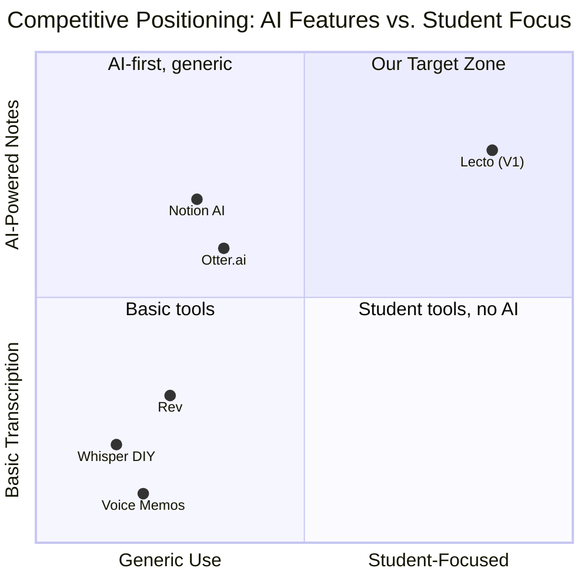

### 14.3 Lecto's Differentiators

| # | Differentiator | Why It Matters |
|---|---------------|---------------|
| 1 | **Offline-first recording** | Most competitors require internet to function. Lecto records reliably in any environment. |
| 2 | **Academic-specific AI** | Extracts assignments, due dates, key concepts — not generic meeting action items. |
| 3 | **Chunked processing** | Enables incremental processing; user sees results faster; individual chunk retry on failure. |
| 4 | **Zero post-lecture work** | Structured notes are ready immediately — no manual organization needed. |
| 5 | **Audio-as-ground-truth philosophy** | Audio is never prematurely deleted, ensuring data integrity above all. |
| 6 | **Student-first design** | Subject folders mirror academic life; not a repurposed meeting tool. |

---

## 15. Risks & Mitigations

### 15.1 Technical Risks

| # | Risk | Probability | Impact | Mitigation |
|---|------|:-----------:|:------:|-----------|
| T1 | **Background recording killed by OS battery optimization** | High | Critical | Use foreground service with persistent notification; guide users to disable battery optimization for Lecto; test extensively on Samsung, Xiaomi, Huawei (aggressive OS optimization) |
| T2 | **STT accuracy insufficient for academic content** | Medium | High | Use enhanced/medical/latest models; allow users to specify domain vocabulary; consider custom vocabulary lists per subject; evaluate Whisper's accuracy vs. Google STT for technical content |
| T3 | **Audio file corruption on disk** | Low | Critical | Write checksums per chunk; validate before upload; periodic buffer flush during recording (every 5–10s) |
| T4 | **Gemini AI hallucinating content** | Medium | High | Strict grounding instructions in system prompt; include "only reference information from the transcript" constraint; user feedback mechanism to flag inaccuracies |
| T5 | **Flutter audio recording package limitations** | Medium | Medium | Evaluate `record`, `flutter_sound`, and `audio_waveforms` packages early; build abstraction layer to swap implementations; consider native platform channels as fallback |
| T6 | **Large audio file upload failures** | Medium | Medium | Chunked upload with resumable uploads; 10-min chunks at WAV = ~19 MB (manageable); compress before upload if needed |
| T7 | **SQLite corruption losing processing queue** | Low | High | WAL mode for crash safety; periodic backup of queue state; recovery mechanism |

### 15.2 Product Risks

| # | Risk | Probability | Impact | Mitigation |
|---|------|:-----------:|:------:|-----------|
| P1 | **Users don't trust AI-generated notes** | Medium | High | Show transcript alongside notes; highlight source timestamps; allow users to verify against original audio; build trust incrementally |
| P2 | **Recording in lectures raises ethical/legal concerns** | Medium | Medium | Display consent reminder on first use; include "I have permission to record" toggle; provide educational guidance; link to institution policies |
| P3 | **Students stop attending lectures ("I'll just record")** | Low | Medium | This is a user behavior issue, not a product issue. Lecto enhances lecture value, it doesn't replace attendance. Marketing should emphasize "be present, not frantic." |
| P4 | **Poor first experience due to bad audio quality** | High | High | Audio quality detection during recording; placement guidance ("Place phone within 1 meter of speaker"); post-recording quality indicator |

### 15.3 Business Risks

| # | Risk | Probability | Impact | Mitigation |
|---|------|:-----------:|:------:|-----------|
| B1 | **STT API costs at scale** | High | High | Estimate: Google STT at ~$0.016/15s ≈ $3.84/hour of audio. At 1000 users × 3 hours/week = $11,520/week. Must plan for monetization or usage limits. |
| B2 | **Gemini API costs at scale** | Medium | Medium | Flash model is cost-effective; ~$0.15 per 1-hour lecture. Monitor and optimize prompt length. |
| B3 | **Competition launches similar student feature** | Medium | Medium | Execute fast; build brand loyalty; deepen academic-specific features in V1.1+. |
| B4 | **Platform policy changes (background recording)** | Low | Critical | Monitor App Store and Play Store policy updates; maintain compliance documentation; have fallback UX for restricted scenarios. |

### 15.4 Cost Projections (V1)

| Service | Cost per Unit | Estimated Monthly (1,000 users) | Notes |
|---------|--------------|--------------------------------|-------|
| Google Cloud STT | ~$3.84/hour of audio | ~$46,000 | Assumes 3 hrs/user/week |
| Gemini 1.5 Flash | ~$0.15/lecture | ~$1,800 | 12 lectures/user/month |
| Backend hosting | ~$200/month | ~$200 | Lightweight proxy |
| Firebase | Free tier | $0 | Auth + Crashlytics + Analytics |
| **Total** | | **~$48,000/month** | At 1,000 active users |

> [!WARNING]
> **STT costs dominate.** This must be addressed through: (1) tiered pricing / freemium model, (2) on-device Whisper for free tier (post-V1), (3) audio compression before upload, (4) caching and deduplication. See §18, Open Question OQ-03.

---

## 16. Release Plan & Milestones

### 16.1 V1 Development Phases

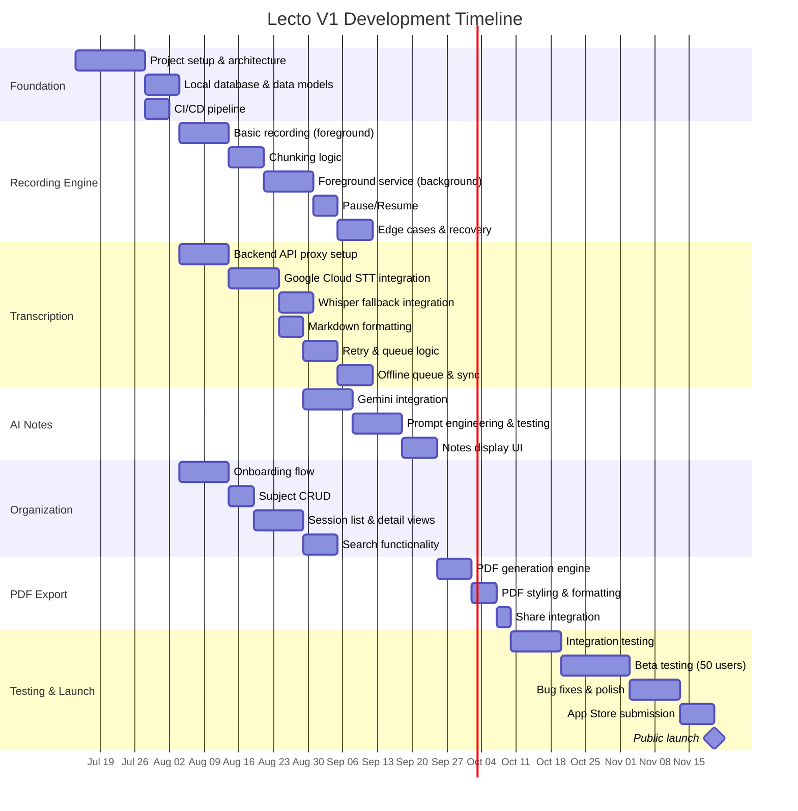

### 16.2 Milestone Summary

| Milestone | Target Date | Deliverables | Success Criteria |
|-----------|------------|--------------|-----------------|
| **M1: Foundation** | Aug 4, 2026 | Project scaffolding, data models, CI/CD | Flutter project builds and runs; SQLite migrations work; CI green |
| **M2: Recording MVP** | Sep 1, 2026 | Recording with chunking, background support, recovery | Can record a 1-hour lecture reliably with app in background; all chunks saved on force-kill |
| **M3: Transcription Pipeline** | Oct 6, 2026 | End-to-end transcription with retry logic | Upload chunk → receive Markdown transcript; fallback works; offline queue functions |
| **M4: AI Notes** | Oct 27, 2026 | Gemini integration with structured output | Full lecture → structured notes in < 60 seconds; all sections present |
| **M5: Organization & UX** | Nov 10, 2026 | Onboarding, subjects, session views, search | Complete onboarding in < 60s; sessions organized by subject; search works |
| **M6: PDF & Polish** | Nov 24, 2026 | PDF export, UI polish, edge case hardening | PDF generates offline; professional formatting; all edge cases handled |
| **M7: Beta** | Dec 8, 2026 | Beta release to 50 users | Beta users complete 10+ recordings; NPS > 30; crash rate < 1% |
| **M8: Launch** | Dec 29, 2026 | Public launch on App Store & Play Store | Apps approved; monitoring in place; support channels active |

### 16.3 Quality Gates

Each milestone must pass these gates before proceeding:

| Gate | Criteria |
|------|----------|
| **Code Review** | 100% of code reviewed by at least 1 peer |
| **Test Coverage** | > 70% unit test coverage; all critical paths have integration tests |
| **Performance** | Meets NFR targets (§12.1) |
| **Edge Cases** | All applicable edge cases from §9 are tested |
| **Design Review** | UI matches approved designs; accessibility check passed |
| **Security Review** | No API keys in client; TLS enforced; auth tested |

---

## 17. Future Vision (Post-V1)

> [!NOTE]
> These features are explicitly **out of scope for V1** but represent the product roadmap. They are listed here for context and to ensure V1 architecture decisions don't preclude future enhancements.

### 17.1 Post-V1 Feature Roadmap

| Version | Feature | Description | Dependency |
|---------|---------|-------------|------------|
| **V1.1** | 🔊 Audio compression | Switch from WAV to AAC/Opus encoding to reduce file sizes by ~10x | V1 Recording Engine |
| **V1.1** | 🌐 Multi-language support | Detect and transcribe non-English lectures | V1 Transcription Pipeline |
| **V1.1** | 📝 Transcript editing | Allow users to manually correct transcript errors | V1 Transcript Display |
| **V1.2** | 🧠 On-device Whisper | Free offline transcription using `whisper.cpp` | V1.1 Audio Compression |
| **V1.2** | 🔍 Global search | Search across ALL transcripts and notes, not just within a session | V1 Search |
| **V1.2** | ☁️ Cloud backup & sync | Optional cloud backup of transcripts and notes (not audio) | V1 Data Model |
| **V2.0** | 🎨 AI-generated slides | Transform lecture notes into presentation slides | V1 AI Notes |
| **V2.0** | 🎬 AI-generated video explainers | Short video summaries of lecture content using AI avatars | V2.0 Slides |
| **V2.0** | 👥 Collaborative notes | Share recordings and notes with classmates; collaborative editing | V1.2 Cloud Sync |
| **V2.0** | 📊 Exam preparation mode | AI generates practice questions, flashcards, and quizzes from notes | V1 AI Notes |
| **V2.5** | 🔗 LMS integration | Connect with Canvas, Blackboard, Moodle to auto-organize by course | V2.0 Collaboration |
| **V2.5** | 📸 Slide capture | Detect and photograph projected slides, link to transcript timeline | Camera integration |
| **V3.0** | 🤖 AI tutor | Interactive Q&A about lecture content ("What did the professor say about X?") | V2.0 Search + AI |

### 17.2 Architecture Considerations for Future Features

| Future Feature | V1 Architecture Requirement |
|----------------|---------------------------|
| On-device Whisper | Recording engine must support pluggable STT providers |
| Cloud sync | Data model must include sync metadata (created_at, updated_at, synced_at) |
| Global search | Transcripts stored in searchable format (SQLite FTS5) |
| Collaborative notes | Session IDs must be globally unique (UUIDs) |
| Multi-language | Language field on Session model; STT provider must be language-parameterized |

---

## 18. Open Questions & Decisions

> These items require stakeholder input before V1 development begins.

| # | Question | Options | Recommendation | Impact | Decision Owner |
|---|----------|---------|----------------|--------|---------------|
| OQ-01 | **Audio format for V1** | WAV (simple, large) vs. AAC (compressed, more complex) | WAV for V1 reliability; AAC in V1.1 | Storage usage, upload time | Engineering Lead |
| OQ-02 | **Chunk duration default** | 10 min (more granular) vs. 15 min (fewer uploads) vs. 20 min (largest chunks) | 10 min — better retry granularity, faster first-result | Processing pipeline, user experience | Product Manager |
| OQ-03 | **Monetization model** | Freemium (X hours free/month) vs. Subscription vs. Pay-per-use | Freemium with 5 hours/month free; $9.99/month unlimited | Revenue, user acquisition, API costs | Business / Founder |
| OQ-04 | **Backend technology** | Node.js (Express) vs. Python (FastAPI) vs. Firebase Cloud Functions | FastAPI — strong async support, Python ML ecosystem | Backend development speed, scalability | Engineering Lead |
| OQ-05 | **User authentication requirement** | Required from start vs. Optional (anonymous usage with upgrade path) | Required — needed for cloud processing quota management | Onboarding friction vs. cost control | Product Manager |
| OQ-06 | **Auto-delete audio after transcription?** | Auto-delete (saves storage) vs. Keep until manual delete (safer) | Keep by default; offer auto-delete as opt-in setting | Storage management, data safety | Product Manager |
| OQ-07 | **Should Lecto process chunks in real-time during recording or only after recording stops?** | Real-time (faster results, needs internet) vs. Post-recording (simpler, offline-friendly) | Real-time when online; post-recording when offline | User experience, architecture complexity | Engineering Lead |
| OQ-08 | **Speaker diarization in V1?** | Include (valuable for Q&A) vs. Defer (complexity) | Defer to V1.1 — adds complexity, not critical for core value | Feature scope, timeline | Product Manager |
| OQ-09 | **What happens if user records without selecting a subject?** | Block recording vs. "Unsorted" folder vs. Prompt after recording | "Unsorted" folder — never block recording | UX flow, organization | Design Lead |
| OQ-10 | **Should we support tablet and/or web in V1?** | Mobile only vs. Mobile + Tablet vs. Mobile + Web | Mobile only — focus resources | Development scope | Product Manager |
| OQ-11 | **How to handle very poor transcripts?** | Show anyway vs. Show with warning vs. Offer audio playback as alternative | Show with confidence warning + preserve audio longer | User trust, storage policy | Product Manager |
| OQ-12 | **Privacy: where is audio processed?** | Our backend (proxy) vs. Direct to Google/OpenAI from device | Backend proxy — control, security, billing management | Security, architecture, latency | Engineering Lead + Legal |

---

## 19. Suggested Improvements & Identified Ambiguities

### 19.1 Identified Ambiguities in the Product Idea

| # | Ambiguity | Question | Suggested Resolution |
|---|-----------|----------|---------------------|
| AMB-01 | **"Chunked every 10-20 minutes"** — The range is unspecified. Is it user-configurable? Fixed? Adaptive? | What determines chunk size? | Default 10 minutes, user-configurable in Settings (10/15/20 min). Documented in REC-004. |
| AMB-02 | **"main.md file for that recording session"** — Is this file stored on device, cloud, or both? | Where does `main.md` live? | Local on-device storage (primary). Cloud backup is post-V1. |
| AMB-03 | **"A beautifully formatted PDF sent to the user"** — Sent how? Push notification? Email? In-app? | What does "sent" mean? | Generated on-device; user initiates export via share sheet. Not pushed/emailed automatically. |
| AMB-04 | **"User can retry processing"** — Is this manual-only or does auto-retry happen? | Manual vs. automatic retry? | Automatic retry with exponential backoff (5 attempts), plus manual retry button. See §6.2.6. |
| AMB-05 | **"Clean onboarding where users create subject folders"** — Is account creation required? Can users skip onboarding? | Is onboarding mandatory? | Account required (for API quota); subject creation is guided but skippable. |
| AMB-06 | **Speech-to-text provider** — "Google Cloud Speech-to-Text or Whisper API" — which one? Both? | Primary vs. fallback? | Google Cloud STT primary; Whisper API as automatic fallback. See §6.2.2. |
| AMB-07 | **Audio file deletion timing** — "If transcript/summary generated successfully → safely delete" — Is this automatic or user-initiated? | Auto-delete vs. manual? | Default: keep audio (user deletes manually). Opt-in setting for auto-delete after confirmed transcription. |
| AMB-08 | **"Structured transcript"** — What does "structured" mean for raw STT output? | How much formatting is applied to raw STT? | Paragraph breaks from speech pauses, proper punctuation/capitalization, chunk headers with timestamps. Not topic-segmented (that's the AI's job). |
| AMB-09 | **Backend involvement** — The spec mentions mobile app but doesn't detail backend requirements explicitly. | How much backend is needed? | Minimal backend proxy for V1: auth, STT proxy, Gemini proxy, rate limiting. No user data storage on server. |
| AMB-10 | **Multi-user / Sharing** — No mention of sharing or collaboration in V1, but PDF "sent to user" implies delivery. | Is sharing in V1 scope? | No dedicated sharing feature in V1. PDF export + system share sheet covers sharing use case. |

### 19.2 Suggested Improvements

| # | Improvement | Rationale | Complexity | Recommendation |
|---|------------|-----------|:----------:|---------------|
| IMP-01 | **Audio quality pre-check** | Before recording, do a 3-second audio check and show quality indicator. Prevents users from recording an entire lecture with the microphone blocked. | Low | ✅ Include in V1 |
| IMP-02 | **Smart chunk boundaries** | Instead of fixed 10-min chunks, detect natural speech pauses or topic shifts to create more meaningful chunk boundaries. | High | ❌ Post-V1 — Fixed intervals are more reliable |
| IMP-03 | **Recording "bookmarks"** | During recording, user taps a "Star" button to mark important moments. These bookmarks appear in the transcript timeline. | Low | ✅ Include in V1 (P2) |
| IMP-04 | **Estimated processing time** | Show "Estimated processing time: ~4 minutes" after recording ends, based on recording length and current queue. | Low | ✅ Include in V1 |
| IMP-05 | **Audio playback synced to transcript** | When viewing the transcript, tap any paragraph to play the corresponding audio. | Medium | ❌ Post-V1 — Requires word-level timestamp alignment |
| IMP-06 | **Notification when notes are ready** | Push notification: "Your CS 301 lecture notes are ready!" when async processing completes. | Low | ✅ Include in V1 |
| IMP-07 | **Subject template suggestions** | During onboarding, suggest common subject categories (Math, Science, History, etc.) for quicker setup. | Low | ✅ Include in V1 |
| IMP-08 | **Recording widget** | Home screen widget with a big Record button for instant recording without opening the app. | Medium | ❌ Post-V1 |
| IMP-09 | **Dark mode** | Full dark mode support for late-night study sessions and lecture hall environments. | Medium | ✅ Include in V1 (P1) |
| IMP-10 | **Session merge** | If a user accidentally stops and restarts, allow merging two sessions into one. | Medium | ❌ Post-V1 — Edge case, not critical |
| IMP-11 | **Custom AI instructions per subject** | "For this biology class, focus on extracting gene names and pathways." | Medium | ❌ Post-V1 — Interesting but complex |
| IMP-12 | **Export to Notion / Google Docs** | Direct export to popular note-taking platforms beyond PDF. | Medium | ❌ Post-V1 — PDF covers V1 needs |
| IMP-13 | **Silence detection with smart skip** | Detect prolonged silence (> 2 min) and flag it in transcript as "[Break / Silence]" rather than transcribing noise. | Medium | ✅ Include in V1 (P2) |
| IMP-14 | **Storage usage dashboard** | Dedicated screen showing per-subject and per-session storage breakdown with cleanup actions. | Low | ✅ Include in V1 |
| IMP-15 | **Onboarding skip + "Quick Record"** | Allow users to skip onboarding entirely and record immediately. Sessions go to "Unsorted". | Low | ✅ Include in V1 |

---

## 20. Appendices

### Appendix A: Glossary

| Term | Definition |
|------|-----------|
| **Audio Chunk** | A segment of continuous audio, typically 10 minutes long, saved as an individual file |
| **Session** | A single recording event from start to stop, containing one or more audio chunks |
| **STT** | Speech-to-Text — the process of converting audio to written text |
| **Transcript** | The text output of STT processing, formatted as Markdown |
| **`main.md`** | The consolidated transcript file for a session, containing all chunk transcripts |
| **`notes.md`** | The AI-generated structured notes file for a session |
| **Foreground Service** | An Android mechanism that keeps an app process alive by showing a persistent notification |
| **Processing Queue** | A persistent local queue of tasks (transcription, AI generation) awaiting execution |
| **Exponential Backoff** | A retry strategy where wait times increase exponentially between attempts |
| **Diarization** | The process of identifying and labeling different speakers in an audio recording |
| **WAR** | Weekly Active Recordings — the product's north star metric |
| **Ground Truth** | The original, authoritative data source — in Lecto's case, the raw audio files |

### Appendix B: File System Structure (On-Device)

```
/app_data/lecto/
├── db/
│   └── lecto.db              # SQLite database
├── subjects/
│   └── {subject_id}/
│       └── sessions/
│           └── {session_id}/
│               ├── audio/
│               │   ├── chunk_001.wav
│               │   ├── chunk_002.wav
│               │   └── ...
│               ├── main.md          # Full transcript
│               ├── notes.md         # AI-generated notes
│               └── exports/
│                   └── Lecto_CS301_20261015_BinaryTrees.pdf
├── config/
│   └── settings.json
└── cache/
    └── ...
```

### Appendix C: State Machine — Session Lifecycle

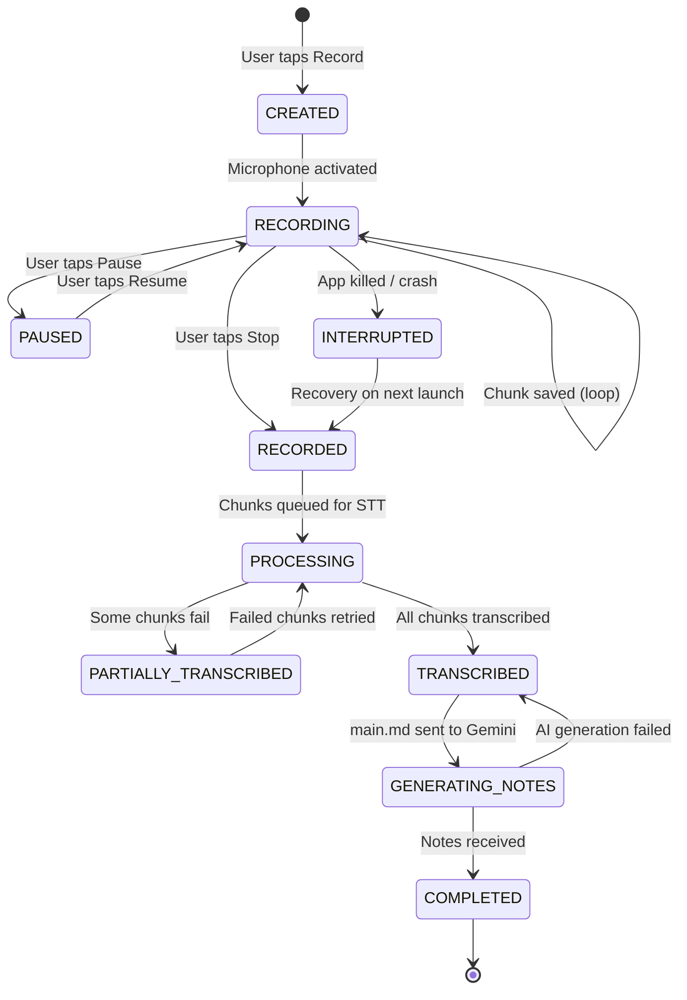

### Appendix D: Prompt Template for Gemini (Draft)

```
SYSTEM PROMPT:

You are Lecto AI, an academic note-taking assistant. You will receive a full
lecture transcript and produce structured study notes.

CRITICAL RULES:
1. ONLY include information that appears in the transcript. Do NOT add external
   knowledge, definitions, or examples not mentioned by the speaker.
2. If the transcript quality is poor or garbled, note this explicitly and do
   your best with available content.
3. For date references (e.g., "next Tuesday", "this Friday"), resolve them to
   actual dates using the provided recording date: {recording_date}.
4. Write in clear, concise academic language suitable for university students.
5. If no assignments, due dates, or action items are mentioned, explicitly state
   "None mentioned in this lecture."

OUTPUT FORMAT:
{See §6.3.3 for exact Markdown template}

INPUT:
Recording Date: {recording_date}
Subject: {subject_name}
Duration: {duration_formatted}

--- BEGIN TRANSCRIPT ---
{main_md_content}
--- END TRANSCRIPT ---
```

---

> **Document Status**: This PRD is a living document. It will be updated as open questions are resolved, stakeholder feedback is incorporated, and development progresses. All changes should be tracked via version control.

| Version | Date | Author | Changes |
|---------|------|--------|---------|
| 1.0.0-draft | July 7, 2026 | Product & Engineering Team | Initial comprehensive draft |
